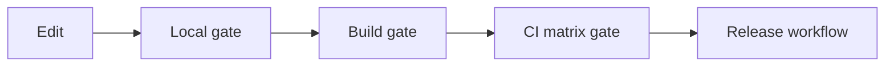

# Development Pipeline

This repo keeps the development pipeline versioned inside the repository.
Use this document as the high-level map, and use the linked contract files as the authoritative details.

## Contracts

- `PROJECT_AGENT_POLICY.md` — shared roles, routing, and non-goals
- `EVAL_CONTRACT.md` — required checks and benchmark interpretation
- `HARNESS_MODES.md` — native fast path vs CodeLens assist vs verifier vs async analysis
- `HARNESS_ARCHITECTURE.md` — structural target for transport, policy, execution, and stores

## Pipeline Stages

### 1. Local Fast Path

Use this during normal edit and iteration loops.

- primary entry: `./scripts/quality-gate.sh`
- mode: default local mode
- intent: keep stop-hook and local verification fast
- checks:
  - `cargo check`
  - `cargo test -p codelens-core`
  - `cargo test -p codelens-mcp`
- conditional extras:
  - `cargo test -p codelens-mcp --features http` for HTTP-sensitive changes
  - `cargo clippy -- -W clippy::all` when Rust gate is active and clippy is installed
  - release builds when manifest/workflow/release-sensitive files change

### 2. Build Workflow Gate

Use this for the dedicated build-and-benchmark workflow.

- entry: `./scripts/quality-gate.sh --mode build`
- workflow: `.github/workflows/build.yml`
- checks:
  - `cargo test -p codelens-core`
  - `cargo test -p codelens-mcp -- --skip returns_lsp_diagnostics --skip returns_workspace_symbols --skip returns_rename_plan`
  - `cargo build --release`
- non-goals:
  - no HTTP suite here
  - no benchmark interpretation here

### 3. CI Matrix Gate

Use this as the shared cross-platform verification layer.

- entry: `./scripts/quality-gate.sh --mode ci`
- workflow: `.github/workflows/ci.yml`
- checks:
  - harness Python syntax gate
  - `cargo check`
  - `cargo test -p codelens-core`
  - `cargo test -p codelens-mcp`
  - `cargo clippy -- -W clippy::all`
  - `cargo build --release --no-default-features`
  - `cargo build --release`
- Ubuntu-only follow-ups in CI:
  - `cargo test -p codelens-mcp --features http`
  - HTTP repeat runs for stability
  - `cargo build --release --features http`
  - benchmark gates and artifact upload

### 4. Release Pipeline

Use this only for tagged release builds.

- workflow: `.github/workflows/release.yml`
- purpose:
  - cross-target release binaries
  - packaging and checksums
  - GitHub Release publishing
  - Homebrew tap update
- note:
  - release workflow is intentionally separate from repo-local quality gate modes because it has cross-target packaging concerns

## Operational Rules

- Keep the local path fast.
- Push heavyweight checks to CI when they are not needed on every local stop.
- Do not duplicate workflow commands in multiple YAML files when they can share one repo-local gate.
- Do not treat release-only packaging steps as part of the normal local or CI parity gate.
- Treat benchmark outputs as artifacts, not proof of refactor wins, unless the build profile and conditions are comparable.
- Treat Claude Code style runtime insights as architecture constraints, not as a reason to embed agent-runtime concerns into this repo.

## Recommended Usage

### Local editing

```bash
./scripts/quality-gate.sh
```

### Build workflow parity

```bash
./scripts/quality-gate.sh --mode build
```

### CI parity

```bash
./scripts/quality-gate.sh --mode ci
```

## Flow


