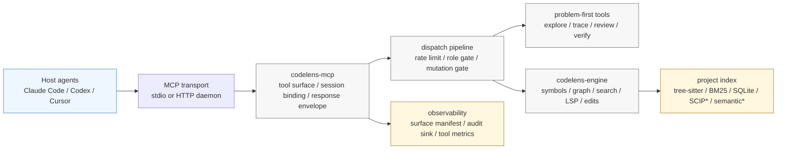

<div align="center">

# CodeLens MCP

**코드베이스를 빠르게 이해하고, 필요한 맥락만 좁혀 주며, 안전한 수정을 돕는 Rust 기반 MCP 코드 인텔리전스 라우터입니다.**

<sub>English: A host-adaptive Rust MCP code-intelligence router for cached hybrid retrieval, index-health visibility, mutation gates, and token-lean coding workflows.</sub>

자동화나 호스트 설정을 CodeLens로 이전할 준비를 하고 있다면 호스트별 마이그레이션 가이드부터 확인하세요: [`docs/migrate-from-codelens.md`](docs/migrate-from-codelens.md).

CodeLens MCP는 multi-agent 코딩 하네스가 “파일을 통째로 읽고 grep을 반복하는 방식”에서 벗어나도록 돕는 순수 Rust MCP 서버입니다. tree-sitter, BM25/sparse ranking, semantic retrieval을 결합한 캐시형 하이브리드 검색, mutation gate가 있는 refactor workflow, token compression, observability를 제공합니다. 기본 retrieval/refactor 표면은 SQLite, vector store, ONNX runtime을 정적으로 포함한 단일 바이너리로 동작합니다. **Semantic search는 별도의 sidecar model directory**(~80 MB ONNX)가 추가로 필요합니다. GitHub Release tarball에는 모델이 자동 포함되지만, `cargo install codelens-mcp` 사용자는 별도 모델 payload를 받아 `CODELENS_MODEL_DIR`로 지정해야 합니다. 자세한 차이는 [Install Channel Matrix](#install-channel-matrix)를 참고하세요.

<sub>English: CodeLens MCP is a pure Rust MCP server for multi-agent coding harnesses. It combines cached hybrid retrieval, mutation-gated refactoring, token compression, and production-oriented observability. Core retrieval and mutation run from one statically linked binary; semantic search additionally requires the model sidecar.</sub>

[](https://github.com/mupozg823/codelens-mcp-plugin/actions)
[](https://crates.io/crates/codelens-mcp)
[](https://docs.rs/codelens-engine)
[](LICENSE)
[](https://crates.io/crates/codelens-mcp)

</div>

## 아키텍처 한눈에 보기

<sub>English: Architecture at a glance.</sub>



CodeLens는 host가 대화를 소유하고, `codelens-mcp`가 MCP tool 표면과 session policy를 관리하며, `codelens-engine`이 실제 코드 index와 graph/search/edit primitive를 제공하는 구조입니다. mutation은 engine primitive를 직접 호출하지 않고 MCP dispatch pipeline을 통과해야 role gate, preflight, audit, cache invalidation이 일관되게 적용됩니다.

<sub>English: The host owns the conversation, `codelens-mcp` owns the MCP surface and session policy, and `codelens-engine` owns repository indexing and code-intelligence primitives. Mutations are expected to pass through the MCP dispatch pipeline so gates, audits, and cache invalidation stay consistent.</sub>

| 영역 | 핵심 코드 | 역할 |
| --- | --- | --- |
| 서버 부팅/transport | [`crates/codelens-mcp/src/main.rs`](crates/codelens-mcp/src/main.rs) | stdio, HTTP/HTTPS, one-shot CLI, profile/preset, semantic banner, daemon mode를 선택합니다. |
| MCP 요청 처리 | [`crates/codelens-mcp/src/server/router.rs`](crates/codelens-mcp/src/server/router.rs), [`crates/codelens-mcp/src/dispatch/mod.rs`](crates/codelens-mcp/src/dispatch/mod.rs) | JSON-RPC tool call을 파싱하고 rate limit, role gate, access check, mutation gate, response shaping을 적용합니다. |
| tool 표면 | [`crates/codelens-mcp/src/tools/mod.rs`](crates/codelens-mcp/src/tools/mod.rs), [`crates/codelens-mcp/src/tool_defs/`](crates/codelens-mcp/src/tool_defs) | 94개 tool 정의, profile/preset별 visible surface, workflow alias, schema output을 관리합니다. |
| session bootstrap | [`crates/codelens-mcp/src/tools/session/project_ops/prepare_harness.rs`](crates/codelens-mcp/src/tools/session/project_ops/prepare_harness.rs) | `prepare_harness_session(project=...)`로 project binding, index recovery, host/skill hint, visible tool context를 반환합니다. |
| runtime state | [`crates/codelens-mcp/src/state.rs`](crates/codelens-mcp/src/state.rs), [`crates/codelens-mcp/src/state/`](crates/codelens-mcp/src/state) | project context cache, watcher, LSP pool, analysis artifacts, coordination claims, audit sinks, semantic engine 상태를 보관합니다. |
| engine primitive | [`crates/codelens-engine/src/lib.rs`](crates/codelens-engine/src/lib.rs), [`crates/codelens-engine/src/symbols/`](crates/codelens-engine/src/symbols), [`crates/codelens-engine/src/search.rs`](crates/codelens-engine/src/search.rs) | tree-sitter symbol index, sparse/BM25 ranking, hybrid search, graph/LSP/read primitive를 제공합니다. |
| semantic lane | [`crates/codelens-mcp/src/dispatch/semantic/`](crates/codelens-mcp/src/dispatch/semantic), [`crates/codelens-engine/src/embedding/`](crates/codelens-engine/src/embedding) | `semantic` feature와 model sidecar가 있을 때 embedding indexing/search를 활성화합니다. |
| 검증/감사 | [`crates/codelens-mcp/src/tools/reports/verifier_reports.rs`](crates/codelens-mcp/src/tools/reports/verifier_reports.rs), [`crates/codelens-mcp/src/audit_sink.rs`](crates/codelens-mcp/src/audit_sink.rs) | `verify_change_readiness`, analysis handle, mutation audit, session report를 제공합니다. |

<!-- SURFACE_MANIFEST_README_SNAPSHOT:BEGIN -->

## Surface Snapshot

- Workspace version: `1.13.34`
- Workspace members: `2` (`crates/codelens-engine`, `crates/codelens-mcp`)
- Registered tool definitions: `97`
- Tool output schemas: `57 / 97`
- Supported language families: `34` across `56` extensions
- Profiles: active `planner-readonly` (42), `builder-minimal` (41), `reviewer-graph` (46); compatibility aliases `evaluator-compact` (42, v2.0 removal), `refactor-full` (41, v2.0 removal), `ci-audit` (46, v2.0 removal), `workflow-first` (42, v2.0 removal)
- Presets: `minimal` (23), `balanced` (84), `full` (97)
- Canonical manifest: [`docs/generated/surface-manifest.json`](docs/generated/surface-manifest.json)

<!-- SURFACE_MANIFEST_README_SNAPSHOT:END -->

---

## 왜 필요한가

multi-agent 코딩 환경은 각 agent가 너무 많은 tool, 너무 많은 원본 코드, 너무 많은 중간 결과를 한꺼번에 보면 쉽게 느려집니다. `tools/list`, 반복적인 파일 읽기, 가치 낮은 raw graph expansion에 token이 낭비되고, 실제 수정에 필요한 판단 맥락은 오히려 흐려집니다.

<sub>English: Multi-agent coding harnesses waste tokens and attention when every agent receives too many tools, raw files, and intermediate graph results.</sub>

## CodeLens가 하는 일

CodeLens는 코드베이스의 **살아 있는 index와 구조 이해**를 유지하고, 이를 MCP host가 바로 사용할 수 있는 최적화 계층으로 노출합니다. 모델은 정확한 질문을 던지고, 필요한 만큼 제한된 답변과 후속 확장 handle을 받습니다. 큰 코드베이스에서도 처음부터 전체 파일을 읽지 않고 “어디를 봐야 하는지”를 먼저 좁힐 수 있습니다.

<sub>English: CodeLens keeps a live indexed model of the repository and returns bounded, expandable answers instead of forcing the model to read everything up front.</sub>

```
Without CodeLens                                    With CodeLens (with semantic feature on)
────────────────────────────────────────────────────────────────────────────────────────────
Read file + grep references   → 4,600 tokens       get_impact_analysis    → 1,500 tokens  (67% saved)
Read manifest + entry + files → 5,000 tokens       onboard_project        →   660 tokens  (87% saved)
Read + grep × 3 files         → 3,200 tokens       get_ranked_context     →   800 tokens  (75% saved)
```

> Measured with tiktoken (cl100k_base) on real projects with `--features semantic` enabled and the bundled CodeSearchNet model loaded. Reproducible via `benchmarks/token-efficiency.py`. The default crates.io build (BM25 + AST only) still hits the bounded-output and workflow-shape benefits but does not run the hybrid semantic ranker.

## 빠른 설치

<sub>English: Quick install options.</sub>

**기본 설치 (BM25 + AST + call-graph, model sidecar 없음)** — 추가 설정 없이 바로 동작합니다:

<sub>English: Default install. BM25 + AST + call graph, no model sidecar required.</sub>

```bash
cargo install codelens-mcp
```

**Hybrid retrieval (semantic + bundled CodeSearchNet model)** — semantic 검색까지 쓰려면 아래 중 하나를 선택하세요:

<sub>English: Pick one of these channels when you want semantic retrieval with the bundled CodeSearchNet model.</sub>

```bash
# Option A: GitHub Release tarball — 모델이 번들되어 있고 CI에서 검증됩니다.
curl -fsSL https://raw.githubusercontent.com/mupozg823/codelens-mcp-plugin/main/install.sh | bash

# Option B: semantic feature로 cargo install 후 CODELENS_MODEL_DIR를 모델 payload로 지정합니다.
#          crates.io 10 MB 제한 때문에 모델은 별도로 받아야 합니다.
cargo install codelens-mcp --features semantic
export CODELENS_MODEL_DIR=/path/to/codesearch/model

# Option C: Homebrew tap (macOS / Linux) — release tarball과 같은 구성입니다.
brew install mupozg823/tap/codelens-mcp
```

**HTTP daemon mode** — 위 설치 경로에 `--features http`를 추가하면 됩니다. Source build 예시는 다음과 같습니다:

<sub>English: Add `--features http` when you want shared HTTP daemon mode.</sub>

```bash
cargo install --git https://github.com/mupozg823/codelens-mcp-plugin codelens-mcp
cargo install --git https://github.com/mupozg823/codelens-mcp-plugin codelens-mcp --features semantic,http
```

> The default `cargo install codelens-mcp` build was switched to `default = []` in 1.10.0 (ADR-0012) so a fresh install boots without the ~80 MB ONNX sidecar. Existing users running `cargo install --force` will see the change in the startup banner.

Latest release: [GitHub Releases](https://github.com/mupozg823/codelens-mcp-plugin/releases/latest). For local release comparisons, use `git tag --sort=-v:refname | head -1` instead of copying a fixed tag into docs.

Runtime smoke proof: [`docs/quickstart-transcript.md`](docs/quickstart-transcript.md) captures install -> doctor/status -> index -> coverage -> retrieve from an isolated temp prefix.

Public repo, release-page, and plugin-marketplace descriptions should use the same short product line as this README. Localized deployment copy for country/language-specific pages lives in [`docs/release-distribution.md#localized-deployment-page-copy`](docs/release-distribution.md#localized-deployment-page-copy).

### Install Channel Matrix

| Channel                                          | What you get                                                                              | Good for                                             | Extra install needed?                                                                                                                                                                                         |
| ------------------------------------------------ | ----------------------------------------------------------------------------------------- | ---------------------------------------------------- | ------------------------------------------------------------------------------------------------------------------------------------------------------------------------------------------------------------- |
| `cargo install codelens-mcp`                     | crates.io package, **BM25 + AST + call-graph default** (no semantic, no model needed)     | Single-agent local MCP sessions, fast first install  | Add `--features semantic` for hybrid retrieval (model sidecar required, see below). Add `--features http` for shared HTTP daemons.                                                                            |
| `cargo install codelens-mcp --features semantic` | crates.io package + ONNX/fastembed/sqlite-vec compiled in                                 | Hybrid retrieval users who prefer crates.io          | **Semantic search requires a sidecar model directory** — model files are excluded from `cargo publish` (10 MB cap on crates.io); fetch one from a GitHub Release tarball and point `CODELENS_MODEL_DIR` at it |
| `cargo install codelens-mcp --features http`     | crates.io package, BM25/AST default + HTTP transport                                      | Shared daemon mode from crates.io without semantic   | Combine with `--features semantic,http` if hybrid retrieval is wanted                                                                                                                                         |
| GitHub Releases / installer / Homebrew           | latest tagged release binary, built in CI with `--features http` (`http,coreml` on macOS) | Tagged release users who want HTTP without compiling | Model payload is bundled in the tarball and verified pre-/post-archive in CI; airgap users can rebundle via `scripts/build-airgap-bundle.sh`                                                                  |
| `cargo install --git ...` or source build        | current repository HEAD                                                                   | Unreleased features on `main` / branch testing       | Models live at `crates/codelens-engine/models/codesearch/` in the source tree; no extra fetch needed                                                                                                          |

Important:

- `CodeLens standalone` means the `codelens-mcp` binary itself. Basic stdio MCP use needs only that binary plus host MCP config.
- `Shared HTTP + multi-agent coordination` still uses the same binary, but the binary must include the `http` feature and the clients must attach by URL.
- If a feature is mentioned in this repository but not present in your installed binary, compare `codelens-mcp --version` with the latest GitHub release and your install channel before assuming a bug.

## Claude Code Plugin

CodeLens ships as a Claude Code plugin that wires the MCP server plus the
CodeLens-specific skills and read-only explorer agent in one install.

**Prerequisite — install the binary first.** The plugin connects to a
`codelens-mcp` binary on your `PATH`; the plugin system does not build it.
The recommended path is the installer or a GitHub Release tarball, which
bundle the semantic model so `semantic_search` and hybrid retrieval work
out of the box:

```bash
curl -fsSL https://raw.githubusercontent.com/mupozg823/codelens-mcp-plugin/main/install.sh | bash
```

A leaner `cargo install codelens-mcp` also works but provides BM25 + AST +
call-graph only (no semantic model; `semantic_search` is gracefully absent
until you add `--features semantic` and a model directory — see the
[Install Channel Matrix](#install-channel-matrix)).

**Install the plugin:**

```text
/plugin marketplace add mupozg823/codelens-mcp-plugin
/plugin install codelens@codelens
```

**What you get:** the `mcp__codelens__*` tools, the `codelens-analyze`,
`codelens-review`, and `codelens-onboard` skills, and the read-only
`codelens-explorer` agent.

**If the tools don't appear** after install, the binary isn't on your
`PATH`. Verify the install with:

```bash
codelens-mcp doctor claude-code
```

**Optional — post-edit diagnostics.** The repo ships
`hooks/post-edit-diagnostics.sh`, which runs CodeLens diagnostics on each
edited file. It is **not** auto-installed by the plugin. To enable it, add a
`PostToolUse` hook for the `Edit` matcher pointing at that script in your
Claude Code settings.

## Setup

### Environment Variables

Copy `.env.example` to `.env` and fill in the values for your environment:

```bash
cp .env.example .env
```

Key variables include `CODELENS_MODEL_DIR` for semantic search, `CODELENS_OTEL_ENDPOINT` for telemetry, and `CODELENS_PROJECT_BRIDGES_ON` to opt into project-specific NL→code bridges.

### Claude Code / Cursor

```json
{
  "mcpServers": {
    "codelens": {
      "command": "codelens-mcp",
      "args": []
    }
  }
}
```

### Shared HTTP Daemon (Multi-Agent)

Running every editor or agent as its own stdio subprocess spawns **one `codelens-mcp` instance per session**, each with its own index and embedding state. Measured on a typical developer laptop with Claude Code + Codex Desktop + Cursor attached to the same project, this adds up to **200–300 MB** of duplicated resident memory for effectively the same data. The HTTP daemon collapses that into a single shared process.

If you installed from crates.io or built from source and need HTTP transport, make sure the binary was built with the `http` feature. The prebuilt release assets and the installer fallback should ship HTTP support.

Minimal setup:

```bash
# Start once, keep running in the background
codelens-mcp /path/to/project --transport http --profile reviewer-graph --daemon-mode read-only --port 7837

# Optional: a second daemon scoped for refactor-capable agents
codelens-mcp /path/to/project --transport http --profile refactor-full --daemon-mode mutation-enabled --port 7838
```

Those ports are the public generic example. In this repository's local launchd
workflow, the repo-local dual-daemon installer uses `:7839` for the read-only
daemon and `:7838` for the mutation daemon.

Every MCP client then attaches by URL instead of spawning a subprocess:

```json
{
  "mcpServers": {
    "codelens": { "type": "http", "url": "http://127.0.0.1:7837/mcp" }
  }
}
```

If you are following this repository's local launchd workflow, replace the
read-only example URL above with `http://127.0.0.1:7839/mcp`. The `:7837`
address remains the public generic example used throughout this section.

#### When to prefer HTTP vs stdio

| Situation                                            | Transport                 | Why                                                                    |
| ---------------------------------------------------- | ------------------------- | ---------------------------------------------------------------------- |
| Single-agent, ephemeral sessions                     | stdio                     | Zero setup, auto-lifecycle, no port management                         |
| 2+ agents (Claude + Codex + Cursor) on the same repo | **HTTP**                  | One shared index, 100–200 MB saved per extra agent                     |
| Long-running agent or automation loop                | **HTTP**                  | Avoids cold-start on every session                                     |
| CI / one-shot script                                 | stdio                     | `--oneshot` matches short-lived commands                               |
| Mutation-heavy workflow needing isolation            | **HTTP with two daemons** | Read-only port for planners, mutation-enabled port for refactor agents |

For shared HTTP deployments, treat CodeLens coordination as advisory evidence rather than a central lock manager. The practical pattern is: bootstrap with `prepare_harness_session`, register intent with `register_agent_work`, claim mutation targets with `claim_files`, and let `verify_change_readiness` surface `overlapping_claims` as a `caution` signal before edits.

What the standalone binary does and does not cover:

- `CodeLens only` is enough for stdio use, HTTP daemon use, role-based surfaces, mutation gates, and coordination tools.
- `Semantic retrieval` needs the packaged model sidecar at `./models/codesearch/` next to the binary, an installed prefix sidecar such as `../models/codesearch/`, or an explicit `CODELENS_MODEL_DIR`. Release packaging fails closed if the model payload is incomplete; release CI can point at a staged model root with `CODELENS_RELEASE_MODELS_DIR`. macOS release binaries enable the `coreml` feature so the INT8 ONNX model can use the CoreML execution provider instead of silently falling back to CPU.
- `IDE adapters` are external adapter endpoints that can be plugged in for IDE-specific semantic edits; no bundled adapters are required for core operation. `semantic_edit_backend=tree_sitter` is the default and always available.
- `SCIP precise navigation` needs a binary built with `--features scip-backend` and an external SCIP index.
- `Claude -> Codex` live delegation is not a CodeLens feature. It additionally needs Claude configured with a `codex` MCP server and a working Codex CLI install.

Recommended operating policy:

- one mutation-enabled agent per worktree
- additional agents stay planner/reviewer/read-only on the same daemon
- use `codelens://activity/current` to inspect active sessions, recent intent, and advisory file claims

#### Troubleshooting

- **`Failed to reconnect` on the client** — the daemon likely exited or the configured URL/port is wrong. Verify with `curl <configured-mcp-url>`; for this repository's local launchd workflow that is usually `http://127.0.0.1:7839/mcp` for read-only and `http://127.0.0.1:7838/mcp` for mutation.
- **Stale index warning on first attach** — expected when the watcher hasn't caught up after a daemon restart. Call `refresh_symbol_index` via MCP once, or restart the daemon with the project root as its CWD.
- **Host config sanity check** — `codelens-mcp doctor <host>` (or `codelens-mcp status <host>`) inspects the host-native files and tells you whether the CodeLens entry is attached exactly, customized, missing, or needs manual review. Add `--strict` to probe HTTP-daemon `embedding_coverage_report`; the command exits non-zero when semantic coverage is attached but not ready or cannot be verified. Add `--json` when another script or host automation needs a machine-readable report.
- **Broken or stale `~/.local/bin/codelens-mcp`** — if `cargo clean` removed the repo build a symlink points at, or if PATH still resolves to an older cargo-installed binary that does not know newer subcommands like `doctor` / `status`, run `bash scripts/sync-local-bin.sh .` to rebuild and re-link the local checkout, or `cargo install --path crates/codelens-mcp --force` to install a fresh standalone binary under `~/.cargo/bin/`.
- **Multiple daemons listening on the same port** — only one will actually bind; the rest exit immediately. Check the actual configured port, for example `lsof -iTCP:7839 -sTCP:LISTEN` or `lsof -iTCP:7838 -sTCP:LISTEN` in this repository's local launchd workflow.
- **Health check** — `scripts/mcp-doctor.sh . --strict` verifies that the configured transport matches an actual attach.

#### Auto-start on macOS (launchd)

For this repository, prefer the installer script over hand-editing plist files:

```bash
bash scripts/install-http-daemons-launchd.sh . --load
```

That installs two repo-local launchd agents from a current
`--features http,semantic` build by default:

- `dev.codelens.mcp-readonly` -> `reviewer-graph` on `:7839`
- `dev.codelens.mcp-mutation` -> `refactor-full` on `:7838`

> **Build flag reminder (v1.10.1+)**: the installer builds the daemon
> with `http,semantic` by default and writes `CODELENS_MODEL_DIR` into
> the plists when the repo-local model sidecar exists. Use `--no-semantic`
> only when you intentionally want an HTTP-only daemon. See
> [`docs/release-verification.md`](docs/release-verification.md#feature-flag-matrix-build-time-requirements)
> for the full feature-flag matrix.

It also updates `.codelens/config.json` with repo-local `host_attach` URL
overrides so `codelens-mcp attach`, `status`, and `doctor` reuse the same
host-to-daemon contract.

Generic single-daemon example, if you want to hand-edit a plist instead of
using the installer above:

```xml
<!-- ~/Library/LaunchAgents/dev.codelens.mcp.plist -->
<?xml version="1.0" encoding="UTF-8"?>
<plist version="1.0"><dict>
  <key>Label</key>            <string>dev.codelens.mcp</string>
  <key>ProgramArguments</key> <array>
    <string>/Users/you/.local/bin/codelens-mcp</string>
    <string>/Users/you/your-project</string>
    <string>--transport</string><string>http</string>
    <string>--profile</string><string>reviewer-graph</string>
    <string>--daemon-mode</string><string>read-only</string>
    <string>--port</string><string>7837</string>
  </array>
  <key>RunAtLoad</key>        <true/>
  <key>KeepAlive</key>        <true/>
  <key>StandardOutPath</key>  <string>/tmp/codelens-mcp.out.log</string>
  <key>StandardErrorPath</key><string>/tmp/codelens-mcp.err.log</string>
</dict></plist>
```

```bash
launchctl load ~/Library/LaunchAgents/dev.codelens.mcp.plist
launchctl list | grep codelens   # confirm it's running
```

For the separate daily aggregate audit snapshot, install the operator job with:

```bash
bash scripts/install-eval-session-audit-launchd.sh . --hour 23 --minute 55
launchctl bootstrap gui/$(id -u) ~/Library/LaunchAgents/dev.codelens.eval-session-audit.codelens-mcp-plugin.plist
```

That scheduled job keeps JSON snapshots as the canonical history and refreshes
`.codelens/reports/daily/latest-summary.md` plus
`.codelens/reports/daily/latest-gate.md` after each run by default.

For an ad hoc operator snapshot without launchd, run:

```bash
bash scripts/export-eval-session-audit.sh
bash scripts/export-eval-session-audit.sh --format markdown
bash scripts/export-eval-session-audit.sh --history-summary-path .codelens/reports/daily/latest-summary.md
bash scripts/export-eval-session-audit.sh --history-gate-path .codelens/reports/daily/latest-gate.md
```

To summarize recent daily snapshots into a drift/trend report, run:

```bash
bash scripts/summarize-eval-session-audit-history.sh
bash scripts/summarize-eval-session-audit-history.sh --limit 7
```

To turn that history into an operator `pass` / `warn` / `fail` verdict, run:

```bash
bash scripts/eval-session-audit-operator-gate.sh
bash scripts/eval-session-audit-operator-gate.sh --fail-on-warn
```

If `.codelens/eval-session-audit-gate.json` exists, the gate script loads it
automatically. CLI flags and env vars still override the repo-local policy.

The export script can also refresh that gate artifact automatically after each
JSON snapshot, so scheduled operators do not need a second wrapper job just to
keep `latest-gate.md` current.

To collect a full productivity evidence bundle for a real agent loop, run:

```bash
bash scripts/run-productivity-proof-loop.sh .
```

That command writes tool-usage analysis, a live daemon audit snapshot, recent
history summary, a latest-vs-previous productivity trend summary, and an
operator gate verdict under
`.codelens/reports/productivity/`.

See [docs/platform-setup.md](docs/platform-setup.md) for Codex, Windsurf, VS Code, and other platforms.

### Distribution Channels

| Channel          | Delivery                                  | Notes                                            |
| ---------------- | ----------------------------------------- | ------------------------------------------------ |
| crates.io        | `cargo install codelens-mcp`              | Standard Rust install path                       |
| Homebrew tap     | `brew install mupozg823/tap/codelens-mcp` | macOS/Linux package install                      |
| GitHub Releases  | prebuilt archives                         | `darwin-arm64`, `linux-x86_64`, `windows-x86_64` |
| installer script | `install.sh`                              | Convenience bootstrap for release assets         |
| source build     | `cargo build --release`                   | Custom feature builds and local hacking          |

## Why CodeLens?

|                         | CodeLens                                     | Read/Grep baseline           |
| ----------------------- | -------------------------------------------- | ---------------------------- |
| **Token cost**          | 50-87% less                                  | Full file content every time |
| **Expensive-model fit** | Lean response contract: −17-18% text channel | N/A                          |
| **Context quality**     | Ranked, bounded, structured                  | Raw text, no prioritization  |
| **Multi-file impact**   | 1 tool call                                  | 5-10 grep + read cycles      |
| **Runtime**             | Single Rust binary, <12ms cold start         | N/A                          |
| **Language support**    | Generated from the surface manifest          | N/A                          |
| **Agent awareness**     | Doom-loop detection, mutation gates          | None                         |

## Token Economics for Fable-Class Models

Frontier agent models (Claude Fable 5: $10/$50 per MTok) re-pay every persisted
tool response as input on each subsequent turn — response bytes are a recurring
cost, not a one-time one. CodeLens treats agent-consumption economics as a
first-class architectural concern, grounded in Anthropic's official tool-design
guidance (tool responses warn at 10K tokens; the text channel is what the host
injects and counts):

| Lever | What it does | Measured |
| --- | --- | --- |
| **Lean response contract** | `CODELENS_RESPONSE_CONTRACT=lean` (daemon-wide) or `_lean: true` per-call (`_lean: false` escapes) drops scaffold-only envelope fields — prose suggestion reasons, per-call telemetry, constant markers, fresh-bucket freshness. Never touches symbol data, next-step suggestions, errors, or recovery hints | **−17-18% text channel**, symbol data byte-identical |
| **Deferred loading + alwaysLoad core** | of 87 registered tools, only 9 pre-load schemas (5 workflow entrypoints + 4 navigation verbs); the rest stay deferred behind host tool-search | Navigation is zero-setup — no ToolSearch round trip on the hot path |
| **Session auto-binding** | `x-codelens-project` header (shipped in `.mcp.json`) binds sessions at initialize | Removes the per-response binding hint (**−35% data payload** on `find_symbol`) and the per-session bootstrap call |
| **5-stage adaptive compression** | Budget-aware summarization with machine-readable truncation warnings and expansion handles | Responses stay under host limits without silent data loss |
| **Warm-LSP precision, zero cold start** | `CODELENS_LSP_PREWARM=auto` pre-warms the project's language servers in the background; the default reference path upgrades to compiler-grade answers only when warm | `cold_start_incurred: false` on the hot path; readiness-calibrated confidence (a server still indexing degrades to 0.7 instead of lying at 0.95) |

Result: mechanical high-frequency agent loops (dynamic workflows, subagent
fan-outs, ultracode sessions) get compiler-adjacent precision at grep-class
latency without paying frontier-model token overhead on envelope scaffold.

## Key Features

### Problem-First Workflows

Instead of starting from the full raw tool registry, begin with the workflow-first entrypoints:

| Workflow                | Tool                      | When                                  |
| ----------------------- | ------------------------- | ------------------------------------- |
| Explore codebase        | `explore_codebase`        | First look or targeted context search |
| Trace execution         | `trace_request_path`      | Follow request or symbol flow         |
| Audit architecture      | `review_architecture`     | Boundaries, coupling, module shape    |
| Plan safe refactor      | `plan_safe_refactor`      | Preview rename/refactor risk first    |
| Review changes          | `review_changes`          | Diff-aware pre-merge review           |
| Diagnose issues         | `diagnose_issues`         | File, symbol, or directory diagnosis  |
| Cleanup duplicate logic | `cleanup_duplicate_logic` | Duplicate or removable logic cleanup  |

### Role-Based Surfaces

| Profile            | Tools Visible                  | Use Case                                        |
| ------------------ | ------------------------------ | ----------------------------------------------- |
| `planner-readonly` | Workflow-first                 | Planner/architect context compression           |
| `builder-minimal`  | Workflow-first                 | Implementation with focused Codex/agent surface |
| `reviewer-graph`   | Review-heavy                   | Graph-aware review and risk analysis            |

Compatibility aliases (`refactor-full`, `ci-audit`, `evaluator-compact`, `workflow-first`) remain parseable through the v1.13 deprecation window, carry `v2.0` removal metadata in the manifest, and canonicalize to the core trio for profile filtering.

### Adaptive Token Compression

5-stage budget-aware compression automatically adjusts response size. The per-request `max_tokens` parameter is honoured by the envelope budget logic; earlier versions silently capped at the profile default even when the caller explicitly asked for a larger budget.

- **Stage 1** (<75% budget): Full detail pass-through
- **Stage 2-3** (75-95%): Structured summarization
- **Stage 4-5** (>95%): Skeleton + truncation with expansion handles

### Analysis Handles

Heavy reports run as durable async jobs. Agents poll for completion and expand only needed sections:

```
start_analysis_job → get_analysis_job → get_analysis_section("impact")
```

### Mutation Safety

Refactor flows require verification before code changes:

```
verify_change_readiness → "ready" → rename_symbol
                        → "blocked" → fix blockers first
```

## What CodeLens Does Well (vs native grep/ls)

A complement to the existing routing matrix in `CLAUDE.md`. The cases below
have shown up repeatedly across self-dogfood and external project sessions
(see `benchmarks/cl-positive-findings-2026-05-03.md` for measurement notes).

| Task                       | CodeLens                                                      | Native fallback               | Why CL wins                                                                                                |
| -------------------------- | ------------------------------------------------------------- | ----------------------------- | ---------------------------------------------------------------------------------------------------------- |
| Project bootstrap          | `prepare_harness_session(profile=…, detail=compact)` — 1 call | `ls + cargo build + python …` | activation + index recovery + capability + tool surface together                                           |
| Pre-merge change review    | `review_changes(changed_files=[…])`                           | manual diff inspection        | quantified 4-axis verifier (diagnostics / refs / tests / mutation), `readiness_score` 0–1, `blocker_count` |
| Function definition lookup | `find_symbol(name=…)`                                         | `grep -rn "def X"`            | exact symbol kind + signature + nearby tests in one response                                               |

For the full _when not_ matrix (where `Grep` / `Read` win), keep the
`CLAUDE.md` "Tool Routing — honest scenario matrix" as the single source
of truth. This section only fixes the recurring "I can use CodeLens for
this?" gap.

## Language Support

<!-- SURFACE_MANIFEST_README_LANGUAGES:BEGIN -->

Canonical parser families (34): C, Clojure/ClojureScript, C++, C#, CSS, Dart, Dockerfile/Containerfile, Erlang, Elixir, F#, Go, Haskell, HTML, Java, Julia, JavaScript, Kotlin, Lua, Make, OCaml, PHP, Python, R, Ruby, Rust, Scala, Bash/Shell, Swift, TOML, TypeScript, TSX/JSX, Vim script, YAML, Zig

Import-graph capable families: C, C++, C#, CSS, Dart, Go, Java, JavaScript, Kotlin, PHP, Python, Ruby, Rust, Scala, Swift, TypeScript, TSX/JSX

The canonical family/extension inventory is generated from `codelens_engine::lang_registry` and published in [`docs/generated/surface-manifest.json`](docs/generated/surface-manifest.json).

<!-- SURFACE_MANIFEST_README_LANGUAGES:END -->

## Performance

| Operation              | Time  | Backend                 |
| ---------------------- | ----- | ----------------------- |
| `find_symbol`          | <1ms  | SQLite FTS5             |
| `get_symbols_overview` | <1ms  | Cached                  |
| `get_ranked_context`   | ~20ms | 4-signal hybrid ranking |
| `get_impact_analysis`  | ~1ms  | Graph cache             |
| Cold start             | ~12ms | No LSP boot needed      |

## Semantic Search

Optional embedding-based code search (feature-gated: `semantic`):

- **Sidecar MiniLM-L12 CodeSearchNet** model (ONNX INT8) — load from `CODELENS_MODEL_DIR` or next to the binary
- Hybrid ranking: semantic supplements structural in `get_ranked_context`
- 2-tier NL→code bridging: generic core (15 entries) + auto-generated project bridges (`.codelens/bridges.json`)
- Multi-language test symbol filtering: Python, JS/TS, Go, Java, Kotlin, Ruby

### Retrieval Quality

Self-benchmark re-measured on commit `26d513e` (v1.9.32, 2026-04-17), model `MiniLM-L12-CodeSearchNet-INT8` (SHA256 prefix `ef1d1e9c`), dataset `benchmarks/embedding-quality-dataset-self.json` (104 queries). Two independent runs produced identical numbers (0% variance — deterministic).

| Method                            | MRR@10    | Acc@1   | Acc@3   | Avg ms  |
| --------------------------------- | --------- | ------- | ------- | ------- |
| Lexical only (no semantic)        | 0.583     | 53%     | 65%     | 41      |
| Semantic only                     | 0.689     | 65%     | 74%     | 498     |
| **Hybrid** (`get_ranked_context`) | **0.712** | **68%** | **75%** | **115** |

Hybrid uplift over lexical: **+0.128 MRR, +15% Acc@1**. Semantic alone beats lexical but hybrid beats semantic by blending both signals. Identifier queries reach `MRR 0.935` with every method (structural matching is sufficient); the hybrid advantage concentrates on natural-language queries (+0.159 MRR) and short phrases (+0.318 MRR).

> **v1.9.23 → v1.9.32 re-measurement**: Hybrid −0.046 (0.758 → 0.712), Semantic −0.043, Lexical −0.018. Dataset and model unchanged. Commit span `84c825d..26d513e` includes retrieval-path tuning that slightly dropped the aggregate score; the architecture refactors in v1.9.31–v1.9.32 (`dispatch/`, `tools/`, `main.rs` splits) do not touch retrieval code. Root-cause investigation is a follow-up in a dedicated bench session.

Cross-project matrix (6 languages, last run v1.9.23 line — not re-measured this cycle): Rust (self / axum / ripgrep), Python (django / requests), TS/JS (jest / next-js / react-core / typescript), Go (gin), Java (gson), C (curl). Historical hybrid numbers for those projects are tracked in `benchmarks/embedding-quality-phase3-matrix.json`.

> 2-tier NL→code bridges: generic core (15 entries) + auto-generated project bridges (`.codelens/bridges.json`).
>
> **Bridge measurement honesty (v1.9.46 three-arm ablation, 2026-04-18)**: on the self dataset, project bridges (`.codelens/bridges.json`, 659 entries) contribute **0 MRR** — both-on and generic-on are bit-exact identical to six decimals. Generic core contributes **+0.010 MRR** overall (+0.016 on natural-language queries). Flask pilot (n=20, Python) found **0/20 generic-term matches** — the generic bridges are CodeLens-dev-tooling vocabulary ("categorize", "camelcase", "who calls", "into an ast"), not a language-agnostic mapping. Cross-language bridge contribution remains unverified pending multi-repo pilots. Artifacts: `benchmarks/results/v1.9.46-3arm-bridge-*.json`.
>
> **Default change (v1.9.60)**: project bridges are now **disabled by default** (`CODELENS_PROJECT_BRIDGES_ON=1` to re-enable) because the ablation proved zero retrieval benefit while imposing per-query file I/O. Generic bridges remain active.

```bash
# Measure on your project
python3 benchmarks/embedding-quality.py . --isolated-copy
```

## Enterprise Features

| Feature                    | Status                                                                     |
| -------------------------- | -------------------------------------------------------------------------- |
| Config policy              | `.codelens/config.json` per-project feature flags                          |
| Rate limiting              | Session-level throttle (default 300 calls, configurable)                   |
| Schema versioning          | `schema_version: "1.0"` in all responses                                   |
| Intelligence sources       | `tree_sitter`, `lsp`, `semantic`, `scip` — reported via `get_capabilities` |
| Mutation audit log         | `.codelens/audit/mutation-audit.jsonl`                                     |
| OTel exporter              | OTLP gRPC via `--features otel` + `CODELENS_OTEL_ENDPOINT` env var         |
| OTel-ready spans           | `tool.success`, `tool.backend`, `tool.elapsed_ms`, `otel.status_code`      |
| SBOM                       | CycloneDX per release                                                      |
| Dataset lint               | CI-integrated benchmark hygiene (5 rules)                                  |
| Multi-language test filter | Python, JS/TS, Go, Java, Kotlin, Ruby test symbols excluded from index     |
| SCIP precise backend       | `--features scip-backend` — definitions, references, diagnostics, hover    |
| Docker                     | Release-runtime `Dockerfile.release` with healthcheck                      |

## vs Serena

| Axis             | CodeLens                                                  | Serena                          |
| ---------------- | --------------------------------------------------------- | ------------------------------- |
| Runtime          | Single Rust binary, <12ms cold start                      | Python + uv                     |
| Intelligence     | tree-sitter + SQLite + optional LSP/SCIP                  | LSP by default                  |
| Token efficiency | Bounded workflows, 50-87% savings + lean contract −17-18% | Standard tool responses         |
| Workflow layer   | Composite reports + analysis handles                      | Symbolic tools                  |
| Semantic search  | Sidecar ONNX + hybrid ranking + NL bridging               | No bundled model                |
| Refactoring      | Gated mutations + LSP rename/navigation/safe-delete apply | Stronger broad IDE-backed edits |
| Enterprise       | Config policy, rate limit, OTel, SBOM                     | None                            |
| Offline          | Works offline with a staged sidecar model                 | Depends on backend              |

**Adversarial 5-lens architecture evaluation (2026-07-03, both codebases read
by independent judges with forced two-way refutation):** CodeLens holds a
structural advantage on 3 of 5 axes — agent-consumption economics (8.5 vs 5.0),
operational robustness & scale (8.5 vs 5.5), and safety/governance (8.5 vs 4.0:
identity-based RBAC with fail-closed policy loading, verifier-first mutation
gates, and a principal-attributed audit trail vs. a static deny layer).
Serena leads today on delivered semantic precision (8.5 vs 6.5 — largely a
maturity gap, being closed by the LSP protocol-parity + quiescence-calibration +
pre-warm work) and on language-coverage marginal cost (8.0 vs 6.5). Honest
detail, including where Serena wins, in
[docs/comparison.md](docs/comparison.md).

See [docs/serena-comparison.md](docs/serena-comparison.md) for detailed gap analysis.

## Building

```bash
cargo build --release                              # semantic pipeline enabled (~75MB)
cargo build --release --no-default-features        # without ML model (~58MB slim)
cargo build --release --features http              # add HTTP transport
cargo build --release --features http,coreml       # macOS HTTP + CoreML semantic runtime
cargo build --release --features otel              # add OpenTelemetry OTLP exporter
cargo build --release --features scip-backend      # add SCIP precise navigation
cargo build --release --features http,otel         # HTTP + OTel

# Core verification
cargo test -p codelens-engine
cargo test -p codelens-mcp
cargo test -p codelens-mcp --features http
cargo test -p codelens-mcp --no-default-features   # semantic=off path
```

### Feature Flags

| Feature        | Description                                             | Binary Size Impact |
| -------------- | ------------------------------------------------------- | ------------------ |
| `semantic`     | Semantic pipeline with sidecar ONNX model               | +53MB              |
| `coreml`       | macOS CoreML execution provider for semantic embeddings | platform-dependent |
| `http`         | Streamable HTTP + SSE transport                         | +2MB               |
| `otel`         | OpenTelemetry OTLP gRPC exporter                        | +4MB               |
| `scip-backend` | SCIP index precise navigation                           | +1MB               |

## Harness Architecture

CodeLens is designed as a **harness coprocessor** — it doesn't replace your agent, it makes your agent's harness smarter.

For the current production-readiness contract, evidence gates, and known gaps,
see [`docs/product-readiness.md`](docs/product-readiness.md).

```
┌──────────────────────────────────────────────────────────────────┐
│                        Agent Harness                             │
│                                                                  │
│   ┌──────────┐  ┌──────────┐  ┌──────────┐  ┌──────────┐       │
│   │ Planner  │  │ Builder  │  │ Reviewer  │  │ Refactor │       │
│   └────┬─────┘  └────┬─────┘  └────┬─────┘  └────┬─────┘       │
│        │              │              │              │             │
│        └──────────────┴──────────────┴──────────────┘             │
│                              │ MCP                               │
│                    ┌─────────▼──────────┐                        │
│                    │   CodeLens MCP     │                        │
│                    │  ┌──────────────┐  │                        │
│                    │  │  Profiles    │  │ planner-readonly       │
│                    │  │  Workflows   │  │ builder-minimal        │
│                    │  │  Handles     │  │ reviewer-graph         │
│                    │  │  Gates       │  │ compat aliases -> core │
│                    │  └──────┬───────┘  │                        │
│                    │         │          │                        │
│                    │  ┌──────▼───────┐  │                        │
│                    │  │codelens-engine│  │ tree-sitter + SQLite  │
│                    │  │34 fam / 56 ext│  │ + embedding + graphs  │
│                    │  └──────────────┘  │                        │
│                    └────────────────────┘                        │
└──────────────────────────────────────────────────────────────────┘
```

**Each agent role sees a different tool surface:**

- **Planner** gets `analyze_change_request`, `onboard_project` — compressed context, no mutations
- **Builder** gets `find_symbol`, `get_ranked_context` — minimal surface, focused implementation
- **Reviewer** gets `impact_report`, `diff_aware_references` — graph-aware bounded reviews
- **Refactor** gets `safe_rename_report`, `verify_change_readiness` — gate-protected mutations

**Harness primitives built in:**

- **Analysis handles** — agents expand only the section they need, not the full report
- **Mutation gates** — verification required before code changes, preventing blind rewrites
- **Doom-loop detection** — identical tool calls auto-detected and redirected
- **Token compression** — 5-stage adaptive budget keeps responses bounded
- **Suggested next tools** — contextual chaining guides agents through optimal tool sequences

## MCP Spec Compliance

| Feature                                 | Status                                  |
| --------------------------------------- | --------------------------------------- |
| Streamable HTTP + SSE                   | Supported                               |
| Role-based capability negotiation       | `--profile` flag                        |
| Tool Annotations (readOnly/destructive) | Supported                               |
| Tool Output Schemas                     | Generated from the surface manifest     |
| `.well-known/mcp.json` Server Card      | HTTP transport                          |
| HTTPS transport                         | Built-in rustls PEM cert/key support    |
| Bearer/JWKS auth                        | Protected resource server mode          |
| Anthropic remote connector              | Tool-only compatibility profile         |
| Analysis handles + section expansion    | Supported                               |
| Durable analysis jobs                   | Supported                               |
| Mutation audit log                      | `.codelens/audit/mutation-audit.jsonl`  |
| Multi-project queries                   | `query_project`                         |
| Contextual tool chaining                | `suggested_next_tools`                  |
| MCP 2025-11-25 spec                     | Latest + 2025-06-18/03-26 compatibility |

## Quality Assurance

| Suite                      | Gate                                               | Scope                                       |
| -------------------------- | -------------------------------------------------- | ------------------------------------------- |
| codelens-engine            | `cargo test -p codelens-engine`                    | Parsing, ranking, embedding, IR             |
| codelens-mcp               | `cargo test -p codelens-mcp`                       | Dispatch, workflows, profiles, schemas      |
| codelens-mcp (no semantic) | `cargo test -p codelens-mcp --no-default-features` | Feature-off path verification               |
| Dataset lint               | `python3 benchmarks/lint-datasets.py --project .`  | file_exists, negative!=positive, duplicates |

```bash
# Full verification
cargo test -p codelens-engine && cargo test -p codelens-mcp
cargo test -p codelens-mcp --no-default-features  # semantic=off path
python3 benchmarks/lint-datasets.py --project .     # dataset hygiene
```

## Contributing

Contributions are welcome! Please open an issue first to discuss what you'd like to change.

```bash
# Development workflow
cargo check && cargo test -p codelens-engine && cargo test -p codelens-mcp
cargo clippy -- -W clippy::all
```

## License

[Apache-2.0](LICENSE)
