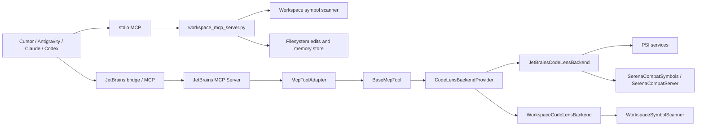

# CodeLens Architecture Audit

Date: 2026-03-27

## Scope

This report covers:

- current repository scaffolding
- major runtime paths and tool pipeline
- objective comparison against the Serena MCP baseline
- overengineering, duplication, and implementation-risk findings
- practical external-client readiness for Cursor and Antigravity

## Method

- Local code inspection of the Kotlin plugin, standalone Python server, tests, and plugin metadata
- Sequential thinking to break down architecture, duplication, and risk
- Context7 check against the MCP Python SDK for stdio client compatibility expectations
- Serena MCP attempt recorded as a compatibility constraint:
  - activating `codelens-mcp-plugin` in the current Serena session failed because the session was initialized with LSP while the project expects the JetBrains backend

## Folder Map

High-signal layout:

- `src/main/kotlin/com/codelens/backend`
  - backend contract and backend selection
- `src/main/kotlin/com/codelens/services`
  - JetBrains PSI-backed service layer
- `src/main/kotlin/com/codelens/tools`
  - tool implementations and tool profiles
- `src/main/kotlin/com/codelens/tools/adapters`
  - JetBrains `McpTool` wrapper layer
- `src/main/kotlin/com/codelens/serena`
  - Serena compatibility HTTP transport and symbol helpers
- `src/main/kotlin/com/codelens/plugin`
  - startup activity, actions, settings
- `src/main/resources/META-INF`
  - plugin metadata and MCP extension wiring
- `workspace_mcp_server.py`
  - standalone workspace MCP server
- `tests/test_workspace_mcp_server.py`
  - stdio MCP smoke and behavior tests for workspace mode
- `docs`
  - roadmap and superset planning

## Primary Runtime Paths

### 1. JetBrains-native path

1. External client connects to JetBrains MCP or the Serena compatibility bridge.
2. JetBrains MCP calls `McpToolAdapter`.
3. `McpToolAdapter` invokes a `BaseMcpTool`.
4. Tool chooses a backend through `CodeLensBackendProvider`.
5. JetBrains backend delegates to PSI services or Serena compatibility helpers.
6. Tool returns JSON payload.

### 2. Standalone workspace path

1. External client starts `workspace_mcp_server.py` over stdio.
2. Server handles `initialize`, `tools/list`, and `tools/call`.
3. Tool handlers operate directly on the filesystem.
4. Symbol/refactoring behavior comes from regex and declaration-range scanning.
5. Structured response is returned over stdio.

## Architecture Summary

### Core components

- `CodeLensBackend`
  - shared capability contract between JetBrains and workspace modes
- `JetBrainsCodeLensBackend`
  - PSI-native behavior and IDE services
- `WorkspaceCodeLensBackend`
  - filesystem-based degraded fallback
- `ToolRegistry`
  - canonical Kotlin-side list of tool implementations
- `CodeLensMcpToolsProvider`
  - JetBrains MCP integration layer
- `SerenaCompatServer`
  - additional HTTP transport for Serena-style compatibility
- `workspace_mcp_server.py`
  - independent stdio MCP server for external clients without JetBrains

### Major strengths

- backend split exists and is already useful
- Serena baseline contract is explicitly modeled
- workspace mode can run without JetBrains
- JetBrains mode exposes IDE-native capabilities Serena does not provide directly

## Diagram

## Objective Comparison With Serena MCP

| Area | Serena MCP | CodeLens now | Assessment |
| --- | --- | --- | --- |
| Symbol tools baseline | Mature | Mostly matched | Near parity |
| JetBrains-native IDE ops | Separate paid plugin path | Built in | CodeLens advantage |
| Standalone no-IDE mode | Mature LSP route | Present, degraded | Serena advantage |
| Language breadth | Stronger | Java/Kotlin strongest, others partial | Serena advantage |
| One-product dual backend | No single repo for both modes | Yes | CodeLens advantage |
| Architectural simplicity | Lower transport duplication | More duplicated paths | Serena advantage |

## Findings

### F1. Tool registration is duplicated in two manual lists

Files:

- `src/main/kotlin/com/codelens/tools/ToolRegistry.kt`
- `src/main/kotlin/com/codelens/tools/adapters/CodeLensMcpToolsProvider.kt`

Problem:

- tool ordering and membership are maintained twice
- drift risk is real when tools are added, removed, or renamed

Impact:

- a tool can exist in one transport path and silently disappear from another

Recommendation:

- generate adapter instances from `ToolRegistry`
- keep a single source of truth for tool membership

### F2. Workspace behavior is duplicated across Kotlin and Python

Files:

- `workspace_mcp_server.py`
- `src/main/kotlin/com/codelens/backend/workspace/WorkspaceCodeLensBackend.kt`
- `src/main/kotlin/com/codelens/backend/workspace/WorkspaceSymbolScanner.kt`

Problem:

- symbol finding, references, rename heuristics, type hierarchy fallback, searchable extensions, profile constants, and onboarding expectations are duplicated

Impact:

- bug fixes will drift
- workspace behavior can diverge depending on transport

Recommendation:

- move workspace semantics into one shared engine or one generated contract layer
- short term: centralize duplicated constants and profile definitions first

### F3. Several files are already god modules

Current large files:

- `workspace_mcp_server.py` — 1323 lines
- `WorkspaceSymbolScanner.kt` — 709 lines
- `SerenaCompatSymbols.kt` — 673 lines
- `tests/test_workspace_mcp_server.py` — 582 lines

Problem:

- the main standalone server mixes transport, config, symbol scan, edit logic, and protocol handling

Impact:

- hard to reason about regressions
- strong signal of AI-style accumulation instead of clear boundaries

Recommendation:

- split `workspace_mcp_server.py` into:
  - protocol/transport
  - workspace config
  - symbol scan and edits
  - memory/file tools

### F4. Support messaging is slightly ahead of implementation

Examples:

- README says Python/JS/Go adapters are planned, but `PythonLanguageAdapter.kt` already exists as a placeholder that always returns `supports = false`
- comparison claims such as "All JetBrains" language support are directionally true for IDE presence, but not for equal feature depth

Impact:

- users may overestimate non-Java/Kotlin quality

Recommendation:

- label these paths as `placeholder`, `partial`, or `degraded`

### F5. One-class-per-adapter wrapper layer is mostly boilerplate

Files:

- `src/main/kotlin/com/codelens/tools/adapters/*`

Problem:

- dozens of files exist only to delegate `McpTool by McpToolAdapter(SomeTool())`

Impact:

- high file count with low information density
- maintainability cost without much product value

Recommendation:

- use a small generated adapter layer or provider-based factory

### F6. Serena integration path is fragmented

Observation:

- Kotlin plugin exposes Serena-compatible tools
- separate HTTP Serena compatibility server exists
- standalone Python server exposes a Serena-like surface
- direct Serena project activation in this session failed because backend expectations were mismatched

Impact:

- "Serena-compatible" is real, but not yet a single coherent compatibility story

Recommendation:

- define compatibility levels explicitly:
  - Serena baseline
  - CodeLens workspace
  - CodeLens JetBrains

## Where overdesign should be reduced first

Do these before adding new language adapters or new transports:

1. unify tool membership into one registry
2. unify standalone/workspace constants
3. split `workspace_mcp_server.py` by responsibility
4. trim wrapper classes in `tools/adapters`

Do not add:

- another backend type
- another parallel compatibility transport
- more placeholder language adapters

until those reductions are done.

## External Client Readiness

### Cursor

Status: usable now

Why:

- stdio MCP server exists
- project-local and global config examples are straightforward
- workspace root can be passed explicitly

Confidence: high

### Antigravity

Status: usable with caveats

Why:

- stdio MCP server exists
- cwd fallback was added, which helps clients that start the process in the project root
- explicit `--workspace-root` still works when cwd is not reliable

Caveat:

- some MCP client implementations do not fully support the whole protocol surface

Confidence: medium

## Concrete Reduction Plan

### Phase A

- make `ToolRegistry` the only source of truth
- derive `CodeLensMcpToolsProvider` from it
- move shared profile constants out of Python and Kotlin duplication

### Phase B

- split workspace standalone server into smaller modules
- isolate protocol framing from symbol semantics

### Phase C

- remove or generate one-line adapter wrappers
- document true support levels per backend and language

### Phase D

- only after A-C, improve standalone precision or add language breadth

## Bottom Line

CodeLens is already credible as a Serena superset in one specific sense:

- Serena-style semantic tools
- plus JetBrains IDE-native operating capabilities
- plus a standalone fallback in the same product

CodeLens is not yet a clean superset in engineering quality:

- there is too much duplicated transport and workspace logic
- standalone and JetBrains compatibility paths are not yet unified enough
- several modules have already grown into god files

The next highest-value work is reduction, not expansion.
