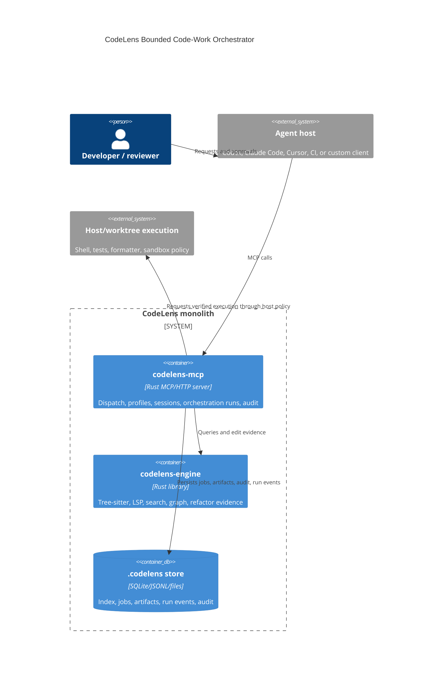
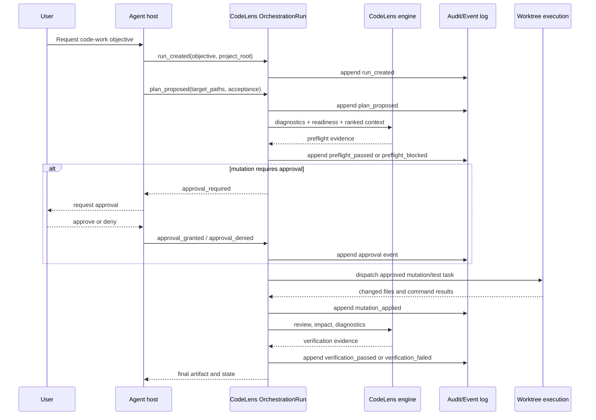

# ADR-0014: Bounded Code-Work Orchestrator Direction

## Status

Accepted

## Date

2026-05-09

## Context

ADR-0005 intentionally positioned CodeLens as a harness substrate, not an
orchestrator. That was the right simplification while the project was closing
runtime truth, tool-surface governance, mutation gates, and role-scoped HTTP
deployment. The product direction has now changed: CodeLens should expand from
"code intelligence MCP server" into a bounded orchestrator for code-work
planning, dispatch, verification, and audit.

Current external systems point in the same direction, but with different
boundaries:

- Serena remains closest to CodeLens on code intelligence. It is an MCP toolkit
  for semantic retrieval/editing, backed by LSP or JetBrains, while an external
  LLM/client orchestrates the work.
- Hermes Agent is closer to a full agent runtime: it owns the agent loop,
  prompt assembly, provider resolution, tool dispatch, session storage,
  messaging gateway, cron, skills, memory, approval, sandboxing, and MCP.
- OpenHands treats the agent server and workspace sandbox as first-class
  product surfaces; local, Docker, and remote workspaces share one API shape.
- OpenAI Agents SDK, LangGraph, Google ADK, and Microsoft Agent Framework all
  make orchestration explicit through managers, handoffs, workflow graphs,
  state, approvals, traces, durable execution, and evaluation hooks.

The important lesson is not "copy the largest framework." The durable pattern
is: production agent systems name the run, model the state machine, persist the
events, gate dangerous actions, and make ownership visible. CodeLens already
has many substrate pieces: role profiles, coordination claims, mutation gates,
audit logs, jobs, artifact handles, telemetry, and semantic code intelligence.
The missing product contract is the orchestrated run that ties those pieces
together.

## Decision

CodeLens will become a **bounded code-work orchestrator**.

This supersedes the narrow wording in ADR-0005 that CodeLens is "not an
orchestrator." The updated boundary is:

- CodeLens **does orchestrate** code-work runs: plan, preflight, dispatch,
  mutate, verify, review, audit, and summarize.
- CodeLens **does not become** a general chat agent, prompt marketplace,
  messaging gateway, full IDE, or generic LangGraph clone.
- CodeLens stays monolithic-first. The orchestrator is a module inside
  `codelens-mcp` over the existing engine, dispatch, job, artifact, session,
  coordination, mutation-gate, and audit services.
- New abstractions are allowed only where they remove duplication from the
  current workflow/audit/coordination surface. No new crate, daemon, A2A layer,
  or graph runtime is part of the MVP.

The product identity becomes:

> CodeLens is a code-intelligence engine plus a bounded orchestrator for
> agentic code-work runs.

## Orchestrator MVP

The MVP is one explicit run type:

```text
OrchestrationRun
  id
  project_root
  worktree
  requester
  objective
  mode: solo | planner_builder | ci_audit
  state
  role_bindings
  target_paths
  approvals
  artifacts
  audit_events
```

### States

The run state is an enum, not prose:

| State | Meaning |
| --- | --- |
| `drafted` | Request captured, no plan accepted |
| `planned` | Plan and target paths are available |
| `preflighted` | diagnostics/readiness/claims have been checked |
| `approval_required` | a gated action is waiting for approval |
| `executing` | mutation or delegated build work is running |
| `verifying` | tests, diagnostics, audits, or reviews are running |
| `completed` | acceptance checks passed and final artifact exists |
| `failed` | run stopped with an error or failed gate |
| `cancelled` | user or host cancelled the run |

### Events

Every state transition is driven by an append-only event:

| Event | From | To | Audit required |
| --- | --- | --- | --- |
| `run_created` | - | `drafted` | yes |
| `plan_proposed` | `drafted` | `planned` | yes |
| `preflight_passed` | `planned` | `preflighted` | yes |
| `preflight_blocked` | `planned` | `failed` | yes |
| `approval_requested` | `preflighted` | `approval_required` | yes |
| `approval_granted` | `approval_required` | `executing` | yes |
| `approval_denied` | `approval_required` | `cancelled` | yes |
| `task_dispatched` | `preflighted` | `executing` | yes |
| `mutation_applied` | `executing` | `verifying` | yes |
| `verification_passed` | `verifying` | `completed` | yes |
| `verification_failed` | `verifying` | `failed` | yes |
| `run_cancelled` | any active state | `cancelled` | yes |

The MVP may store these events in the existing `.codelens/audit/` tree. A
dedicated database table is deferred until multiple run readers need indexed
queries.

## Role-Based Permission Model

The first version uses existing profiles as the enforcement substrate and
documents the role/action/API mapping explicitly.

| Role | Screen / surface | Allowed actions | API/tools | Mutations |
| --- | --- | --- | --- | --- |
| Viewer | run summary, artifacts, audit | inspect only | reports, diagnostics, exported artifacts | never |
| Planner | plan, preflight, claims | create plan, run preflight, claim files | `prepare_harness_session`, `get_symbols_overview`, `get_file_diagnostics`, `verify_change_readiness`, `register_agent_work`, `claim_files` | never |
| Builder | execution lane | apply approved changes, run focused tests | mutation tools already gated by `verify_change_readiness`; command/test tools by host policy | only after approval/preflight |
| Reviewer | verification lane | review diff, audits, tests | `review_changes`, `audit_builder_session`, `audit_planner_session`, `impact_report` | never |
| Admin | operation lane | cancel run, override stale claims, configure policy | session/admin/configuration tools | policy-controlled |

Any action that changes files, approvals, claims, role bindings, run state,
policy, or stored artifacts must emit an audit event. Audit is fail-closed for
orchestrated runs: if the event cannot be recorded, the action must not proceed.

## Data Ownership

Ownership is intentionally boring:

- `project_root` owns code index data, project memories, project-local audit,
  artifacts, and run event logs.
- `worktree` owns mutable file state and test execution side effects.
- `OrchestrationRun` owns plan, target paths, approvals, claims, artifact
  handles, state, and event timeline.
- The host owns user chat, model choice, credentials, UI presentation, and any
  cross-project workflow policy unless explicitly delegated later.
- Global/user memory remains out of the orchestrator MVP. Importing Hermes- or
  Serena-style global memory into the run state is deferred until there is a
  concrete multi-project use case.

## C4 Diagram



## Dynamic Flow



## Implementation Phases

### Phase 0: Contract only

- Land this ADR and update architecture docs.
- Keep existing runtime behavior unchanged.
- Treat every orchestrator claim as future-facing unless a tool already exists.

### Phase 1: Dry-run orchestration

- Initial implementation: `orchestrate_change` is a read-only workflow entry
  point that creates a run plan, target-path list, readiness evidence, audit
  timeline, role bindings, approval boundary, and evidence handles.
- No file mutation.
- Reuse `prepare_harness_session`, diagnostics, `verify_change_readiness`,
  `claim_files`, jobs, artifacts, and existing audit stores.

### Phase 2: Approved execution

- Initial implementation: `orchestrate_change` accepts an approval decision and
  records `approval_requested`, `approval_granted`, or `approval_denied` events.
- Mutation calls that opt into orchestration with `orchestration_run_id` are
  rejected unless the run has a fresh recorded approval covering the mutation
  target path.
- Mutation success appends `mutation_applied` to the run audit timeline; verifier
  calls with the same `orchestration_run_id` append `verification_passed` or
  `verification_failed`.
- Wrap existing mutation tools; do not rewrite refactor engines.
- Require `mutation_applied` and `verification_*` events before completion.

### Phase 3: Durable/resumable runs

- Add indexed run lookup, resume/cancel APIs, event replay, and UI-ready run
  summaries after Phase 1/2 show repeated use.
- Consider a database-backed event store only after JSONL/file-backed events
  become a bottleneck.

## Rejected / Deferred

- **Full agent runtime like Hermes.** Rejected for MVP. CodeLens does not need
  provider selection, messaging gateways, cron delivery, global personality, or
  self-writing skills to orchestrate code changes.
- **LangGraph clone.** Rejected. The MVP needs one typed state machine, not an
  arbitrary graph runtime.
- **A2A-first product.** Deferred. Existing MCP/HTTP and handoff artifacts are
  enough until cross-product agent-to-agent routing has a concrete buyer.
- **New orchestrator crate.** Rejected. The initial version must stay inside
  `codelens-mcp` and prove duplicate removal before extraction.
- **Global memory productization.** Deferred. Keep project/run ownership clear
  before adding user-level memory semantics.

## References

- ADR-0005: Harness v2 — CodeLens as shared substrate for role-specialized agent hosts
- ADR-0008: Serena upper-compatible absorption
- ADR-0009: Mutation Trust Substrate
- ADR-0011: Control-Plane Sprawl Resolution
- `docs/multi-agent-integration.md`
- `docs/serena-comparison.md`
- Serena: `https://github.com/oraios/serena`
- Serena memories/workflow docs: `https://oraios.github.io/serena/02-usage/045_memories.html`, `https://oraios.github.io/serena/02-usage/040_workflow.html`
- Hermes Agent architecture/security/MCP docs: `https://hermes-agent.nousresearch.com/docs/developer-guide/architecture`, `https://hermes-agent.nousresearch.com/docs/user-guide/security`, `https://hermes-agent.nousresearch.com/docs/user-guide/features/mcp`
- OpenHands agent-server and sandbox docs: `https://docs.openhands.dev/sdk/guides/agent-server/overview`, `https://docs.openhands.dev/openhands/usage/sandboxes/overview`
- OpenAI Agents SDK orchestration/tracing docs: `https://openai.github.io/openai-agents-python/multi_agent/`, `https://openai.github.io/openai-agents-python/tracing/`
- LangGraph overview/durable execution docs: `https://docs.langchain.com/oss/python/langgraph/overview`, `https://docs.langchain.com/oss/python/langgraph/durable-execution`
- Google ADK overview/workflow agents docs: `https://adk.dev/get-started/about/`, `https://adk.dev/agents/workflow-agents/`
- Microsoft Agent Framework overview/orchestration docs: `https://learn.microsoft.com/en-us/agent-framework/overview/`, `https://learn.microsoft.com/en-us/agent-framework/workflows/orchestrations/`
