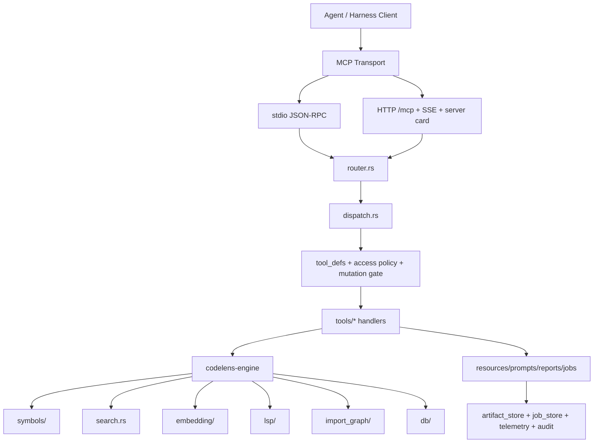

# CodeLens Architecture Audit (2026-04-12)

## 1. Scope And Method

This report analyzes the current repository shape from four evidence sources:

- local code and file structure in this repository
- CodeLens self-describing MCP resources such as `codelens://project/overview` and `codelens://project/architecture`
- official MCP documentation via Context7
- Serena public documentation and repository docs

Important boundary:

- Serena MCP itself was **not available** in this session, so the Serena comparison is based on Serena's public docs and repository-level architecture, not a live Serena server run.

## 2. Executive Verdict

CodeLens has a strong macro-architecture:

- `codelens-engine` is the code-intelligence data plane
- `codelens-mcp` is the harness-facing control plane
- the repo also contains a serious benchmark, evaluation, and model pipeline

The main weakness is not the absence of features. The main weakness is **concentration and drift**:

- too much behavior is packed into a few oversized modules
- some registries are duplicated across crates
- a few runtime facts are easy to confuse, especially `registered tools` vs `active visible surface`
- query preprocessing and retrieval policy are effective, but too concentrated inside one large MCP tool file

Current honest product position:

- stronger than Serena on harness-oriented bounded workflows
- weaker than Serena on deep IDE-style semantic editing and memory centrality
- not yet a strict superset

## 3. Current Folder Scaffolding

### 3.1 Top-Level Shape

```text
codelens-mcp-plugin/
├── crates/
│   ├── codelens-engine/      # tree-sitter/LSP/search/graph/embedding core
│   └── codelens-mcp/         # MCP transport/runtime/tool surface/policy layer
├── benchmarks/               # token/runtime/quality evaluation harnesses
├── docs/                     # public architecture, setup, benchmark, release docs
├── scripts/finetune/         # embedding training, compression, promotion gate
├── models/                   # bundled or candidate model assets
├── hooks/                    # agent/runtime hooks
├── skills/                   # local skill packaging
├── agents/                   # agent-facing project contracts
└── .codelens/                # runtime memories/audit/index state
```

### 3.2 Core Rust Crates

```text
crates/codelens-engine/src/
├── db/               # SQLite, FTS, vec storage, migrations
├── embedding/        # ONNX/fastembed runtime and embedding pipeline
├── file_ops/         # file read/write helpers
├── import_graph/     # graph, blast radius, dead code, import resolution
├── lsp/              # LSP recipes, session pool, protocol
├── symbols/          # parsing, ranking, cached retrieval
├── search.rs         # hybrid exact/FTS/fuzzy/semantic search
├── project.rs        # root detection and workspace package discovery
└── lib.rs            # public engine exports

crates/codelens-mcp/src/
├── server/           # stdio + streamable HTTP transport
├── tool_defs/        # tool registry, presets, profiles, schemas
├── tools/            # concrete tool handlers and workflow reports
├── state.rs          # AppState and runtime project/session machinery
├── dispatch.rs       # tool-call normalization, routing, mutation gate hookup
├── resources.rs      # MCP resources
├── prompts.rs        # MCP prompts
└── main.rs           # startup, project resolution, mode selection
```

## 4. Main Runtime Flows

### 4.1 Startup Flow

1. `main.rs` parses CLI flags and environment-backed project roots.
2. It resolves the startup project in priority order: explicit CLI path, `CLAUDE_PROJECT_DIR`, `MCP_PROJECT_DIR`, then cwd.
3. It builds `AppState`, selects a surface/profile/budget, and then chooses one of:
   - one-shot mode
   - stdio JSON-RPC mode
   - HTTP Streamable MCP mode

Key files:

- [`crates/codelens-mcp/src/main.rs`](../crates/codelens-mcp/src/main.rs)
- [`crates/codelens-mcp/src/state.rs`](../crates/codelens-mcp/src/state.rs)

### 4.2 Transport Flow

HTTP transport exposes:

- `POST /mcp` for JSON-RPC requests
- `GET /mcp` for SSE server push
- `DELETE /mcp` for session termination
- `GET /.well-known/mcp.json` for server card metadata

Stdio transport keeps a simpler JSON-RPC loop for local attachment.

Key files:

- [`crates/codelens-mcp/src/server/transport_http.rs`](../crates/codelens-mcp/src/server/transport_http.rs)
- [`crates/codelens-mcp/src/server/transport_stdio.rs`](../crates/codelens-mcp/src/server/transport_stdio.rs)
- [`crates/codelens-mcp/src/server/router.rs`](../crates/codelens-mcp/src/server/router.rs)

### 4.3 Request Routing Flow

1. transport parses JSON-RPC
2. `router.rs` dispatches `initialize`, `tools/list`, `tools/call`, `resources/*`, `prompts/*`
3. `dispatch.rs` normalizes the tool envelope
4. access control and mutation-gate checks run
5. the concrete handler in `tools/*` executes
6. `dispatch_response.rs` shapes bounded output

Key files:

- [`crates/codelens-mcp/src/server/router.rs`](../crates/codelens-mcp/src/server/router.rs)
- [`crates/codelens-mcp/src/dispatch.rs`](../crates/codelens-mcp/src/dispatch.rs)
- [`crates/codelens-mcp/src/dispatch_response.rs`](../crates/codelens-mcp/src/dispatch_response.rs)

### 4.4 Retrieval Flow

There are two major retrieval lanes:

- structural/hybrid search through `SymbolIndex` + SQLite + ranking
- semantic retrieval through embedding index plus hybrid merge

For agent-facing context retrieval, the main path is:

1. `tools/symbols.rs` analyzes the query
2. it generates semantic and expanded retrieval forms
3. it calls engine ranking/search methods
4. engine readers collect candidates and prune to budget
5. MCP layer returns a bounded `RankedContextResult`

Key files:

- [`crates/codelens-mcp/src/tools/symbols.rs`](../crates/codelens-mcp/src/tools/symbols.rs)
- [`crates/codelens-engine/src/symbols/mod.rs`](../crates/codelens-engine/src/symbols/mod.rs)
- [`crates/codelens-engine/src/symbols/reader.rs`](../crates/codelens-engine/src/symbols/reader.rs)
- [`crates/codelens-engine/src/search.rs`](../crates/codelens-engine/src/search.rs)
- [`crates/codelens-engine/src/embedding/mod.rs`](../crates/codelens-engine/src/embedding/mod.rs)

### 4.5 Mutation And Safety Flow

Code mutation is not a plain edit surface. It is a policy surface:

1. the caller asks for `verify_change_readiness` or a related preview-first report
2. `mutation_gate.rs` validates freshness and target alignment
3. only then are content mutations allowed in the gated profile
4. audit metadata is written for mutation tracing

Key files:

- [`crates/codelens-mcp/src/mutation_gate.rs`](../crates/codelens-mcp/src/mutation_gate.rs)
- [`crates/codelens-mcp/src/mutation_audit.rs`](../crates/codelens-mcp/src/mutation_audit.rs)
- [`crates/codelens-mcp/src/tools/report_verifier.rs`](../crates/codelens-mcp/src/tools/report_verifier.rs)

### 4.6 Analysis Job Flow

For heavier workflow reports, the server supports durable analysis handles and jobs:

1. a report or job is started
2. artifacts and job lifecycle are persisted
3. clients poll job status or fetch one section only
4. bounded sections reduce prompt/context blow-up

Key files:

- [`crates/codelens-mcp/src/analysis_queue.rs`](../crates/codelens-mcp/src/analysis_queue.rs)
- [`crates/codelens-mcp/src/artifact_store.rs`](../crates/codelens-mcp/src/artifact_store.rs)
- [`crates/codelens-mcp/src/job_store.rs`](../crates/codelens-mcp/src/job_store.rs)

## 5. Architecture Diagram



## 6. Objective Comparison With Serena

### 6.1 Where CodeLens Is Stronger Today

- harness bootstrap discipline
- role/profile-based tool surfaces
- deferred and bounded context delivery
- durable workflow reports and section expansion
- bundled semantic retrieval with local benchmark culture
- fail-closed mutation gating

These are harness-layer strengths, not merely "more tools."

### 6.2 Where Serena Is Still Stronger

- IDE/LSP-centric semantic backend story
- memory as a more central product concept
- broader language-backend coverage and deeper semantic edit substrate

### 6.3 Honest Current Verdict

CodeLens is not yet a strict Serena superset.

The most accurate framing remains:

- **CodeLens**: harness-native context compression, workflow orchestration, gated mutation
- **Serena**: semantic backend with stronger IDE-grade edit depth

This matches the current public comparison in [docs/serena-comparison.md](serena-comparison.md).

## 7. AI-Like Overdesign / Drift Signals

### 7.1 Oversized Modules

These file sizes are the clearest concentration signal in the current codebase:

| File | Lines | Risk |
| --- | ---: | --- |
| `crates/codelens-engine/src/embedding/mod.rs` | 4308 | semantic runtime, prompt shaping, storage, and tests are too concentrated |
| `crates/codelens-mcp/src/state.rs` | 1539 | AppState is effectively a God object |
| `crates/codelens-mcp/src/tools/symbols.rs` | 1438 | query analysis, semantic priors, formatting, and handler logic are mixed |
| `crates/codelens-mcp/src/dispatch.rs` | 974 | dispatch + semantic handlers + response policy concentration |
| `crates/codelens-mcp/src/tools/mod.rs` | 664 | dispatch table, LSP defaults, phase routing, and suggestion logic are mixed |
| `crates/codelens-engine/src/symbols/mod.rs` | 612 | public API plus retrieval logic concentration |

The issue is not that any one file is "bad." The issue is that a few files now carry too many responsibilities, which raises maintenance cost and makes AI-generated accretion harder to detect.

### 7.2 Duplicated LSP Registry Logic

There is a concrete drift risk between:

- [`crates/codelens-engine/src/lsp/registry.rs`](../crates/codelens-engine/src/lsp/registry.rs)
- [`crates/codelens-mcp/src/tools/mod.rs`](../crates/codelens-mcp/src/tools/mod.rs)

The engine already has authoritative LSP recipes.
The MCP layer still carries its own extension-to-command and command-to-args mappings.

That is exactly the kind of duplication that looks convenient in the short term and becomes silent inconsistency later.

### 7.3 Candidate Fan-Out Duplication

There are two similar candidate collection functions:

- `select_solve_symbols` in engine `symbols/mod.rs`
- `select_solve_symbols_cached` in engine `symbols/reader.rs`

They are not identical, but they are close enough that future retrieval behavior can drift between cached and non-cached paths.

### 7.4 Query Analysis Concentration

`crates/codelens-mcp/src/tools/symbols.rs` currently owns:

- lexical-vs-natural-language detection
- identifier splitting
- query expansion
- semantic priors
- response shaping and tests

The behavior is useful, but the structure is too monolithic. It needs a dedicated `query_analysis` boundary or equivalent extraction.

### 7.5 Tool Inventory vs Active Surface Confusion

The repo has more than one "tool count" truth:

- `91` registered `Tool::new(...)` definitions in source
- `26` visible tools in the current `builder-minimal` runtime surface

Both facts can be true at once, but docs must say which one they mean.

### 7.6 Local Drift Already Visible In The Worktree

Current worktree state includes uncommitted code changes outside this report:

- modified: `crates/codelens-mcp/src/tools/composite.rs`
- modified: `crates/codelens-mcp/src/tools/mod.rs`
- modified: `crates/codelens-mcp/src/tools/symbols.rs`
- untracked: `crates/codelens-engine/src/semantic_backend.rs`

That is not automatically wrong, but it is a real integration risk and should be intentionally triaged before a broad merge.

## 8. Concrete Error Risks

### 8.1 Dependency Version Drift

Before this audit, [`crates/codelens-mcp/Cargo.toml`](../crates/codelens-mcp/Cargo.toml) pinned:

```toml
codelens-engine = { path = "../codelens-engine", version = "1.4.0" }
```

while the workspace itself is `1.6.4`.

This was a real drift smell. The path dependency now relies on the workspace/package definition only, which is the safer choice for this monorepo.

### 8.2 Broad Architecture Queries On Minimal Surface

The active `builder-minimal` surface intentionally hides some higher-level workflow tools.
That is good for token discipline, but it also means broad onboarding/architecture requests can get noisier or lose some richer analysis entrypoints unless the surface is switched first.

This is a tradeoff, not necessarily a bug, but docs should describe it explicitly.

### 8.3 Documentation Drift

`docs/architecture.md` previously mixed stable product facts with runtime-session facts.
That made it easy to confuse:

- total registered tools
- current visible surface
- historical LOC/test counts

This audit separates those concepts more explicitly.

## 9. What Should Stay

These parts are directionally correct and should remain core:

- two-crate split: engine vs MCP runtime
- fail-closed mutation gate
- durable report/job abstraction
- transport duality: stdio fallback plus HTTP as the preferred harness mode
- benchmark-first culture around retrieval and token efficiency
- resource/prompt layer on top of primitive tools

The right move is simplification inside the existing architecture, not a ground-up rewrite.

## 10. Highest-Value Simplification Order

1. **Single-source the LSP registry**
   - remove MCP-local command/args duplication
   - derive CLI defaults from engine recipes

2. **Extract AppState responsibilities**
   - split project runtime context, session/runtime metrics, and watcher maintenance from `state.rs`

3. **Split query analysis from symbol handlers**
   - move lexical/NL detection and identifier/query expansion into a smaller dedicated module

4. **Unify candidate fan-out logic**
   - make cached and non-cached retrieval share one candidate selection algorithm

5. **Split embedding runtime by responsibility**
   - runtime/bootstrap
   - text preparation/query shaping
   - vector storage/index operations
   - benchmark/debug utilities

## 11. Recommended Next Change

The safest structural follow-up is not a giant refactor.
It is:

- extract a single authoritative LSP default source
- then extract the smallest AppState slice with the lowest blast radius

That reduces silent drift first, before moving on to larger file splits.
