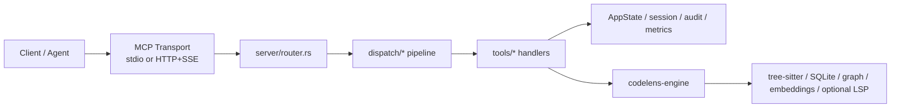
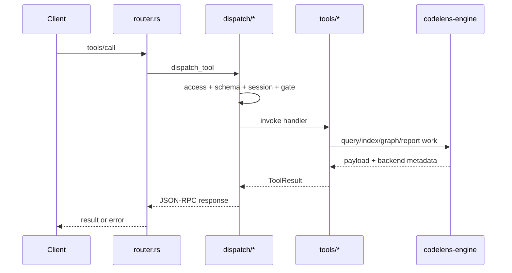

# CodeLens Architecture Audit

Date: 2026-04-24

## Executive Summary

Verdict: **partially product-usable, not yet general-release clean**.

- Read-only MCP daemon flows are usable now.
- The harness-native workflow shape is coherent.
- The call-graph subsystem still fails a small external correctness gate, so the product is **not yet honest to release as a generally reliable cross-repo caller/callee engine**.
- The biggest non-functional problem is not one bug. It is **control-plane sprawl**: too many surface-policy branches, too many large modules, and too much duplicated presentation logic.

This audit treats “AI-like overengineering” as a concrete engineering smell:

- control logic spread across multiple files without a single source of truth
- thin delegation layers that add no policy value
- giant files that mix runtime, documentation, and product-policy concerns
- harness helpers that accumulate unrelated responsibilities

One concrete simplification was applied in this pass:

- `tools/list` and `codelens://tools/list*` now share the same listing filter logic for deprecated/phase filtering, instead of diverging counts across the protocol and resource surfaces.

## Product Readiness

### What is genuinely usable

- HTTP daemon mode with role-specific surfaces
- deferred `tools/list` workflow for bounded agents
- session-aware resources like `codelens://session/http`
- review-oriented graph/symbol/report workflows
- harness evaluation and release-quality benchmarking scaffolding

### What is not yet strong enough

- general-purpose call graph accuracy across mixed Rust/TS repositories
- architecture control plane simplicity
- documentation freshness and internal consistency across all generated/manual docs
- benchmark helper modularity

### Release recommendation

- Release as a **harness-native MCP server for bounded review/build workflows**: reasonable.
- Release as a **generic high-confidence code intelligence engine across arbitrary repos**: not yet.

## Objective Evidence

### Local runtime verification

Actual daemon smoke was already validated against live HTTP MCP calls:

- `initialize`
- `tools/list`
- `resources/read codelens://session/http`
- `prepare_harness_session`
- `find_symbol`
- `get_callers`
- `get_callees`

Observed working operational shape:

- `:7839` read-only daemon, `reviewer-graph`
- `:7838` mutation-enabled daemon, `refactor-full`

### Release-vs-candidate call-graph benchmark

Dataset: `benchmarks/call-graph-quality-dataset.json`

| Metric | v1.9.57 baseline | current candidate | delta |
| --- | ---: | ---: | ---: |
| `edge_recall_at_k` | `0.1818` | `0.4545` | `+0.2727` |
| `mrr_first_expected_edge` | `0.2500` | `0.7500` | `+0.5000` |
| `avg_elapsed_ms` | `292.15` | `298.63` | `+6.48` |
| `p95_elapsed_ms` | `1289` | `1254` | `-35` |
| `confidence_honesty_failure_count` | `0` | `0` | `flat` |
| `forbidden_high_confidence_failure_count` | `0` | `0` | `flat` |
| failed rows | `3` | `2` | `improved` |
| quality gate | `fail` | `fail` | `still fail` |

Interpretation:

- The candidate is materially better than the last release on this thin benchmark.
- It is still not good enough to claim broad call-graph reliability.
- The remaining misses are structural, not cosmetic.

### Still-failing benchmark rows

- `self-rust-handle-request-callees`
- `claw-dev-main-callees`

These failures matter because they represent the exact class of problem the user called out: **범용 코드베이스 호출관계 포착 실패**.

## External Reference Comparison

The strongest current references still converge on the same pattern: **clearer runtime boundaries and a smaller control plane**.

- [OpenHands SDK architecture](https://docs.openhands.dev/sdk/arch/overview)
  - local and production/sandboxed modes are separated explicitly
  - the same agent code switches workspace/runtime instead of growing a second orchestration layer
- [OpenHands remote agent server overview](https://docs.openhands.dev/sdk/guides/agent-server/overview)
  - local-to-remote transition is workspace substitution, not architecture duplication
- [OpenAI Codex repository](https://github.com/openai/codex)
  - the product is framed as a local coding agent with explicit sandbox/approval controls, not a thick policy compiler
- [MCP roots spec](https://modelcontextprotocol.io/specification/2025-06-18/client/roots)
  - roots is a client capability with `listChanged`, not a vague server-managed abstraction
- [MCP progress spec](https://modelcontextprotocol.io/specification/2025-11-25/basic/utilities/progress)
  - request-scoped `progressToken` and `notifications/progress` keep async tracking thin
- [MCP tasks spec](https://modelcontextprotocol.io/specification/2025-11-25/basic/utilities/tasks)
  - tasks are still experimental; runtime advertisement should follow actual support, not aspiration
- [official Rust MCP SDK](https://github.com/modelcontextprotocol/rust-sdk)
  - tools/resources/prompts/transport are kept close to the protocol rather than hidden behind extra product layers

Inference from these references:

- good systems separate runtime execution from UI/control concerns
- capability advertisement follows real runtime support
- transport, progress, and roots stay protocol-native
- “more layers” is not treated as an architectural win by default

## Current Folder Scaffold

### High-signal directories

- `crates/codelens-engine`
  - indexing, ranking, DB, call graph, language support, embeddings
- `crates/codelens-mcp`
  - MCP server, transport, dispatch, tool registry, session/resource surfaces
- `benchmarks`
  - retrieval/runtime/call-graph/harness evaluation scripts
- `docs`
  - architecture, ADRs, release notes, plans, generated manifests
- `.codelens`
  - runtime indexes, caches, audit artifacts, reports

### Noise / maturity drag

- `target/`
- `.venv/`
- `models/.venv/`
- `checkpoints/`
- `scripts/finetune/`

These directories are understandable in a working repo, but they overwhelm source scanning. For product maturity, they should not dominate the first visual impression of the repository.

## Main Runtime Pipeline

### Dynamic request flow

## Architecture Summary

### Healthy parts

- dispatch pipeline is stage-oriented and mostly understandable
- role/profile-based surfaces are operationally useful
- HTTP session model is real, not mock architecture
- recent roots/progress alignment work moved the server closer to MCP-native behavior

### Structural liabilities

#### 1. God modules

- [main.rs](/Users/bagjaeseog/codelens-mcp-plugin/crates/codelens-mcp/src/main.rs)
  - startup, CLI parsing, attach/detach/doctor, transport selection, tracing, surface manifest
- [tool_defs/presets.rs](/Users/bagjaeseog/codelens-mcp-plugin/crates/codelens-mcp/src/tool_defs/presets.rs)
  - profiles, presets, overlays, namespace mapping, preferred bootstrap policy, deprecations
- [surface_manifest.rs](/Users/bagjaeseog/codelens-mcp-plugin/crates/codelens-mcp/src/surface_manifest.rs)
  - runtime manifest assembly, docs-facing summaries, host adapters, surface statistics
- [benchmarks/harness/harness_runner_common.py](/Users/bagjaeseog/codelens-mcp-plugin/benchmarks/harness/harness_runner_common.py)
  - artifact I/O, repo resolution, prompt rendering, MCP HTTP, metrics/eval glue

#### 2. Thin delegation without policy value

- [session_host.rs](/Users/bagjaeseog/codelens-mcp-plugin/crates/codelens-mcp/src/state/session_host.rs)
  - mostly one-line forwarding into `session_runtime.rs`

This is not abstraction. It is indirection.

#### 3. Duplicated surface logic

- [server/router.rs](/Users/bagjaeseog/codelens-mcp-plugin/crates/codelens-mcp/src/server/router.rs)
- [resource_context.rs](/Users/bagjaeseog/codelens-mcp-plugin/crates/codelens-mcp/src/resource_context.rs)
- [resource_catalog.rs](/Users/bagjaeseog/codelens-mcp-plugin/crates/codelens-mcp/src/resource_catalog.rs)

The repo had two different tool-list presentation paths with different filtering semantics. This pass removed one concrete divergence, but the broader surface/policy logic is still too spread out.

#### 4. Oversized test modules

- [integration_tests/workflow.rs](/Users/bagjaeseog/codelens-mcp-plugin/crates/codelens-mcp/src/integration_tests/workflow.rs)
- [server/http_tests.rs](/Users/bagjaeseog/codelens-mcp-plugin/crates/codelens-mcp/src/server/http_tests.rs)

They are becoming integration-test warehouses. This slows fault localization and encourages accidental coupling.

## Error Risk / Misimplementation Risk

### High risk

- call-graph overclaims can still happen if fallback edges are not kept visibly low-confidence
- giant policy modules increase the chance that one surface change silently drifts another
- benchmark harness reuse/checkpoint logic is still dense enough to hide stale-run mistakes

### Medium risk

- docs can become stale because generated/manual surface descriptions are split
- session/audit/access policy is not yet normalized under a single access-class model
- product surface remains broader than what the current benchmark evidence justifies

### Lower risk but worth fixing

- top-level repo clutter makes real source boundaries harder to inspect
- some documentation still reads like a product catalog rather than an operational architecture spec

## Improvements Applied In This Pass

### Shared listing filter path

Changed files:

- [resource_context.rs](/Users/bagjaeseog/codelens-mcp-plugin/crates/codelens-mcp/src/resource_context.rs)
- [resource_catalog.rs](/Users/bagjaeseog/codelens-mcp-plugin/crates/codelens-mcp/src/resource_catalog.rs)
- [server/router.rs](/Users/bagjaeseog/codelens-mcp-plugin/crates/codelens-mcp/src/server/router.rs)
- [integration_tests/protocol.rs](/Users/bagjaeseog/codelens-mcp-plugin/crates/codelens-mcp/src/integration_tests/protocol.rs)

What changed:

- extracted shared listing filter logic for deprecated/phase-aware filtering
- `tools/list` now reuses `ResourceRequestContext` + `build_visible_tool_context`
- `codelens://tools/list` and `codelens://tools/list/full` now expose the same default visible count as `tools/list`
- added regression test for protocol/resource count parity

Why this matters:

- less duplicated control-plane logic
- lower drift risk between MCP method and resource surface
- tighter contract for hosts and harnesses

## Priority Order

### P1

1. Fix call-graph generalization before broad release claims.
   - Focus on inter-file callee resolution and cross-module symbol matching.
   - Do not benchmark-hack specific rows.
2. Collapse or sharply reduce [session_host.rs](/Users/bagjaeseog/codelens-mcp-plugin/crates/codelens-mcp/src/state/session_host.rs).
3. Split [tool_defs/presets.rs](/Users/bagjaeseog/codelens-mcp-plugin/crates/codelens-mcp/src/tool_defs/presets.rs) by:
   - surface membership
   - overlay compilation
   - namespace/phase metadata
   - deprecation metadata

### P2

1. Split [surface_manifest.rs](/Users/bagjaeseog/codelens-mcp-plugin/crates/codelens-mcp/src/surface_manifest.rs) into runtime manifest vs docs/export adapters.
2. Split [workflow.rs](/Users/bagjaeseog/codelens-mcp-plugin/crates/codelens-mcp/src/integration_tests/workflow.rs) and [http_tests.rs](/Users/bagjaeseog/codelens-mcp-plugin/crates/codelens-mcp/src/server/http_tests.rs) by subject area.
3. Split [harness_runner_common.py](/Users/bagjaeseog/codelens-mcp-plugin/benchmarks/harness/harness_runner_common.py) into only three modules:
   - artifact I/O
   - repo resolution
   - eval/metric helpers

### P3

1. Reduce repo-root noise in developer-facing documentation.
2. Refresh architecture docs so the scaffold description matches the real workspace members and runtime behavior.

## Bottom Line

CodeLens is no longer in “toy” territory.

But it is also not yet in the “trust it as a general code intelligence product” tier.

The honest status today is:

- **usable as a harness-native MCP product**
- **improving against the last release**
- **still overdesigned in the control plane**
- **still underperforming on general call-graph accuracy**

That means the next phase should optimize for:

1. smaller control plane
2. fewer policy duplication points
3. stronger cross-repo call-graph correctness
4. release claims that match measured capability
