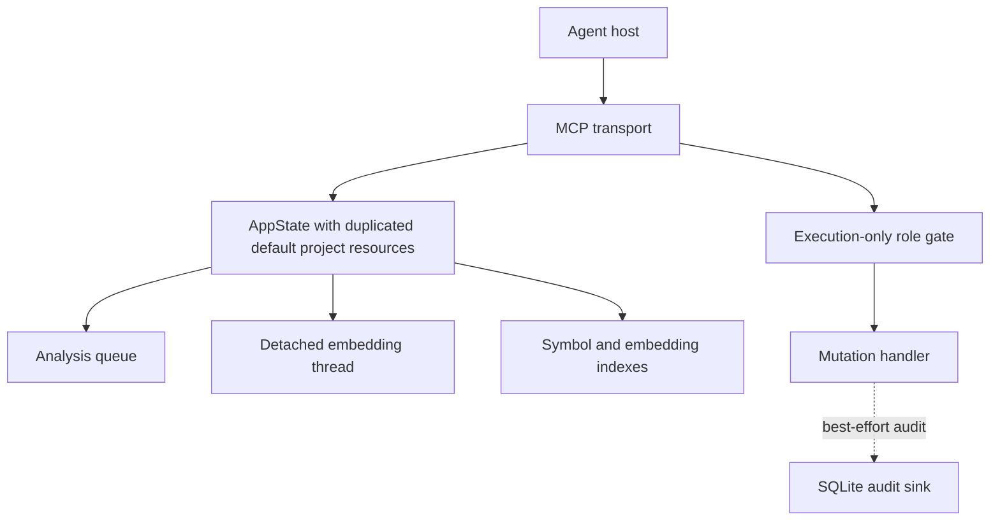
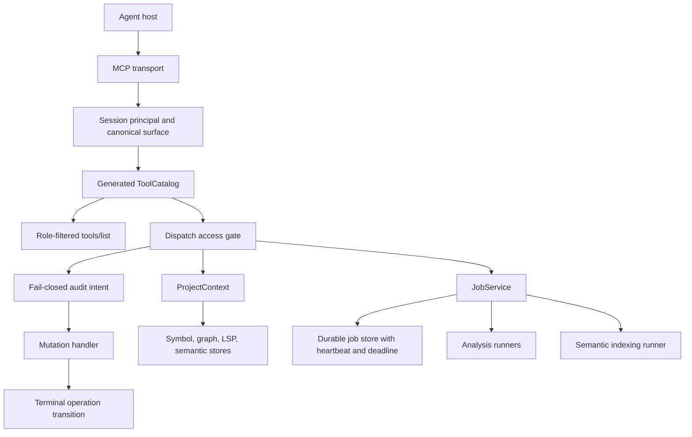
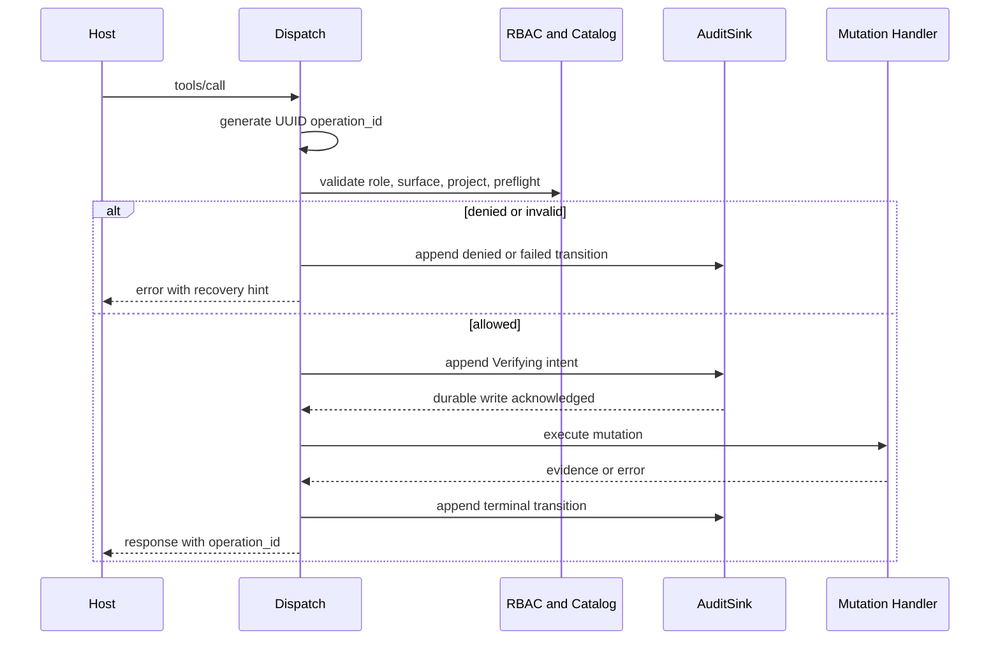
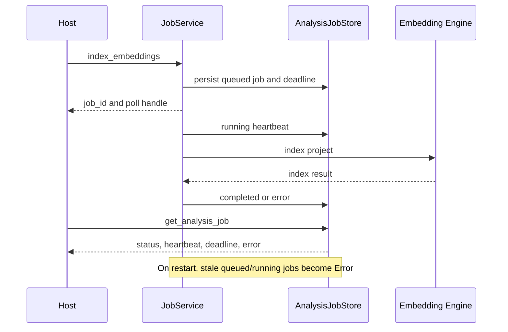

# Architecture Migration Roadmap

이 문서는 mutation 보안 경계, 프로젝트 상태, 장기 작업, 제품 tool surface를 단순화한 현재 구현 계약을 설명합니다. English summaries are included under each phase for host integrators.

## Runtime Contract

| Concern | Canonical implementation | Operational rule |
| --- | --- | --- |
| Tool catalog | `crates/codelens-mcp/tools.toml` plus generated metadata | Run `python3 scripts/regen-tool-defs.py --check --enforce-drift` |
| Mutation identity | One UUID `operation_id` per invocation | `transaction_id` is a deprecated response/query alias only |
| Mutation audit | SQLite intent and terminal transition rows | Audit open/write failure blocks mutation |
| RBAC | Project or user `principals.toml` | Mutation-capable runtime without a valid file resolves every principal to `ReadOnly` |
| Project state | `ProjectContext` | Request binding selects one context without copying project resources into `AppState` |
| Long jobs | `JobService` and `AnalysisJobStore` | Queue, semantic indexing, cancellation, heartbeat, deadline, and stale recovery share one lifecycle |
| Product surface | `readonly`, `review`, `builder` | Previous profile names remain deprecated input aliases until v2.0 |
| Experimental tools | `CODELENS_EXPERIMENTAL_FEATURES` | `secondary-projects`, `orchestration`, or `all` must be explicitly enabled |

`principals.toml` mappings are cached per project audit directory. After changing the file, restart the daemon. A malformed or missing mapping cannot be repaired through a mutation call because the runtime is already fail-closed.

## Phase 0: Immediate Risk Controls

- Mutation dispatch opens the audit sink and writes a `Verifying` intent before the handler runs.
- Audit open or intent-write failure returns an error before any content mutation.
- A UUID `operation_id` is generated once and reused by intent, denial, failure, terminal audit row, response, and orchestration event.
- `tools/list` is intersected with the authenticated principal role. Listing and execution use the same `_session_principal_id`.
- A mutation-capable runtime requires an operator-authored `principals.toml`; missing or malformed configuration resolves to `ReadOnly`.
- `scripts/runtime-snapshot.py` generates source HEAD/tree, disk binary SHA, live daemon SHA, and role-filtered tool counts.

English: mutation authorization and audit durability now form one fail-closed pre-execution boundary.

## Phase 1: Integrity Recovery

- Mutation classification moved from a Rust match list into the generated ToolCatalog metadata sourced from `tools.toml`.
- Audit records are validated in Rust and constrained by SQLite lifecycle domains.
- Audit schema v5 renames the physical `transaction_id` column and index to `operation_id`; only the request/response compatibility alias remains.
- Role denial, surface/access denial, parameter failure, preflight failure, handler failure, rollback, and success use the same operation log.
- Memory mutation responses expose both `scope` and `tier`; rename, archive, restore, and archived listing support project and global roots consistently.
- The legacy `transaction_id` query input and response field remain compatibility aliases for `operation_id`.

English: catalog, RBAC, audit, and memory ownership now use shared classifications instead of parallel string lists.

## Phase 2: State And Job Simplification

- `ProjectContext` owns project root, symbol index, graph cache, LSP pool, memory/analysis/audit directories, watcher, and watcher health.
- `AppState` holds one default context plus request-scoped/cached context references instead of eight duplicated default project fields.
- `JobService` is the only background queue for report analysis and semantic indexing.
- Jobs persist `heartbeat_at_ms`, `deadline_at_ms`, and `cancel_requested_at_ms`.
- Semantic indexing checks cancellation and deadline state at file and embedding-batch boundaries while refreshing its heartbeat.
- Startup converts stale queued/running jobs to `Error` with `worker interrupted` evidence instead of leaving them permanently active.
- `CODELENS_JOB_DEADLINE_SECS` defaults to 1800 seconds; `CODELENS_JOB_STALE_SECS` defaults to 300 seconds.
- `CODELENS_JOB_HEARTBEAT_SECS` defaults to 5 seconds for long semantic jobs.

English: project ownership is explicit and every durable background task follows one recoverable lifecycle.

## Phase 3: Product Surface Reduction

- Canonical profiles are `readonly`, `review`, and `builder`.
- `planner-readonly`, `reviewer-graph`, `builder-minimal`, `refactor-full`, `ci-audit`, `workflow-first`, and `evaluator-compact` are deprecated input aliases.
- Overlay details remain internal routing calculations; only canonical profile and selected guidance are product contracts.
- Secondary-project tools require `CODELENS_EXPERIMENTAL_FEATURES=secondary-projects`.
- Orchestration requires `CODELENS_EXPERIMENTAL_FEATURES=orchestration`.
- `index_embeddings` queues by default. `background:false` is the explicit synchronous compatibility path.

English: the public product has three role surfaces; research and orchestration capabilities no longer enlarge the default contract.

## C4 As-Is



## C4 To-Be



## Dynamic Flow: Mutation



## Dynamic Flow: Semantic Job



## Deployment Verification

```bash
cargo check --workspace --features http,semantic
cargo test -p codelens-engine
cargo test -p codelens-mcp --bin codelens-mcp --features http,semantic
python3 scripts/regen-tool-defs.py --check --enforce-drift
python3 scripts/surface-manifest.py --check
bash scripts/redeploy-daemons.sh --build --probe
python3 scripts/runtime-snapshot.py --write --check
```
