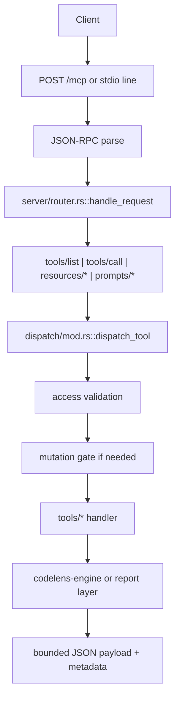
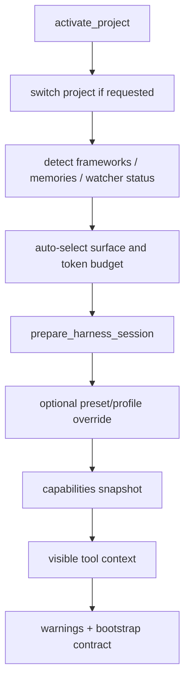

# CodeLens Architecture Review (2026-04-15)

## Scope

This report summarizes the current repository shape, main runtime flows, and the highest-signal simplification opportunities.

Evidence used:

- local repository inspection
- live CodeLens MCP analysis against this repository
- `cargo check`
- Anthropic official guidance and the Anthropic skills repository for current skill-structure patterns

Important boundary:

- Serena MCP was not available in this session, so live Serena execution was not possible
- Anthropic "Claude skill 2.0" is not exposed as a formal versioned spec in the sources consulted; the comparison below uses the current Anthropic skills guidance as the latest practical baseline

## Executive Summary

CodeLens is structurally sound at the top level.
The repository already has a clear control-plane / data-plane split:

- `codelens-engine` owns indexing, parsing, retrieval, graph analysis, LSP integration, and semantic infrastructure
- `codelens-mcp` owns transport, runtime state, tool exposure, policy, mutation safety, and analysis orchestration
- `codelens-tui` is a secondary presentation surface, not a third architecture center

The main weaknesses are not missing features.
The main weaknesses are concentration, wrapper accretion, and documentation drift:

1. a small number of files still carry too much behavior
2. some workflow entrypoints are thin aliases over lower-level tools
3. some guidance and snapshot metadata drift from the live runtime
4. at least one workflow (`diagnose_issues`) still has ambiguous file-vs-directory routing semantics

## Current Folder Scaffolding

```text
codelens-mcp-plugin/
├── crates/
│   ├── codelens-engine/       # parsing, index DB, search, graphs, LSP, embeddings
│   ├── codelens-mcp/          # MCP server, transport, runtime policy, reports
│   └── codelens-tui/          # terminal UI surface
├── docs/                      # architecture, ADRs, release notes, benchmarks
├── benchmarks/                # token, quality, and runtime evaluation
├── scripts/                   # install, doctor, training, release automation
├── models/                    # bundled model assets
├── hooks/                     # runtime/harness hooks
├── skills/                    # project-local skill packaging
├── agents/                    # agent-facing repo contracts
└── .codelens/                 # runtime state, memories, audit artifacts
```

## Architecture Summary

### 1. Top-level boundaries

- `codelens-engine` is the durable code-intelligence core.
- `codelens-mcp` is the harness-facing runtime and orchestration layer.
- `codelens-tui` is optional presentation infrastructure.

### 2. Runtime model

- startup resolves a project root from CLI path, environment, or cwd
- `AppState` assembles the active project, symbol index, graph cache, watcher, telemetry, session store, and analysis stores
- transport is selected as stdio, one-shot, or HTTP
- HTTP mode layers session management and deferred tool loading on top of the same tool dispatch path

### 3. Tool model

- primitive tools expose file, symbol, LSP, analysis, and mutation operations
- workflow tools are problem-first entrypoints that delegate into composite reports or primitive tools
- access is filtered by surface/profile, tier, namespace, daemon mode, and trust level
- refactor-capable mutation is gated by recent verifier evidence

## Main Runtime And API Flows

### HTTP endpoints

- `POST /mcp`
  - accepts JSON-RPC requests
  - validates and injects session context
  - dispatches synchronously through `handle_request`
  - creates or resumes a session on `initialize`
- `GET /mcp`
  - opens the persistent SSE stream
  - requires `Mcp-Session-Id`
  - stores a sender handle in session state for server push
- `DELETE /mcp`
  - terminates the session if present
- `GET /.well-known/mcp.json`
  - returns a server card for discovery and health-oriented metadata

### JSON-RPC flow



### Session/bootstrap flow



### Engine retrieval flow

- `SymbolIndex::get_ranked_context` is the central structural retrieval API
- structural candidates are ranked and pruned to budget
- semantic evidence can boost or supplement structural results
- import graph, scoped references, and LSP are separate precision lanes rather than one monolithic backend

## Objective Strengths

### Sound macro-architecture

- the engine/runtime split is clear and defensible
- mutation safety is encoded as runtime policy rather than just developer convention
- the repository has a serious evaluation culture: benchmarks, release notes, audit docs, and ADRs already exist

### Good harness-oriented behavior

- profile-based tool surfaces reduce agent overload
- HTTP mode supports long-lived multi-agent attachment
- analysis handles and jobs keep large reports bounded

### Strong local operability

- single Rust workspace
- `cargo check` passed during this review
- live project activation and symbol indexing worked against the repository itself

## Main Risks And Simplification Targets

### 1. Oversized hot files still exist

Largest current files include:

- `crates/codelens-engine/src/embedding/mod.rs` — 4709 LOC
- `crates/codelens-mcp/src/integration_tests/workflow.rs` — 3040 LOC
- `crates/codelens-mcp/src/dispatch/mod.rs` — 1077 LOC
- `crates/codelens-mcp/src/tools/symbols.rs` — 987 LOC
- `crates/codelens-mcp/src/state.rs` — 967 LOC

This is the clearest "AI accretion" signal in the repository.
The problem is not the existence of advanced behavior.
The problem is too much unrelated behavior landing in too few files.

### 2. Thin workflow alias layer

`crates/codelens-mcp/src/tools/workflows.rs` mostly delegates to existing report/composite handlers with light metadata wrapping.

This is not wrong by itself.
It becomes a maintenance smell when:

- the wrapper adds no new decision logic
- the wrapper duplicates input-shaping behavior already available in the delegated tool
- documentation has to explain both the wrapper and the underlying tool

Recommendation:

- keep workflow entrypoints that materially improve agent routing
- generate or collapse purely pass-through wrappers

### 3. Registry drift risk

The project already recognized "single-source registries" as an architectural need in ADR-0001.
This review confirmed one remaining example: user-facing LSP install guidance had drift risk because the authoritative LSP recipe registry lived in the engine, while MCP error messaging kept its own command mapping.

This review includes a code change to route install guidance through the engine registry.

### 4. Documentation drift

Before this review:

- `README.md` pointed to `v1.9.23` as the latest release notes
- `docs/architecture.md` still reported `1.9.14`, `101` tools, and `65 / 101` schemas

This is exactly the kind of drift that makes AI-generated architecture summaries look more reliable than they actually are.

### 5. Ambiguous problem-first routing

`diagnose_issues` currently treats `path` and `file_path` too similarly.
When a directory-like `path` is passed, it can route into file diagnostics and fail with an LSP-oriented error instead of giving a directory-scope diagnosis.

This should be treated as a real product bug:

- `file_path` should mean file diagnostics
- `path` should mean directory/module scope
- symbol-based unresolved-reference checks should remain symbol-aware

## Comparison Against Current Anthropic Skill Guidance

Current Anthropic skill guidance emphasizes:

- a single `SKILL.md` as the required root contract
- optional `scripts/`, `references/`, and `assets/` directories
- progressive disclosure so only relevant references are loaded

Sources:

- Anthropic Claude Code overview: <https://docs.anthropic.com/en/docs/claude-code/overview>
- Anthropic skills repository: <https://github.com/anthropics/skills>

What CodeLens is already doing well:

- repo-local instructions are explicit (`AGENTS.md`, `CLAUDE.md`)
- benchmark and release discipline is documented
- runtime policies are encoded, not just described

What should improve to better match a maintainable long-lived agent repo:

- keep `skills/` self-contained and progressive rather than mixing large policy text into multiple top-level docs
- treat `agents/`, `skills/`, and `docs/adr/` as distinct layers:
  - `agents/` for runtime behavior contracts
  - `skills/` for reusable task recipes
  - `docs/adr/` for architectural decisions
- avoid letting `CLAUDE.md` become a second architecture manual

## Recommended Improvement Roadmap

### Phase 1: remove drift and shallow duplication

- keep registry-derived install guidance single-source
- auto-generate architecture snapshot facts from source counts where practical
- make `diagnose_issues` explicitly separate file scope and directory scope

### Phase 2: shrink hot files without abstraction theater

- split `dispatch/mod.rs` by responsibility:
  - normalization
  - access/gating
  - execution
  - post-mutation side effects
- continue reducing `state.rs` by moving session/project helpers into focused modules
- keep `embedding/mod.rs` on a staged extraction plan rather than a one-shot rewrite

### Phase 3: thin the workflow layer

- identify wrappers that only rename another tool without adding decision logic
- convert them into generated metadata aliases or remove them from the primary path
- keep only the workflow tools that genuinely improve agent routing quality

### Phase 4: align repo structure with long-lived agent development

- keep architecture docs short and current
- move tactical review reports into dated files under `docs/`
- keep ADRs stable and concise
- keep skill-specific guidance inside `skills/*/SKILL.md` plus targeted `references/`

## Recommended Decision

The right next move is not a rewrite.
The right next move is controlled simplification:

1. preserve the two main runtime boundaries
2. centralize all registries and guidance that can drift
3. reduce wrapper-only layers
4. keep architecture docs live and source-backed

That preserves what is already strong in CodeLens while making future AI-assisted development easier to audit and safer to extend.
