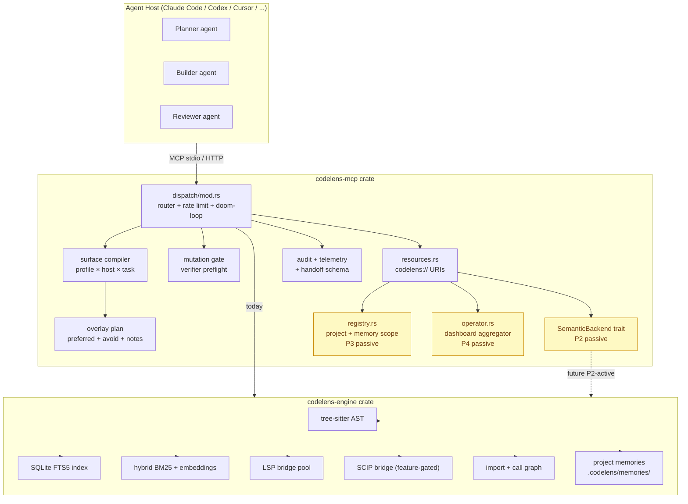

# CodeLens MCP — Architecture Synthesis (v1.9.49)

Date: 2026-04-19
Status: Authoritative — supersedes scattered notes in `ARCHITECTURE.md`,
ADR-0005, ADR-0008, `docs/design/serena-comparison-2026-04-18.md`
for the single-document summary.

## 1. Identity — what CodeLens is, what it is not

CodeLens MCP is a **harness-native Rust MCP server**. Three words,
three commitments:

- **Harness-native** — the server is designed to feed planner → builder
  → reviewer agent harnesses rather than a single chat agent. Role
  profiles, mutation gates, audit lanes, and delegation scaffolds are
  first-class.
- **Rust** — zero-cost abstractions, memory safety, deterministic
  performance, single-binary deployment. The engine (~462 symbols, 24
  files) is lean; the MCP surface (~709 symbols, 35 files) is where
  tool + profile ceremony lives.
- **MCP server, not agent toolkit** — CodeLens does not own agent
  state, prompts, or orchestration. It ships context + mutation + audit
  as MCP resources; the agent host (Claude Code, Codex, Cursor, etc.)
  owns the loop.

**What CodeLens explicitly is NOT**

| Anti-pattern                                                              | Why rejected                                                                      |
| ------------------------------------------------------------------------- | --------------------------------------------------------------------------------- |
| Monolithic agent-owns-tools-owns-prompt-owns-server (e.g. Serena pattern) | Collapses substrate vs agent-toolkit boundary; host adaptation becomes impossible |
| Prompt-driven safety only                                                 | Runtime mutation gates are cheaper and stricter than prompt hints                 |
| In-process IDE replacement                                                | IDEs are host adapters; CodeLens feeds them rather than replacing them            |
| Synchronous analysis for every call                                       | Heavy work goes through async handle + poll (`start_analysis_job`)                |

## 2. Rust-based architecture advantages (measured)

| Advantage                | Manifestation in CodeLens                                                                                            | Measured impact                                                   |
| ------------------------ | -------------------------------------------------------------------------------------------------------------------- | ----------------------------------------------------------------- |
| Zero-cost abstractions   | `McpTool` trait dispatch is a single vtable call; `ToolExecutor` type alias hides `Box<dyn Fn>` without runtime cost | Tool call overhead negligible vs handler body                     |
| Type-state enforcement   | `BuiltTool::new(handler)` makes "no-op tool" impossible at compile time (after ToolBuilder retirement in v1.9.47)    | Compile error eliminates class of runtime "not implemented" traps |
| Memory safety            | No manual lifetime juggling around `AnalysisArtifactStore`, `RecentRingBuffer`, `AgentCoordinationStore`             | Zero use-after-free / data-race CVEs by construction              |
| Single-binary deployment | `target/release/codelens-mcp` = 74 MB, no runtime, no system dependencies beyond libc                                | Cold start 328–1,837 ms; warm primitives all < 100 ms             |
| `cfg`-gated features     | `semantic`, `http`, `scip-backend`, `otel` feature flags let operators pick their payload size and linkage           | Minimal build excludes embedding model weight (ONNX) entirely     |
| `tree-sitter` zero-copy  | Engine parses source files into AST without allocating per-token strings                                             | Symbol indexing: 269 ms for the full self-repo                    |
| `LazyLock` static init   | `DISPATCH_TABLE`, rule corpus, surface manifest built once on first access                                           | No runtime rebuild cost per tool call                             |

## 3. Efficiency maximization (measured, self-benchmark)

| Axis                               |   CodeLens |          grep |                 Ratio |
| ---------------------------------- | ---------: | ------------: | --------------------: |
| `find_symbol` latency              |      53 ms |     30,155 ms |       **568×** faster |
| `find_referencing_symbols` latency |      54 ms |     21,836 ms |       **405×** faster |
| Output size (same lookup)          | 688 tokens | 46,615 tokens | **67.8×** compression |
| Warm primitive budget              |   < 100 ms |           n/a |                   n/a |

### Compression pipeline (OpenDev 5-stage adaptive)

Tools run under an explicit token budget. Five-stage compression
triggers on budget usage:

```
Stage 1 (<75%)    pass-through
Stage 2 (75-85%)  light structured summarization
Stage 3 (85-95%)  aggressive summarization
Stage 4 (95-100%) minimal skeleton + truncated flag
Stage 5 (>100%)   hard truncation with error payload
```

Thresholds shift with `CODELENS_EFFORT_LEVEL`: low = -10 pp earlier,
high = +10 pp later. Payload shape is preserved so JSON keys never
disappear under compression — only string/array values shrink.

## 4. Harness-agent ergonomics

Tools are shaped so a multi-agent harness (planner, builder, reviewer,
evaluator) can call them with minimal cognitive load:

### Role profiles (pre-existing)

| Profile             | Intended role               | Exposed tool count |
| ------------------- | --------------------------- | -----------------: |
| `planner-readonly`  | Planning / exploration      |              30–40 |
| `builder-minimal`   | Focused editing             |                 35 |
| `reviewer-graph`    | PR / change review          |                 30 |
| `evaluator-compact` | Acceptance scoring          |                 25 |
| `refactor-full`     | Multi-file restructuring    |                60+ |
| `ci-audit`          | Machine-readable reports    |                 20 |
| `workflow-first`    | Opinionated workflow chains |                 10 |

### Overlay compiler (v1.9.47, P1)

Three-axis composition on top of role profiles:

- **profile** answers "what lane is this agent in?"
- **host_context** answers "what envelope am I running under?"
  (`claude-code` / `codex` / `cursor` / `cline` / `windsurf` /
  `vscode` / `jetbrains` / `api-agent`)
- **task_overlay** answers "what shape of work?"
  (`planning` / `editing` / `review` / `onboarding` / `batch-analysis`
  / `interactive`)

The compiler emits a `SurfaceOverlayPlan` with preferred entrypoints,
emphasized tools, avoid list, executor bias, and routing notes.

### Suggested next tools

Every tool response includes a `suggested_next_tools` array and a
`suggestion_reasons` map explaining why each is proposed. Harness
agents can follow the chain without hand-written planning.

### Doom-loop protection

The server detects identical tool+args called 3+ times consecutively
and responds with `budget_hint` warnings + alternate suggestions.
Rapid burst (3 identical calls in 10 s) triggers async job fallback.

### Mutation gate

Editing tools (`rename_symbol`, `replace_symbol_body`, `insert_content`,
`replace`, `add_import`, `refactor_*`) require a verifier preflight.
Agents MUST run `verify_change_readiness` / `safe_rename_report` and
check `mutation_ready ∈ {ready, caution, blocked}` before mutating.

## 5. Symbolic analysis stack

CodeLens composes three symbolic backends behind a passive
capability abstraction (P2):

```
┌──────────────────────────────────────────────┐
│ SemanticBackend trait (passive declaration)  │
└──────────────────────────────────────────────┘
       │
       ├──▶ RustEngineBackend   (always present)
       │     • tree-sitter AST symbol extraction
       │     • SQLite FTS5 full-text index
       │     • Hybrid BM25 + semantic embedding ranker
       │     • Zero-external-dependency, pure Rust
       │
       ├──▶ LspBridgeBackend   (compiled in, opt-in per language)
       │     • Rust-analyzer / pyright / tsserver / gopls / etc.
       │     • Type-aware references + diagnostics
       │     • `use_lsp=true` opt-in on `find_referencing_symbols`
       │
       └──▶ ScipBridgeBackend   (#[cfg(feature="scip-backend")])
             • SCIP index ingestion
             • Precise symbol lookup + impact analysis
```

Capability coverage (all three backends, 10 capabilities total):

| Capability       | rust-engine | lsp-bridge | scip-bridge |
| ---------------- | :---------: | :--------: | :---------: |
| symbol_lookup    |      ✓      |            |      ✓      |
| symbols_overview |      ✓      |            |             |
| references       |      ✓      |     ✓      |      ✓      |
| type_hierarchy   |             |     ✓      |             |
| rename           |      ✓      |     ✓      |             |
| edit             |      ✓      |            |             |
| diagnostics      |             |     ✓      |             |
| impact_analysis  |      ✓      |            |      ✓      |
| semantic_search  |      ✓      |            |             |
| embeddings       |      ✓      |            |             |

## 6. Context compression + information preservation

Three complementary mechanisms guarantee information integrity under
compression:

1. **Schema-stable payloads** — tool response shape is declared via
   JSON Schema (`output_schema`). Compression never drops keys — only
   shrinks values. Partial responses set `partial: true` explicitly.
2. **Analysis handles** — heavy reports emit a handle (`analysis_id`)
   with section URIs rather than inlining 50 kB of data. Agents fetch
   sections on demand via `get_analysis_section`.
3. **Handoff artifacts** — cross-agent transfers use the
   `codelens://schemas/handoff-artifact/v1` contract. Delegation scaffolds
   preserve `handoff_id`, `delegate_tool`, `delegate_arguments`, and
   `carry_forward` verbatim across host boundaries.

Compression is applied after schema fills, so a 95 %-full budget
produces a valid truncated-but-parseable payload, not a broken JSON.

## 7. Layering + quality gates

```
┌─────────────────────────────────────────────────────────┐
│  Layer 5.  Operator plane                               │  P4 ✅
│            codelens://operator/dashboard                │
│            (aggregation only, no orchestration)         │
├─────────────────────────────────────────────────────────┤
│  Layer 4.  Host adapter contract                        │  Pre-existing
│            attach/detach/doctor, delegate_*, replay     │  + doctor CLI v1.9.47
├─────────────────────────────────────────────────────────┤
│  Layer 3.  Surface compiler                             │  P1 ✅
│            profile × host_context × task_overlay        │  v1.9.47
│            → visible tools + entrypoints + warnings     │
├─────────────────────────────────────────────────────────┤
│  Layer 2.  Semantic backend adapters                    │  P2 passive ✅
│            SemanticBackend trait + capability map       │  v1.9.47
│            (rust-engine / lsp-bridge / scip-bridge)     │
├─────────────────────────────────────────────────────────┤
│  Layer 1.  Substrate kernel                             │  Core
│            session state, mutation gate, telemetry,     │  Pre-existing
│            audit/eval lanes, artifact export, handoff   │  + cycle fix v1.9.47
└─────────────────────────────────────────────────────────┘
```

Quality gates enforced at runtime (not in prompt):

- **Dispatch validation** — required fields checked before handler runs
- **Mutation gate** — editing tools refuse without recent preflight
- **Rate limit** — 300 calls/minute per session (doom-loop adjunct)
- **Output schema** — responses must match `output_schema` or fail
- **Response size limit** — `_meta["anthropic/maxResultSizeChars"]`
  signals per tier (Workflow=200K, Analysis=100K, Primitive=50K)
- **Doom-loop detection** — 3+ identical calls triggers budget
  warning + alt suggestions
- **Cycle check** — `onboard_project.has_cycles` must stay `false`
- **Test gate** — `cargo test --features http` must be 100 %
  deterministic before release

## 8. Current architecture diagram (mermaid)



## 9. Maturity scorecard

Scoring rubric:

- **Concept** — idea articulated in ADR / design doc
- **Wired** — code lands, resource/tool exposed
- **Tested** — unit + integration tests land
- **Gated** — runtime guard (rate limit, mutation gate, schema) enforced
- **Released** — shipped under a semver tag + release notes

| Area                              | Concept |     Wired     | Tested |          Gated          | Released | Maturity                   |
| --------------------------------- | :-----: | :-----------: | :----: | :---------------------: | :------: | -------------------------- |
| Crate layout (engine / mcp / tui) |   ✅    |      ✅       |   ✅   |           ✅            |    ✅    | **Mature**                 |
| `McpTool` trait + dispatch        |   ✅    |      ✅       |   ✅   |           ✅            |    ✅    | **Mature**                 |
| Role profiles                     |   ✅    |      ✅       |   ✅   |           ✅            |    ✅    | **Mature**                 |
| Mutation gate + preflight         |   ✅    |      ✅       |   ✅   |           ✅            |    ✅    | **Mature**                 |
| Adaptive 5-stage compression      |   ✅    |      ✅       |   ✅   |           ✅            |    ✅    | **Mature**                 |
| Schema validation                 |   ✅    |      ✅       |   ✅   |           ✅            |    ✅    | **Mature**                 |
| Doom-loop detection               |   ✅    |      ✅       |   ✅   |           ✅            |    ✅    | **Mature**                 |
| P1 context overlay compiler       |   ✅    |      ✅       |   ✅   |       ⚠ advisory        |    ✅    | **Active, advisory**       |
| P2 semantic backend abstraction   |   ✅    |  ✅ passive   |   ✅   |   ❌ dispatch bypass    |    ✅    | **Scaffold only**          |
| P3 project + memory registry      |   ✅    |  ✅ passive   |   ✅   | ❌ write routing bypass |    ✅    | **Scaffold only**          |
| P4 operator dashboard             |   ✅    | ✅ aggregator |   ✅   |     ✅ (read-only)      |    ✅    | **Active, read-only**      |
| Host adapter doctor CLI           |   ✅    |      ✅       |   ✅   |           ✅            |    ✅    | **Mature**                 |
| Delegation + handoff schema       |   ✅    |      ✅       |   ✅   |           ✅            |    ✅    | **Mature**                 |
| Self-benchmark + perf baseline    |   ✅    |      ✅       |   ✅   |    ❌ no CI gate yet    |    ✅    | **Mature, no enforcement** |

**Aggregate maturity (weighted by area)**

- Mature / Active : **10 / 13 areas** (77 %)
- Scaffold only : 2 / 13 areas (15 %) — P2, P3 passive halves
- No enforcement : 1 / 13 areas (8 %) — perf baseline not CI-gated

Overall: **production-ready substrate**, Serena-compatible surface
absorbed with known scaffold debt tracked in ADR-0008.

## 10. Known debt + explicit scope

| Item                                           | Status       | Policy                                                                                                      |
| ---------------------------------------------- | ------------ | ----------------------------------------------------------------------------------------------------------- |
| P2-active (dispatch through `SemanticBackend`) | Parked       | Lands when a new backend (e.g. JetBrains bridge) creates driving need                                       |
| P3-active (write routing to global memory)     | Parked       | Lands when an explicit global-memory tool is requested                                                      |
| 6 `too_many_arguments` clippy warnings         | Parked       | All on internal coordination helpers; parameter-struct refactor = multi-site churn without behaviour change |
| Dashboard UI renderer                          | Out of scope | Serena §Layer 5 explicitly scopes P4 to data, not render                                                    |
| Perf regression CI gate                        | Optional     | Benchmark script exists; wiring into CI is a follow-up phase                                                |

## 11. References

- `ARCHITECTURE` memory (CodeLens project scope)
- ADR-0005 harness-v2 (architecture decision lineage)
- ADR-0007 symbiote rebrand
- ADR-0008 Serena upper-compatible absorption (this release's driver)
- `docs/design/serena-comparison-2026-04-18.md` (delta matrix)
- `docs/plans/PLAN_post-cycle-hygiene.md` (approved plan artifact)
- `benchmarks/bench-v1.9.46-result.md` (self-benchmark)
- GitHub releases v1.9.47 → v1.9.49
