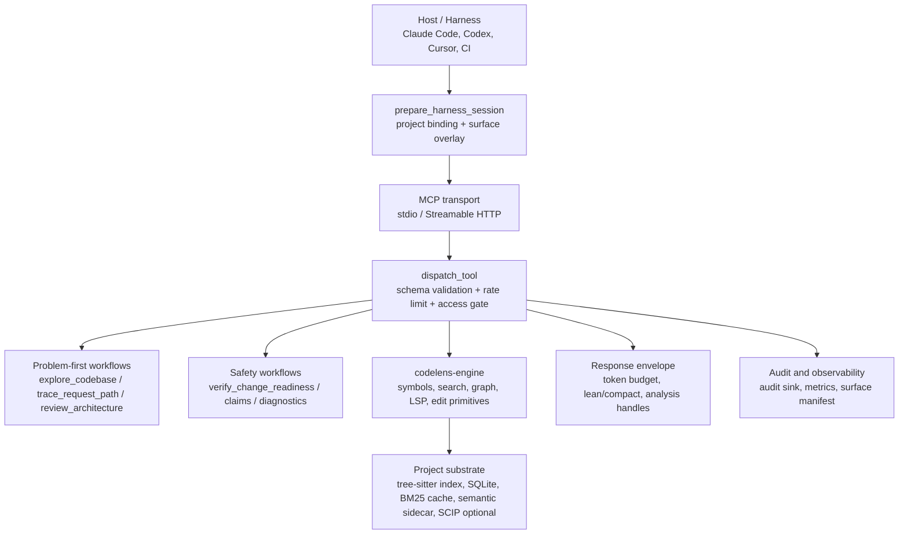
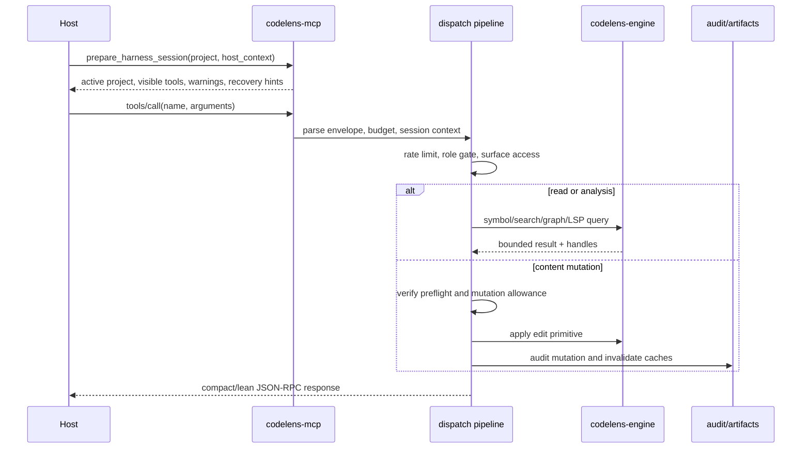

# CodeLens MCP — Architecture & Project Overview

> multi-agent 코딩 하네스를 위한 host-adaptive Rust MCP 코드 인텔리전스 라우터입니다.
> 캐시형 hybrid retrieval, 생성된 tool-surface governance, daemon health check, mutation-gated refactoring을 제공합니다.

<sub>English: Host-adaptive Rust MCP code-intelligence router for multi-agent harnesses. It provides cached hybrid retrieval, generated surface governance, daemon health checks, and mutation-gated refactoring.</sub>

## 한글 아키텍처 요약 (2026-07-08)

CodeLens는 “대화형 AI 런타임”이 아니라 host가 필요로 하는 코드 맥락을 작게 잘라 공급하는 MCP substrate입니다. host는 대화, 모델 선택, 권한 UI를 소유하고, CodeLens는 project binding, tool surface, index health, retrieval, mutation gate, audit evidence를 담당합니다.

<sub>English: CodeLens is not the chat runtime. It is the MCP substrate that narrows code context, binds projects, exposes profile-specific tools, checks index health, gates mutations, and records evidence.</sub>



### 요청 처리 흐름

<sub>English: Request-processing flow.</sub>



### 핵심 코드 지도

<sub>English: Core code map.</sub>

| 계층 | 현재 코드 | 책임 |
| --- | --- | --- |
| CLI / daemon entry | [`../crates/codelens-mcp/src/main.rs`](../crates/codelens-mcp/src/main.rs) | `--transport`, `--profile`, `--preset`, `--daemon-mode`, one-shot CLI, HTTP/stdout-safe tracing, semantic feature banner를 선택합니다. |
| MCP protocol/router | [`../crates/codelens-mcp/src/server/router.rs`](../crates/codelens-mcp/src/server/router.rs), [`../crates/codelens-mcp/src/server/transport_stdio.rs`](../crates/codelens-mcp/src/server/transport_stdio.rs), [`../crates/codelens-mcp/src/server/transport_http.rs`](../crates/codelens-mcp/src/server/transport_http.rs) | JSON-RPC 요청을 받고 `tools/list`, `tools/call`, resources를 transport별로 연결합니다. |
| Dispatch boundary | [`../crates/codelens-mcp/src/dispatch/mod.rs`](../crates/codelens-mcp/src/dispatch/mod.rs), [`../crates/codelens-mcp/src/dispatch/table.rs`](../crates/codelens-mcp/src/dispatch/table.rs) | tool envelope parsing, required-param validation, doom-loop/rate-limit, role gate, access validation, mutation gate, response shaping을 수행합니다. |
| Tool registry | [`../crates/codelens-mcp/src/tools/mod.rs`](../crates/codelens-mcp/src/tools/mod.rs), [`../crates/codelens-mcp/src/tool_defs/`](../crates/codelens-mcp/src/tool_defs) | file/symbol/LSP/analysis/edit/memory/session/workflow/report tool을 등록하고 profile/preset별 노출 표면을 생성합니다. |
| Harness bootstrap | [`../crates/codelens-mcp/src/tools/session/project_ops/prepare_harness.rs`](../crates/codelens-mcp/src/tools/session/project_ops/prepare_harness.rs) | `project=<absolute path>` binding, stale-index recovery, host environment snapshot, Codex skill hints, visible tool routing을 반환합니다. |
| Runtime state | [`../crates/codelens-mcp/src/state.rs`](../crates/codelens-mcp/src/state.rs), [`../crates/codelens-mcp/src/state/`](../crates/codelens-mcp/src/state) | active project, project context cache, watcher, graph cache, LSP pool, analysis jobs, coordination claims, preflight store, audit sinks를 보관합니다. |
| Engine API | [`../crates/codelens-engine/src/lib.rs`](../crates/codelens-engine/src/lib.rs) | read/search/mutation primitive를 re-export합니다. mutation primitive 자체는 role gate/audit/cache invalidation을 보장하지 않으므로 MCP dispatch를 통해 호출해야 합니다. |
| Index/search | [`../crates/codelens-engine/src/symbols/`](../crates/codelens-engine/src/symbols), [`../crates/codelens-engine/src/search.rs`](../crates/codelens-engine/src/search.rs), [`../crates/codelens-mcp/src/sparse_symbol_cache.rs`](../crates/codelens-mcp/src/sparse_symbol_cache.rs) | tree-sitter symbol index, sparse/BM25 scoring, ranked context, path-scope cache를 담당합니다. |
| Semantic retrieval | [`../crates/codelens-mcp/src/dispatch/semantic/`](../crates/codelens-mcp/src/dispatch/semantic), [`../crates/codelens-engine/src/embedding/`](../crates/codelens-engine/src/embedding) | `semantic` feature와 model sidecar가 있을 때 `index_embeddings`와 `semantic_search`를 활성화합니다. |
| Readiness/audit | [`../crates/codelens-mcp/src/tools/reports/verifier_reports.rs`](../crates/codelens-mcp/src/tools/reports/verifier_reports.rs), [`../crates/codelens-mcp/src/audit_sink.rs`](../crates/codelens-mcp/src/audit_sink.rs) | `verify_change_readiness`, analysis sections, mutation evidence, durable audit log를 제공합니다. |

### 현재 구조 근거

- CodeLens dogfood `review_architecture(path=.)` 기준 현재 workspace member는 `crates/codelens-engine`, `crates/codelens-mcp` 두 개이며, 두 crate 사이에는 양방향 module dependency가 있습니다.
- `docs/generated/surface-manifest.json`과 아래 Surface Snapshot은 public tool count, profile/preset, language family 수의 canonical source입니다.
- `codelens-engine/src/lib.rs`는 read primitive는 직접 호출 가능하되 mutation primitive는 `codelens-mcp` dispatch pipeline을 통과해야 한다고 명시합니다. 이 문서의 mutation boundary 설명은 해당 코드 주석을 기준으로 합니다.

## Current Snapshot (2026-07-07 local daemon re-check)

<!-- SURFACE_MANIFEST_ARCHITECTURE_SNAPSHOT:BEGIN -->

- Workspace version: `1.13.34`
- Workspace members: `2` (`crates/codelens-engine`, `crates/codelens-mcp`)
- Registered tool definitions in source: `100`
- Tool output schemas in source: `71 / 100`
- Supported language families: `34` across `56` extensions
- Canonical manifest: [`docs/generated/surface-manifest.json`](generated/surface-manifest.json)

<!-- SURFACE_MANIFEST_ARCHITECTURE_SNAPSHOT:END -->
- The registered-tool count in the snapshot above is measured against the default build surface; the absolute number of entries in `tools.toml` is higher because some tools are semantic-feature-gated and only compile in under their feature flags.
- Runtime surface is profile- and session-dependent; use [`prepare_harness_session`](../crates/codelens-mcp/src/tools/session/project_ops.rs) and `tools/list` for live counts rather than this document
- Published distribution channels: crates.io, GitHub Releases, Homebrew tap, installer script, source builds
- Current release notes: [latest GitHub release](https://github.com/mupozg823/codelens-mcp-plugin/releases/latest). For local release-quality comparisons, resolve the baseline tag with `git tag --sort=-v:refname | head -1`.
- Current release verification guide: [docs/release-verification.md](release-verification.md)
- Current external comparison status: CodeLens is stronger as a harness-native MCP layer, but not yet a strict Serena superset. See [docs/serena-comparison.md](serena-comparison.md).
- Current audit and simplification report: [docs/architecture-audit-2026-04-24.md](architecture-audit-2026-04-24.md). Runtime/script surface audits split pending-D3 ghosts into `pending_d3_symbolic_edit_core` and `pending_d3_refactor_substrate`.
- Current simplification decision record: [docs/adr/ADR-0001-runtime-boundaries-and-single-source-registries.md](adr/ADR-0001-runtime-boundaries-and-single-source-registries.md)
- Current enterprise productization decision record: [docs/adr/ADR-0002-enterprise-productization-evaluation-and-release-gates.md](adr/ADR-0002-enterprise-productization-evaluation-and-release-gates.md)
- Current product direction: CodeLens is becoming a bounded code-work orchestrator over its existing code-intelligence substrate. See [docs/adr/ADR-0014-bounded-code-work-orchestrator.md](adr/ADR-0014-bounded-code-work-orchestrator.md).
- Current migration contract: [Architecture Migration Roadmap](architecture-migration-roadmap.md) documents fail-closed mutation audit, `ProjectContext`, `JobService`, the three canonical surfaces, and As-Is/To-Be dynamic flows.
- Runtime identity proof is generated, not hand-maintained: run `python3 scripts/runtime-snapshot.py --write --check` after `scripts/redeploy-daemons.sh --build --probe`. The resulting ignored `.codelens/runtime-snapshot.json` records source HEAD/tree, disk binary SHA, live daemon SHA, and each principal-filtered `tools/list` count.
- Latest retrieval performance proof: the sparse symbol BM25 layer now caches token weights and document frequencies by project/path-scope fingerprint. The local gate improved from `41465.92 ms` to `26584.4 ms` with quality gates passing and unchanged top-hit behavior.

This document describes the product shape and the stable architectural layers.
The audit document above captures the current overdesign, duplication, and drift findings against the latest code.

---

## Current Improvement Priorities (2026-07-07 follow-up)

The current hot path is no longer "run more retrieval"; it is keeping the
retrieval stack cache-aware, observable, and profile-scoped so the same daemon
can serve planner/reviewer/builder sessions without repeated full-project
sparse scoring.

Evidence:

- Serena live local check: active project `codelens-mcp-plugin`, context `codex`, Serena `1.5.4.dev0`, active tools limited to symbolic read/navigation plus `search_for_pattern`; edit tools such as `replace_symbol_body`, `rename_symbol`, and `safe_delete_symbol` are available but not active in this Codex context.
- CodeLens dogfood: `review_architecture(path=crates/codelens-mcp/src/tools)` reported 55 importers, 63 impacted files, and 1 cycle hit; `review_architecture(path=crates/codelens-mcp/src/dispatch)` reported 10 importers, 15 impacted files, and 0 cycle hits; `review_architecture(path=crates/codelens-engine/src)` reported 82 importers, 91 impacted files, and 1 cycle hit.
- Current large non-test production files include `crates/codelens-mcp/src/dispatch/response.rs` (867 LOC) and `crates/codelens-engine/src/project.rs` (895 LOC). The prior `tools/workflows.rs` 956 LOC hotspot is now split: the workflow entrypoint file is 330 LOC, with duplicate-cleanup filtering and tests in `tools/workflows/duplicate_cleanup.rs`. The former `session_metrics_payload.rs` hotspot is also split: the parent file is 57 pure LOC, with session fields, derived KPIs, token-bill payloads, and grouped field writers in focused submodules under `crates/codelens-mcp/src/session_metrics_payload/`.

Prioritized architecture moves:

1. Completed (2026-07-07): cache the sparse BM25 symbol index behind the current
   retrieval diagnostics path. Repeated `hybrid_search` calls now reuse
   per-project/path-scope token weights instead of rebuilding the sparse corpus.
2. Resolved (2026-07-03): pending-D3 stays dispatch-only (internal) by decision — this is no longer an open TODO. The 4-tool `pending_d3_symbolic_edit_core` and the 5-tool `pending_d3_refactor_substrate` remain callable behind the mutation gate but unlisted (schemaless). Rationale: hosts route schema-exposed symbolic edits through a dedicated editor (Serena et al.), while the `:7838` mutation daemon must keep calling these behind the gate. Re-listing is conditioned on host demand with no symbolic editor plus a mature LSP authoritative-apply path. The `pending_d3_` identifiers are retained deliberately because CI drift gates and runtime report vocabulary key off them.
3. Completed: split `tools/workflows.rs` by real responsibility; duplicate-cleanup quality filters and tests now live in `tools/workflows/duplicate_cleanup.rs`, leaving workflow entrypoints as thin orchestration.
4. Completed: split `session_metrics_payload.rs` by real ownership. The parent now snapshots `AppState` and delegates to submodules for session fields, derived KPIs, and token bill construction; grouped field writers keep every touched file under the 250 pure-LOC review ceiling.
5. Completed: productize the local tool-usage analyzer modules as operator-facing telemetry. The CLI now covers metrics JSON, telemetry JSONL, and Codex rollout JSONL; rollout event parsing lives in `scripts/codex_rollout_events.py`, leaving `scripts/codex_rollout_usage.py` as the loader/orchestration layer.
6. Completed (2026-07-10): route every completed tool call through one
   borrowed `ToolCallEvent` before fanning out to global/session aggregates
   and the opt-in JSONL writer. The persisted schema has a backward-compatible
   `recording_origin` addition covered by a structured-event regression test.
   The productivity analyzer separately requires a non-local HTTP session plus
   a Codex/Claude `client_name`, and excludes generic or unattributed daemon
   probe/audit rows. A separate `evidence_status` keeps host-attributed
   `tools/list` and `prepare_harness_session` bootstrap traffic as
   `bootstrap_only` until a task tool call is observed, so process provenance
   is not mistaken for productivity proof.
   Updated (2026-07-22): each event now keeps the public request name alongside
   its resolved target, selected mode, canonical work class, and downstream
   handler-entry count. Guidance and telemetry share the registry-backed
   classifier, and derived KPI payloads identify the new contract as
   `codelens-session-evidence-kpis`.
   This is a boundary cleanup, not a new event bus.
7. Next: put the same strict measurements around adaptive RRF/rerank and
   hierarchical context changes: compare Recall@k, nDCG/MRR, latency p50/p95,
   and context-token deltas before widening defaults.
8. Next: review `crates/codelens-engine/src/project.rs` detection helpers with CodeLens before any split. It is still a large production file and has broader engine blast radius than the Python telemetry lane.
9. Treat `dispatch/response.rs` as high-risk but second order: it is large, but the dispatch boundary has no cycle hit. Only extract cohesive delegate-hint or response-enrichment helpers when the diff removes real branching complexity.
10. Keep Serena comparison honest: CodeLens should adopt Serena's deterministic routing pressure at the plugin/skill layer, not Serena's blind-trust editing prompt or LSP-adapter breadth race.

---

## Retrieval Adaptation Tiers

CodeLens uses three retrieval lanes before host-side fusion or reranking:

- lexical/symbol lane: tree-sitter symbols, identifier splits, BM25-style sparse
  weights, and exact path/name signals
- semantic lane: cfg-gated embedding search using the configured CodeSearchNet
  sidecar model
- workflow/context lane: profile-aware tools such as ranked context,
  architecture review, trace request path, and analysis jobs

The sparse symbol lane is cached by project/root query scope. Cache keys include
the project identity and the path scope, so focused searches avoid paying for a
full-project sparse rebuild while still invalidating when the symbol index or
scope changes.

Semantic query shaping is split into two explicit tiers:

- generic adaptation lives in code and is expected to transfer across repositories
- project-specific adaptation lives in `.codelens/bridges.json` at the project root

Generic adaptation is limited to repository-agnostic shaping such as identifier splitting, natural-language code framing, and generic NL-to-code vocabulary alignment.

Project-specific adaptation is opt-in and file-backed. It is intended for repository-local vocabulary only and must not be used as evidence for general retrieval claims.

Current project bridge file format:

```json
[
  { "nl": "recently accessed", "code": "record_file_access recency" },
  { "nl": "stdin", "code": "run_stdio stdio" }
]
```

Rules:

- `nl` is the lower-signal natural-language phrase to detect
- `code` is the repository-local code vocabulary appended for embedding search
- missing or malformed `.codelens/bridges.json` is treated as empty
- generic bridges remain active without any project file

---

## Agent-Consumption Envelope (Token Economics Layer, 2026-07)

The response envelope treats frontier-model token cost as an architectural
constraint, not a formatting detail. Layers, from request to wire:

1. **Budget resolution** — per-request `max_tokens` → per-tool caps
   (`effective_budget_for_tool`) → profile defaults; effort level
   (`CODELENS_EFFORT_LEVEL`) scales budget ×0.6–×1.3.
2. **Lean response contract** — `dispatch/envelope.rs` resolves
   `lean = _lean arg || CODELENS_RESPONSE_CONTRACT=lean` (explicit
   `_lean:false` overrides the env). Lean strips scaffold-only fields
   (prose `suggestion_reasons`, `token_estimate`/`elapsed_ms` telemetry,
   `sync` routing hints, constant `schema_version`, fresh-bucket
   `index_freshness`) and never touches `data`, suggestions, errors, or
   recovery hints — quality-neutral by construction, deliberately decoupled
   from the legacy `_compact` data pruning. Measured −17-18% text channel.
3. **5-stage adaptive compression** — over-budget payloads degrade through
   summarization → skeleton with machine-readable `truncation_warning` +
   `*_omitted_count` markers and expansion handles (`get_analysis_section`).
4. **Session binding economics** — sessions bound via `x-codelens-project`
   header / `initialize` `project` param omit the per-response
   `project_binding` hint (−35% on `find_symbol` data); unbound store-backed
   HTTP sessions are blocked from content mutations (#347) with a structured
   `ProjectBindingRequired` recovery hint.
5. **Surface economics** — of 100 `tools.toml` tool records, the default / alwaysLoad
   slice stays capped at 9 control-plane tools; everything else expands by
   phase, namespace, tier, preferred entrypoint, or host tool search.

## LSP Subsystem — Precision Tiers (P1.1, 2026-07)

`crates/codelens-engine/src/lsp/` implements a bidirectional LSP client used
as the *precision tier* above tree-sitter and beside SCIP:

- **Protocol parity**: the response read loop answers server→client requests
  (`workspace/configuration` → per-item nulls, capability registrations →
  ack, `workspace/applyEdit` → refused — read sessions never accept
  server-initiated edits) instead of discarding them; unknown methods get
  spec-correct `MethodNotFound`.
- **Readiness (warm ≠ quiescent)**: the client advertises
  `experimental.serverStatusNotification` and harvests rust-analyzer's
  quiescence signal per session (`warm_session_quiescence`). Reference
  results are confidence-calibrated: a server that itself reports
  indexing-in-progress degrades to 0.7 with a `degraded_reason`; verified
  quiescence earns the 0.95 precise label.
- **Pre-warm pool** (`CODELENS_LSP_PREWARM=off|auto|list`): language servers
  spawn in the background at daemon/project-activation (auto = index
  per-extension counts, ≥10 files, ≤3 servers, recipe-enforced), so the
  latency-sensitive default reference path upgrades to LSP answers with
  `cold_start_incurred: false`. Pre-warm is an optimization, never a
  correctness dependency — failures log and skip.
- **Subprocess trust boundary**: `LspSessionPool` captures canonical
  executables from the daemon's operator-controlled environment and binds each
  one to a registered `LSP_RECIPES` entry. Every request, retry, mutation
  backend, and pre-warm path reaches one spawn boundary that requires the
  recipe's exact immutable arguments. A caller-supplied path is accepted only
  when its canonical target is already registered for that pool; generic
  `python`/`python3` execution and implicit project `node_modules/.bin`
  discovery are not launch authorities. The validated executable/argument
  tuple, rather than raw tool input, is the only value passed to
  `Command::new`.
- **Per-server `initializationOptions`** table (documented options only;
  sole entry: rust-analyzer `checkOnSave: false`).

This boundary closes direct command/argument injection; it is not an OS
sandbox for the language server itself. Some trusted servers can load project
plugins, build metadata, or compiler extensions. Shared deployments must keep
trusted executable directories operator-owned and use process/container
isolation when repository contents are hostile. Operational details are in
[`operations/runtime-knobs.md`](operations/runtime-knobs.md#lsp-subprocess-trust-boundary).

---

## Distribution Surface

CodeLens is currently packaged and deployed through six public distribution paths:

| Channel          | Current shape                             | Notes                                            |
| ---------------- | ----------------------------------------- | ------------------------------------------------ |
| crates.io        | `cargo install codelens-mcp`              | Fastest lean path for Rust users                 |
| GitHub Releases  | prebuilt tar/zip artifacts                | `darwin-arm64`, `linux-x86_64`, `windows-x86_64` |
| GitHub installer | `install.sh`                              | Convenience wrapper over published binaries      |
| GHCR OCI image   | `ghcr.io/...:<tag>`                       | Containerized release artifact                   |
| Homebrew tap     | `brew install mupozg823/tap/codelens-mcp` | Generated from release checksums in CI           |
| Source build     | `cargo build --release`                   | Required for custom feature combinations         |

Operational deployment modes:

- stdio for single local agent sessions
- Streamable HTTP + SSE for shared daemon or multi-agent deployments
- read-only daemon mode for reviewer/planner/CI surfaces
- mutation-enabled daemon mode only for explicit refactor surfaces

---

## 1. High-Level Architecture

```
┌─────────────────────────────────────────────────────────────────────┐
│                 Agent Runtime / Harness Layer                        │
│  Claude Code / OpenAI Agents / LangGraph / Custom Agent SDK         │
├───────────────────────┬─────────────────────────────────────────────┤
│    A2A (future)       │              MCP Protocol                   │
│  Agent ↔ Agent        │  JSON-RPC 2.0 over stdio / Streamable HTTP  │
├───────────────────────┴─────────────────────────────────────────────┤
│                                                                     │
│  ┌───────────────────────────────────────────────────────────────┐  │
│  │       codelens-mcp (Bounded Code-Work Orchestrator)           │  │
│  │                                                               │  │
│  │  ┌──────────┐  ┌──────────┐  ┌──────────┐  ┌──────────────┐  │  │
│  │  │ Dispatch │→ │  Tools   │→ │   Run    │→ │ Audit/Events │  │  │
│  │  │  Table   │  │ (surface │  │  State   │  │ Telemetry    │  │  │
│  │  │          │  │ dependent)│  │          │  │ Artifacts    │  │  │
│  │  └──────────┘  └────┬─────┘  └────┬─────┘  └──────────────┘  │  │
│  │                     │             │                           │  │
│  │  ┌─────────────────────────────────────────────────────────┐  │  │
│  │  │              Tool Categories (profile dependent)        │  │  │
│  │  │  File │ Symbol │ LSP │ Analysis │ Edit                  │  │  │
│  │  │  Workflow │ Memory │ Session │ Semantic*               │  │  │
│  │  │                         * cfg-gated                     │  │  │
│  │  └─────────────────────────────────────────────────────────┘  │  │
│  └───────────────────────────────┬───────────────────────────────┘  │
│                                  │                                   │
│  ┌───────────────────────────────▼───────────────────────────────┐  │
│  │                 codelens-engine (Engine)                      │  │
│  │                                                               │  │
│  │  ┌─────────┐  ┌─────────┐  ┌─────────┐  ┌───────────────┐    │  │
│  │  │ Symbols │  │ Search  │  │   DB    │  │ Import Graph  │    │  │
│  │  │ Parser  │  │ FTS5 +  │  │ SQLite  │  │ PageRank,SCC  │    │  │
│  │  │ Ranking │  │ Scoring │  │ Schema  │  │ Dead Code     │    │  │
│  │  │ Reader  │  │ Hybrid  │  │ + vec   │  │ Call Graph    │    │  │
│  │  │ Writer  │  │         │  │ v4 + heal│ │ Coupling      │    │  │
│  │  └────┬────┘  └────┬────┘  └────┬────┘  └──────┬────────┘    │  │
│  │       │            │            │               │             │  │
│  │  ┌────▼────────────▼────────────▼───────────────▼────────┐    │  │
│  │  │              Foundation Layer                          │    │  │
│  │  │  tree-sitter registry  │ LSP pool (opt-in)            │    │  │
│  │  │  Lang Registry         │ Scope Analysis               │    │  │
│  │  │  Lang Config           │ File Watcher (notify)        │    │  │
│  │  │  VFS / Project Root    │ Embedding (MiniLM + fastembed)│   │  │
│  │  └───────────────────────────────────────────────────────┘    │  │
│  └───────────────────────────────────────────────────────────────┘  │
│                                                                     │
└─────────────────────────────────────────────────────────────────────┘
```

---

CodeLens is not a general interactive chat runtime.
It is now positioned as a bounded code-work orchestrator: it plans, gates,
dispatches, verifies, audits, and summarizes code-work runs while preserving
the existing MCP/code-intelligence substrate. The host still owns model choice,
user conversation, credentials, UI, and broad workflow policy unless a future
ADR explicitly moves one of those responsibilities into CodeLens.

Use repo-local contracts alongside this document:

- `EVAL_CONTRACT.md`
- `docs/platform-setup.md`
- `docs/REFERENCE-2026-03.md`
- Project `CLAUDE.md` (harness routing + mutation gates)
- Project `AGENTS.md`

## 2. Project Directory Structure

```
codelens-mcp-plugin/
├── Cargo.toml                            # Workspace: 2 crates, 25 tree-sitter deps
├── CLAUDE.md                             # AI agent instructions (harness routing)
├── AGENTS.md                             # Agent role contracts
├── EVAL_CONTRACT.md                      # Verification command contracts
├── README.md                             # Public documentation
├── install.sh                            # One-line installer
│
├── crates/
│   ├── codelens-engine/                  # Engine crate
│   │   ├── Cargo.toml                    # deps: tree-sitter x25, rusqlite, rayon, ort
│   │   ├── benches/                      # Performance benchmarks
│   │   ├── tests/                        # Integration suites
│   │   └── src/
│   │       ├── lib.rs                    # Public API surface
│   │       ├── project.rs                # ProjectRoot, framework detection
│   │       │
│   │       ├── lang_registry.rs          # 34 language families: ext → canonical → config
│   │       ├── lang_config.rs            # tree-sitter Language + Query per lang
│   │       │
│   │       ├── symbols/                  # Symbol extraction & ranking
│   │       │   ├── mod.rs                # SymbolIndex — central API
│   │       │   ├── parser.rs             # tree-sitter query execution
│   │       │   ├── writer.rs             # Index builder (refresh_all)
│   │       │   ├── reader.rs             # Symbol queries (find/overview)
│   │       │   ├── ranking.rs            # 4-signal ranking engine
│   │       │   └── scoring.rs            # Score computation
│   │       │
│   │       ├── db/                       # SQLite + FTS5 + sqlite-vec
│   │       │   ├── mod.rs                # IndexDb — schema v4, self-heal, migrations
│   │       │   ├── ops.rs                # CRUD operations (1K+ LOC)
│   │       │   └── tests.rs              # DB suite (incl. self-heal)
│   │       │
│   │       ├── search.rs                 # Hybrid search: FTS5 + jaro_winkler
│   │       │
│   │       ├── import_graph/             # Dependency analysis
│   │       │   ├── mod.rs                # Graph builder (petgraph)
│   │       │   ├── parsers.rs            # Import statement parsing
│   │       │   ├── resolvers.rs          # Path resolution per language
│   │       │   └── dead_code.rs          # Multi-pass dead code detection
│   │       │
│   │       ├── lsp/                      # LSP integration (opt-in)
│   │       │   ├── mod.rs                # LspSessionPool
│   │       │   ├── session.rs            # Single LSP session lifecycle
│   │       │   ├── protocol.rs           # JSON-RPC for LSP
│   │       │   └── registry.rs           # 24 LSP recipes
│   │       │
│   │       ├── file_ops/                 # File I/O + mutation writers
│   │       │   ├── mod.rs
│   │       │   ├── reader.rs
│   │       │   └── writer.rs
│   │       │
│   │       ├── scope_analysis.rs         # def/read/write/import classification
│   │       ├── call_graph.rs             # Function call graph
│   │       ├── circular.rs               # Tarjan SCC cycle detection
│   │       ├── coupling.rs               # Git temporal coupling
│   │       ├── type_hierarchy.rs         # Native inheritance analysis
│   │       ├── rename.rs                 # Multi-file rename engine
│   │       ├── auto_import.rs            # Missing import detection
│   │       ├── change_signature.rs       # Refactoring: change signature
│   │       ├── inline.rs                 # Refactoring: inline function
│   │       ├── move_symbol.rs            # Refactoring: move to file
│   │       ├── git.rs                    # Git diff/changed files
│   │       ├── community.rs              # Community detection for clustering
│   │       ├── embedding.rs              # bundled MiniLM + optional fastembed (2.9K LOC)
│   │       ├── embedding_store.rs        # sqlite-vec storage
│   │       ├── memory.rs                 # Project memory store
│   │       ├── vfs.rs                    # Virtual filesystem normalization
│   │       ├── watcher.rs                # File watcher (notify + debounce)
│   │       └── oxc_analysis.rs           # JS/TS semantic analysis (oxc)
│   │
│   └── codelens-mcp/                     # MCP server crate
│       ├── Cargo.toml                    # deps: axum, tokio, serde_json
│       └── src/
│           ├── main.rs                   # Entry: CLI args, transport selection
│           ├── state.rs                  # AppState assembly + shared runtime helpers
│           ├── state/                    # Project/session/preflight/watcher services
│           ├── dispatch/                 # Dispatcher, access, response shaping
│           ├── protocol.rs               # Tool, ToolAnnotations, OutputSchema
│           ├── error.rs                  # CodeLensError enum
│           ├── telemetry.rs              # ToolMetricsRegistry (in-memory session)
│           ├── mutation_gate.rs          # verify_change_readiness enforcement
│           ├── audit_sink.rs             # durable audit sink plumbing
│           ├── preflight_store.rs        # Preflight TTL cache
│           ├── analysis_queue.rs         # Durable analysis job queue
│           ├── artifact_store.rs         # Analysis handle storage
│           ├── job_store.rs              # Job persistence
│           ├── session_context.rs        # Per-session state
│           ├── session_metrics_payload.rs
│           ├── recent_buffer.rs          # Doom-loop detection
│           ├── client_profile.rs         # Client identity heuristics
│           ├── resources/                # MCP resource registry and URI aliases
│           │   ├── catalog.rs
│           │   ├── profiles.rs
│           │   ├── analysis.rs
│           │   └── tool_listing.rs
│           ├── resource_context.rs       # Profile-scoped resource access
│           ├── resources.rs              # MCP resource endpoints
│           ├── prompts.rs                # MCP prompt templates
│           ├── runtime_types.rs
│           ├── tool_runtime.rs
│           ├── test_helpers.rs           # Shared test utilities
│           │
│           ├── tool_defs/                # Tool registration
│           │   ├── mod.rs
│           │   ├── build.rs              # registered tool definitions (central registry)
│           │   ├── output_schemas.rs     # thin re-export layer
│           │   ├── output_schemas/       # schema groups: symbols/jobs/harness/misc
│           │   └── presets.rs            # presets/profiles + overlay metadata
│           │
│           ├── server/                   # Transport layer
│           │   ├── mod.rs
│           │   ├── router.rs             # JSON-RPC method routing
│           │   ├── transport_stdio.rs    # stdio transport
│           │   ├── transport_http.rs     # Streamable HTTP + SSE + Server Card
│           │   ├── session.rs            # HTTP session management (UUID, TTL)
│           │   └── oneshot.rs            # CLI one-shot mode
│           │
│           └── tools/                    # Tool handler implementations
│               ├── mod.rs                # Dispatch table + suggest_next_tools
│               ├── symbols.rs            # Symbol lookup handlers
│               ├── workflows.rs          # Workflow-first alias layer for agent entrypoints
│               ├── lsp.rs                # LSP-backed handlers
│               ├── graph.rs              # Analysis graph handlers
│               ├── filesystem.rs         # File I/O handlers
│               ├── mutation.rs           # Code edit handlers
│               ├── memory.rs             # Memory handlers
│               ├── composite.rs          # Composite workflow handlers
│               ├── report_contract.rs    # Analysis-handle contract
│               ├── report_jobs.rs        # thin re-export layer
│               ├── report_jobs/          # job handlers/helpers/runners
│               ├── report_payload.rs     # Report shaping
│               ├── report_utils.rs
│               ├── report_verifier.rs    # Verifier-first mutation gate
│               ├── reports/              # Workflow report implementations
│               │   ├── context_reports.rs
│               │   ├── impact_reports.rs
│               │   └── verifier_reports.rs
│               └── session/              # Session-scoped handlers
│                   ├── metrics_config.rs
│                   └── project_ops.rs
│
├── docs/
│   ├── architecture.md                   # this file
│   ├── platform-setup.md                 # per-platform install/config
│   └── REFERENCE-2026-03.md              # architecture reference snapshot
│
├── benchmarks/
│   ├── token-efficiency.py               # MCP vs Read/Grep A/B (tiktoken cl100k_base)
│   ├── embedding-quality.py              # MRR / Recall / Acc@k / payload bytes
│   ├── embedding-runtime.py              # latency/throughput
│   ├── daemon-latency-gate.py            # daemon hot-path p95 gate
│   ├── embedding-quality-dataset-self.json  # 96 self-regression queries
│   └── *.json                            # result snapshots
│
├── models/                               # ONNX model assets, INT8
└── install.sh                            # Homebrew / one-line installer
```

---

## 3. Data Flow

```
                 ┌─────────────────────┐
                 │   AI Agent Request  │
                 │ "find dispatch_tool │
                 │   function"         │
                 └──────────┬──────────┘
                            │
              ┌─────────────▼─────────────┐
              │     Transport Layer       │
              │  stdio │ HTTP+SSE │ CLI   │
              └─────────────┬─────────────┘
                            │
              ┌─────────────▼─────────────┐
              │     server/router.rs      │
              │  initialize / tools/list  │
              │  tools/call → dispatch    │
              └─────────────┬─────────────┘
                            │
              ┌─────────────▼─────────────┐
              │      dispatch/mod.rs      │
              │  ┌─────────────────────┐  │
              │  │ schema pre-validate │  │  ← MissingParam fast-fail
              │  │ _profile override   │  │  ← token budget control
              │  │ preflight gate      │  │  ← mutation_gate checks
              │  │ DISPATCH_TABLE      │  │  ← handler lookup
              │  │ telemetry record    │  │  ← latency tracking
              │  │ doom-loop detect    │  │  ← recent_buffer
              │  │ response envelope   │  │  ← dispatch/response.rs + _meta
              │  └─────────────────────┘  │
              └─────────────┬─────────────┘
                            │
              ┌─────────────▼─────────────┐
              │      Tool Handler         │
              │  tools/symbol_query/*     │  ← deep pipeline (PR-A/B/C/D/E/F/G/H)
              │  tools/symbols/*          │  ← BM25/fuzzy/inventory + 3 stubs
              │  tools/semantic_retriever │  ← cross-cutting seam
              │  tools/lsp.rs             │
              │  tools/graph.rs           │
              │  tools/mutation.rs        │
              │  tools/reports/*.rs       │
              └─────────────┬─────────────┘
                            │
        ┌───────────────────┼───────────────────┐
        │                   │                   │
   ┌────▼────┐         ┌────▼────┐        ┌────▼────┐
   │SymbolIdx│         │ImportGr │        │   LSP   │
   │ SQLite  │         │petgraph │        │  (opt)  │
   │  FTS5   │         │PageRank │        │         │
   └────┬────┘         └────┬────┘        └────┬────┘
        │                   │                   │
   ┌────▼───────────────────▼───────────────────▼────┐
   │           tree-sitter (34 language families)    │
   │         Statically linked, zero-config          │
   │         Error recovery, millisecond parsing     │
   └──────────────────────────────────────────────────┘
```

---

## 4. Tool Ecosystem (Current Surface Snapshot)

These counts come from `docs/generated/surface-manifest.json`. Historical
89/94-tool snapshots are not current inventory and must not be used for product
or token-economics claims.

### Preset Distribution

```
FULL     (100)  ████████████████████████████████████████████  100%
BALANCED (87)   ████████████████████████████████████████████   87%
MINIMAL  (26)   ██████████████                                 26%
```

### Namespace Distribution

| Namespace | Tool definitions |
| --- | ---: |
| filesystem | 5 |
| graph | 11 |
| lsp | 2 |
| memory | 5 |
| reports | 23 |
| session | 40 |
| symbols | 14 |

The generated manifest is the source of truth for per-tool membership; this
document intentionally avoids a second hand-maintained tool list.

### Output Schemas

- Output schema coverage is generated from the surface manifest snapshot above
- All read handles (`analysis_handle`), mutation results, and primary symbol/reference payloads are schema-typed
- Response annotations include `_meta["anthropic/maxResultSizeChars"]` per MCP v2.1.91+

---

## 5. Language Support

<!-- SURFACE_MANIFEST_ARCHITECTURE_LANGUAGES:BEGIN -->

Canonical parser families (34): C, Clojure/ClojureScript, C++, C#, CSS, Dart, Dockerfile/Containerfile, Erlang, Elixir, F#, Go, Haskell, HTML, Java, Julia, JavaScript, Kotlin, Lua, Make, OCaml, PHP, Python, R, Ruby, Rust, Scala, Bash/Shell, Swift, TOML, TypeScript, TSX/JSX, Vim script, YAML, Zig

Import-graph capable families: C, C++, C#, CSS, Dart, Go, Java, JavaScript, Kotlin, PHP, Python, Ruby, Rust, Scala, Swift, TypeScript, TSX/JSX

The canonical family/extension inventory is generated from `codelens_engine::lang_registry` and published in [`docs/generated/surface-manifest.json`](generated/surface-manifest.json).

<!-- SURFACE_MANIFEST_ARCHITECTURE_LANGUAGES:END -->

---

## 6. Core Design Principles

```
┌─────────────────────────────────────────────────────────────┐
│                  tree-sitter-first                           │
│                                                              │
│  "MCP 도구의 소비자는 IDE 사용자가 아니라 AI 에이전트"        │
│                                                              │
│  ┌──────────────────┐      ┌──────────────────┐             │
│  │  tree-sitter     │      │  LSP (opt-in)    │             │
│  │  ✓ 0ms 시작      │      │  ✗ 2-30s 콜드    │             │
│  │  ✓ 제로 설정     │      │  ✗ 서버 설치     │             │
│  │  ✓ 34 family     │      │  ✗ 설정 필요     │             │
│  │  ✓ 에러 복구     │      │  ✗ 빌드 실패시   │             │
│  │  ✓ 결정적        │      │    무응답        │             │
│  │  DEFAULT ←───────┤      │  use_lsp=true    │             │
│  └──────────────────┘      └──────────────────┘             │
│                                                              │
│  에이전트 우선순위: 속도 > 가용성 > 안정성 > 정밀도          │
└─────────────────────────────────────────────────────────────┘
```

### Bounded Answer Principle

CodeLens is no longer a "more tools" MCP — it is a **bounded-answer MCP**.

- Workflow tools return pre-synthesized reports (impact_report, refactor_safety_report, module_boundary_report)
- Analysis handles let agents expand only one section at a time (`get_analysis_section`)
- Durable analysis jobs (`start_analysis_job` → `get_analysis_job`) keep heavy reports out of the response envelope
- Role profiles + token budget (`_profile`) cap response size before serialization
- Adaptive compression (5-stage OpenDev) kicks in when budget usage approaches 100%

### Mutation Gate Protocol

All mutation tools are gated:

1. `verify_change_readiness` (or `safe_rename_report` for rename) must return `mutation_ready: "ready"` or `"caution"`
2. `preflight_store` caches readiness with TTL (override via `CODELENS_PREFLIGHT_TTL_SECS`)
3. Mutation audit log at `.codelens/audit/mutation-audit.jsonl`
4. Post-mutation `suggested_next_tools` always includes `get_file_diagnostics`

---

## 7. Protocol Stack & Future Readiness

```
┌─────────────────────────────────────────────────────────┐
│              2026 Agentic Architecture                  │
│                                                         │
│  ┌───────────────────────────────────────────────────┐  │
│  │ Agent SDK (Claude/OpenAI/LangGraph/ADK)           │  │
│  └───────────────────────┬───────────────────────────┘  │
│                          │                              │
│  ┌───────────────────────▼───────────────────────────┐  │
│  │ A2A Protocol (Agent ↔ Agent)           [future]   │  │
│  │ Agent Cards, Task lifecycle, Discovery            │  │
│  └───────────────────────┬───────────────────────────┘  │
│                          │                              │
│  ┌───────────────────────▼───────────────────────────┐  │
│  │ MCP Protocol (Agent ↔ Tool)                       │  │
│  │ JSON-RPC 2.0, stdio/HTTP+SSE                      │  │
│  └───────────────────────┬───────────────────────────┘  │
│                          │                              │
│  ┌───────────────────────▼───────────────────────────┐  │
│  │ CodeLens MCP Server                               │  │
│  │                                                   │  │
│  │  ✅ Streamable HTTP + SSE                         │  │
│  │  ✅ Tool Annotations (readOnly/destructive)       │  │
│  │  ✅ Tool Output Schemas (generated manifest)      │  │
│  │  ✅ Preset + Role Profile subsetting              │  │
│  │  ✅ Token budget control (_profile)               │  │
│  │  ✅ Adaptive compression (OpenDev 5-stage)        │  │
│  │  ✅ Session management (UUID, TTL)                │  │
│  │  ✅ .well-known/mcp.json Server Card              │  │
│  │  ✅ Deferred tool loading (bootstrap-aware)       │  │
│  │  ✅ Telemetry (in-memory + opt-in JSONL)          │  │
│  │  ✅ suggest_next_tools (contextual chaining)      │  │
│  │  ✅ v2.1.91+ `_meta` annotation                   │  │
│  │  ✅ Doom-loop detection (rapid-burst → async)     │  │
│  │  ⬜ Stateless session tokens (spec pending)       │  │
│  │  ⬜ A2A Agent Card (long-term)                    │  │
│  └───────────────────────────────────────────────────┘  │
│                                                         │
│  AAIF (Linux Foundation) — 146 member organizations     │
│  Anthropic, Google, OpenAI, Microsoft, AWS              │
└─────────────────────────────────────────────────────────┘
```

---

## 8. Historical Metrics Snapshot (2026-04-11)

The original 2026-04-11 benchmark table is intentionally no longer repeated here:
its tool, schema, and language counts drifted from the generated surface
manifest. Use the **Current Snapshot** above for inventory counts and
`docs/benchmarks.md` for performance measurements.

Stable substrate facts that still match the current architecture:

| Metric | Current source of truth |
| --- | --- |
| Tool, schema, preset, and profile counts | `docs/generated/surface-manifest.json` |
| Language family and extension inventory | `codelens_engine::lang_registry` via `docs/generated/surface-manifest.json` |
| DB substrate | SQLite schema v4 with FTS5, sqlite-vec, and self-heal paths |
| Retrieval substrate | tree-sitter registry, hybrid lexical/semantic search, import/call graphs, optional LSP precision tier |
| Transport | stdio, Streamable HTTP + SSE, CLI oneshot |

### Performance Snapshot

| Operation            | Latency                           | Source                      |
| -------------------- | --------------------------------- | --------------------------- |
| find_symbol          | <1ms                              | SQLite FTS5                 |
| get_symbols_overview | <1ms                              | Cached                      |
| get_ranked_context   | ~135ms (hybrid) / ~39ms (lexical) | self regression benchmark   |
| get_impact_analysis  | ~1ms                              | Graph cache                 |
| semantic_search      | ~507ms                            | self regression benchmark   |
| Project onboard      | ~21ms                             | benchmarks/token-efficiency |
| Cold start           | ~12ms                             | No LSP boot                 |

### Quality Snapshot (Current Regression Tiers, 2026-04-17 v1.9.36 re-measurement)

| Dataset                              | Semantic MRR | Lexical MRR | Hybrid MRR | Notes                                                                                               |
| ------------------------------------ | -----------: | ----------: | ---------: | --------------------------------------------------------------------------------------------------- |
| Self regression (`104` queries)      |        0.647 |       0.532 |  **0.681** | Ground truth re-anchored onto dispatch decomposition in v1.9.34 — strictly harder than v1.9.12 tier |
| Role regression (`70` queries)       |        0.783 |       0.757 |  **0.814** | Workflow-style phrasing and implementation ownership queries                                        |
| External smoke (2 repos, 24 queries) |        0.847 |       0.528 |  **0.896** | Mixed TS/Rust via `external-retrieval-dataset.json`; semantic + hybrid both clearly lead lexical    |

- Hybrid remains the default product path because it outperforms lexical by **+0.15 MRR** on self, **+0.06** on role, and **+0.37** on external — the spread widens as queries move toward natural language.
- The earlier 2026-04-12 v1.9.12 snapshot (Self 0.841, Role 0.962, Flask 0.563, curl 0.623) remains in `docs/benchmarks.md §8 Historical Snapshots` as an experiment-log reference; the tighter ground truth introduced in v1.9.34 makes the current baseline a stricter test, not a regression (see `docs/design/retrieval-regression-bisect-2026-04-17.md`).

### Token Efficiency Snapshot (vs Read/Grep, tiktoken cl100k_base)

| Task               | Baseline | CodeLens | Savings        |
| ------------------ | -------- | -------- | -------------- |
| Find symbol        | 616      | 309      | 2.0x           |
| File structure     | 5,988    | 1,612    | 3.7x           |
| Impact analysis    | 5,321    | 1,651    | 3.2x           |
| Find references    | 616      | 240      | 2.6x           |
| Project onboarding | 7,972    | 763      | 10.4x          |
| Context retrieval  | 7,692    | 46       | **167.2x**     |
| **Total**          | 28,205   | 4,621    | **6.1x (84%)** |

Workflow profile compression (Balanced vs Profile):

- Planner change request: 15.6x
- Reviewer impact analysis: 16.3x
- Refactor safety: 4.4x

Re-run: `python3 benchmarks/token-efficiency.py <project>`
