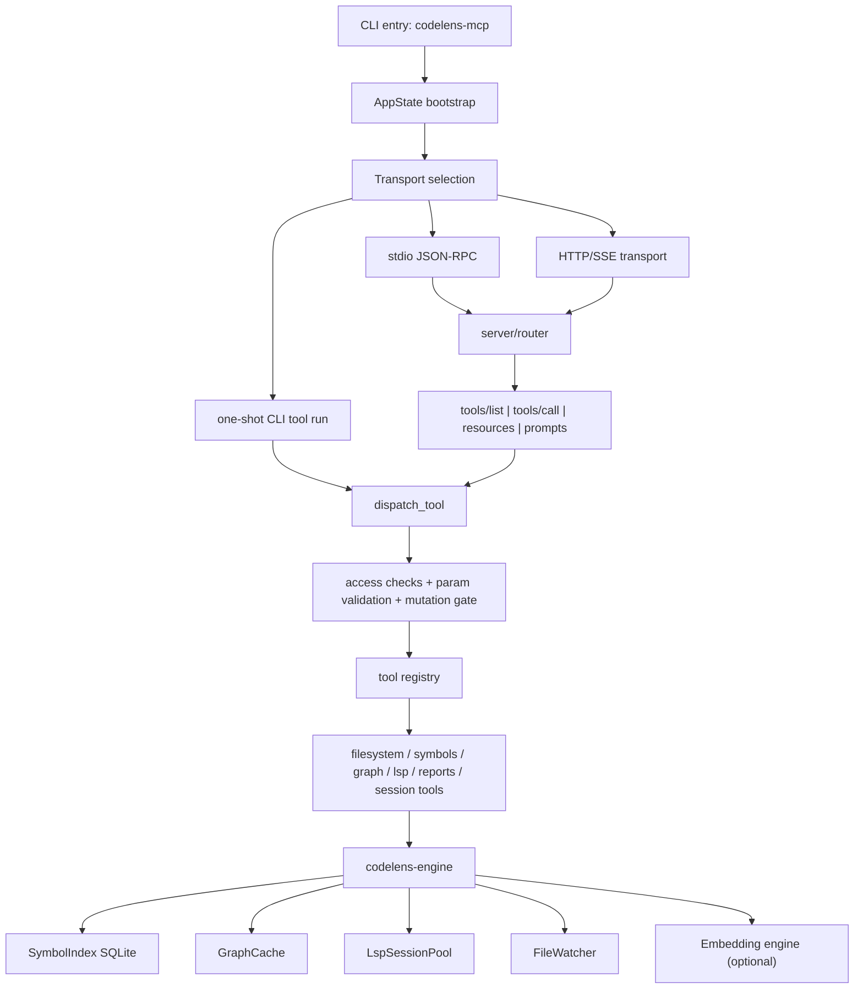
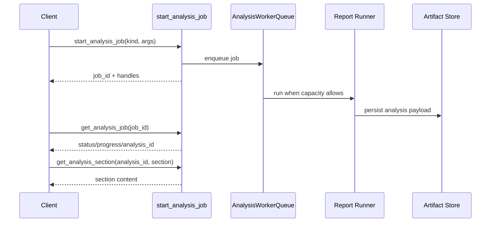

# Architecture Audit

- Date: 2026-04-16
- Scope: `/Users/bagjaeseog/codelens-mcp-plugin`
- Method: native repo inspection, CodeLens workflow tools, `cargo check`, `cargo test -p codelens-mcp`

## Summary

This repository is a Rust workspace with a clear top-level split:

- `crates/codelens-engine`: code intelligence engine
- `crates/codelens-mcp`: MCP server, protocol, transport, session/runtime state
- `crates/codelens-tui`: terminal dashboard and health check

The overall architecture is sound. The engine/server boundary is real, the transport layer is separated from tool execution, and the project includes strong integration coverage around protocol, workflow tools, mutation safety, and queueing behavior.

The two concrete issues found in this audit were both in the packaging and docs path, not in the Rust execution path:

1. release binaries and installer source fallback were being built without the optional `http` feature
2. `crates/codelens-mcp/README.md` documented an obsolete `--http 8080` CLI shape that does not match the current parser

Those were fixed in this pass.

## Workspace Scaffold

```text
codelens-mcp-plugin/
├─ crates/
│  ├─ codelens-engine/
│  ├─ codelens-mcp/
│  └─ codelens-tui/
├─ .github/workflows/
├─ benchmarks/
├─ docs/
├─ models/
├─ scripts/
├─ skills/
└─ install.sh
```

## Runtime Architecture



## Major API and Request Flow

### 1. Process startup

`codelens-mcp` startup does four main things:

1. initialize tracing and optional OTLP
2. resolve project root from CLI, env, or cwd
3. build `AppState`
4. select one of `stdio`, `http`, or `oneshot`

### 2. HTTP endpoints

HTTP transport exposes:

- `POST /mcp`: JSON-RPC requests
- `GET /mcp`: SSE stream
- `DELETE /mcp`: session shutdown
- `GET /.well-known/mcp.json`: server card

### 3. JSON-RPC router flow

The router handles:

- `initialize`
- `resources/list`
- `resources/read`
- `prompts/list`
- `prompts/get`
- `tools/list`
- `tools/call`

`tools/list` is not a flat registry dump. It is filtered by profile, namespace, tier, deferred loading state, and client contract mode.

### 4. Tool execution flow

`tools/call` routes into `dispatch_tool`, which applies:

1. request normalization
2. per-session rate limiting
3. session/project context resolution
4. tool surface and daemon-mode access checks
5. required param validation
6. mutation gate or direct handler execution
7. post-mutation reindex/audit side effects
8. doom-loop telemetry
9. response shaping and compression

### 5. Analysis job flow

Heavy reports use a durable queue:



## Core Internal Boundaries

### `codelens-engine`

Main responsibilities:

- root detection and file collection
- symbol extraction and ranking
- SQLite-backed symbol index
- import graph and blast-radius logic
- LSP session orchestration
- watcher-driven incremental reindex
- optional semantic retrieval

### `codelens-mcp`

Main responsibilities:

- transport and protocol handling
- role-based tool surface shaping
- session-scoped state and metrics
- mutation/readiness gates
- report/job orchestration
- resource/prompt exposure

### `codelens-tui`

Main responsibilities:

- local dashboard
- non-interactive health check

## Overengineering Assessment

### Good complexity

- engine vs MCP server split is justified
- transport/router/dispatch/tool modules are separate
- mutation gate and preflight store are justified by the product promise
- analysis queue is justified because report payloads are intentionally durable and sectioned

### Risky growth points

1. `AppState` is becoming a wide coordination object
2. `tools::dispatch_table()` is still a single maintenance hotspot
3. workflow/report/session logic is accumulating inside one crate
4. CI/build workflow intent is partially duplicated across multiple GitHub Actions files

These are not failures yet, but they are the places most likely to become "AI-generated overbuild" if new features keep landing without boundary discipline.

## Findings

### Fixed in this pass

1. release workflow now builds binaries with `--features http`
2. installer source fallback now builds with `--features http`
3. MCP README now documents the real HTTP CLI syntax
4. root README now explains that HTTP transport requires the `http` feature for source/crates.io installs

### Still worth cleaning up

1. `.github/workflows/build.yml` and `.github/workflows/ci.yml` overlap in trigger intent and build verification scope
2. `AppState` should not absorb more business logic than it already has
3. any new tool family should avoid growing the central dispatch table without adding stronger grouping or generation rules

## Recommended Direction

### Short term

- keep the current 3-crate workspace
- do not split more crates yet
- treat `AppState` as orchestration-only and move new feature-specific logic to dedicated modules
- keep adding tests at the protocol and workflow layer

### Medium term

- extract clearer internal boundaries inside `codelens-mcp`:
  - transport/protocol
  - session/runtime
  - reports/jobs
  - mutation safety
- consolidate overlapping CI workflows if they are not intentionally separate release gates

### Avoid

- introducing a second abstraction layer over tool dispatch without an actual generation pipeline
- splitting reports/session/mutation into separate crates before compile-time or ownership pressure justifies it
- adding another runtime mode unless it solves a real deployment problem

## Verification

- `cargo check`: passed
- `cargo test -p codelens-mcp`: passed (`238 passed; 0 failed`)

## Tooling Note

`serena MCP` was not available in this session, so this audit used the repo's own CodeLens MCP tooling plus native inspection and test execution.
