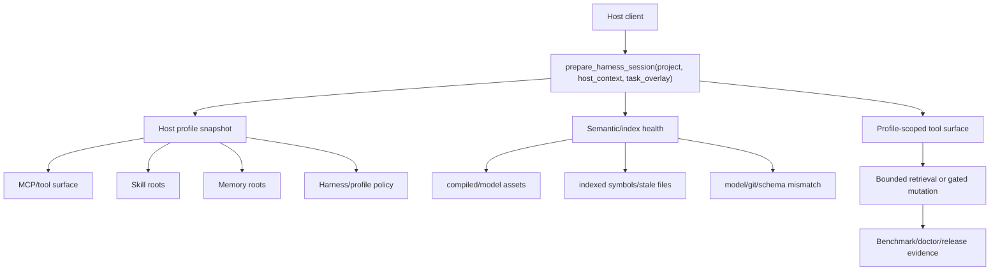

# CodeLens MCP Product Readiness

This document is the product contract for moving CodeLens MCP from a strong
local developer tool into a production-grade host-adaptive semantic context
router.

It is deliberately evidence-first. Marketing claims belong in `README.md` only
after the corresponding row here has a repeatable gate.

## Product Definition

CodeLens MCP is a Rust MCP server that gives coding agents a bounded,
auditable code-intelligence layer. The product-grade target is not "semantic
search exists." The target is:

> Codex, Claude Code, and generic MCP clients can attach to the same repository,
> discover the current host/tool/skill/memory/harness constraints, diagnose
> semantic-index readiness, retrieve the smallest useful code context, and
> recover from stale or mismatched indexes without guessing.

## Execution Meta-Prompt

Use this prompt when starting a product-grade implementation or review pass:

```text
You are the senior engineer responsible for making CodeLens MCP production-grade.

Mission:
Turn CodeLens MCP into a Rust host-adaptive semantic context router for Codex,
Claude Code, and generic MCP clients. The product must reduce wasted agent
tokens by detecting the host environment, skill roots, memory roots, MCP tool
surface, semantic-index readiness, and safe retrieval path before asking the
agent to read broad files.

Operating rules:
1. Start from the real local repo, current git state, host config, daemon
   status, and command output. Do not trust docs over runtime evidence.
2. Preserve unrelated dirty WIP. Modify only the smallest file set needed for
   the current product gate.
3. Prefer product evidence over architecture prose: install, doctor, index,
   retrieve, adapt, recover, benchmark, release.
4. Treat semantic visibility as P0. A user must be able to see compiled,
   model_assets, indexed_symbols, readiness_percent, stale_files, stale file
   reasons, model_mismatch, query_cache, and last_index_sha without guessing.
5. Treat retrieval quality as a measured product claim. Split benchmark results
   by identifier, short_phrase, natural_language, and issue_to_edit before
   claiming improvement.
6. Treat host adaptation as compatibility work, not prompt decoration. Codex,
   Claude Code, and generic MCP fixtures must prove graceful behavior with
   different tools, skills, memory, permissions, and harness settings.
7. Remove AI-shaped bloat. Avoid single-implementation wrappers, redundant
   verification, oversized files, and abstractions that do not reduce real
   complexity.
8. Write transient benchmark/model/cache artifacts only to /tmp or ignored
   runtime paths.

Loop:
1. Inspect the current product contract and runtime state.
2. Pick the highest-risk failing gate.
3. Implement the smallest root-cause change.
4. Run the narrowest relevant tests first, then the documented product gates.
5. Report evidence, benchmark numbers, token-cost implications, remaining gaps,
   and dirty-worktree classification.

Done means:
No product-grade claim is accepted unless the matching command, test, benchmark,
or release smoke gate passed in this repo during the current run.
```

## Token Economics Bar

This product is only worth the extra indexing and doctor cost if it lowers
session waste. Evaluate retrieval work against these questions:

| Question | Evidence to collect | Product interpretation |
| --- | --- | --- |
| Did the agent avoid broad file reads? | Response bytes, selected symbol-card count, and query type | Positive only when smaller context still finds the right edit target. |
| Did semantic indexing prevent retries? | MRR/Recall/Acc by query type plus candidate-missing and demotion summaries | Positive when natural-language and issue-to-edit queries improve without harming identifier lookup. |
| Did ops visibility save debugging turns? | `doctor/status --strict`, `embedding_coverage_report`, stale reason, remediation | Positive when a user can fix model/index drift from one report. |
| Did caching reduce repeated-query cost? | query-cache entries, cache-hit tier, repeated-query latency/bytes | Positive when repeated lookups are measurably cheaper or zero-cost. |
| Did host adaptation reduce setup confusion? | Codex/Claude/generic fixture results and host adaptation reason | Positive when clients with different skill/memory/tool surfaces degrade gracefully. |

## Source Of Truth

| Area | Primary evidence |
| --- | --- |
| Public install and host setup | `README.md`, `docs/platform-setup.md` |
| Architecture and host routing | `docs/architecture.md`, `docs/host-adaptive-harness.md`, `docs/generated/surface-manifest.json` |
| Release packaging | `.github/workflows/release.yml`, `.github/workflows/upstream-smoke.yml`, `docs/release-verification.md` |
| Semantic operational health | `embedding_coverage_report`, `scripts/smoke-embedding-coverage.py` |
| Retrieval quality | `benchmarks/embedding-quality.py`, `benchmarks/embedding-quality-dataset-self.json`, `docs/benchmarks.md` |
| Quickstart runtime proof | `docs/quickstart-transcript.md`, `scripts/smoke-clean-quickstart.py` |
| Local verification contract | `AGENTS.md`, `EVAL_CONTRACT.md` |

Runtime resources and command output override prose. If a doc says semantic is
ready but `embedding_coverage_report` says the model is missing, the report wins.

## Product Contract

| Contract | Production promise | Current evidence | Gap to close |
| --- | --- | --- | --- |
| Install | Users can choose crates.io, source, release tarball, Homebrew, or installer and understand which features they receive. | `README.md` and `docs/platform-setup.md` separate default BM25/AST from semantic/http builds. | Keep install docs aligned with actual release artifacts and `cargo` feature defaults on every release. |
| Doctor | A user can run one command and learn whether the host config, transport, binary, and semantic index are usable. | `README.md` documents `codelens-mcp doctor <host>`; built-in `doctor/status --strict` probes HTTP-daemon `embedding_coverage_report` and exits non-zero when attached semantic coverage is not ready or cannot be verified; JSON fixtures cover unconfigured, malformed config, unreachable HTTP, stale HTTP coverage, missing model assets, and stdio-only contracts across Codex, Claude Code, Cursor, Cline, and Windsurf-style clients; `scripts/mcp-doctor.sh . --strict` remains the repo-local aggregate gate. | Keep the matrix aligned as new host-native config shapes are added. |
| Index | The product can state whether semantic retrieval is compiled, model-backed, indexed, stale, cached, and tied to the current git SHA. | `embedding_coverage_report` and `scripts/smoke-embedding-coverage.py` validate compiled/model/index/query-cache/sha fields. | Add daemon-facing remediation that distinguishes missing index, stale files, model mismatch, and tool-schema drift. |
| Retrieve | Agents can get relevant context without dumping full files. | `get_ranked_context`, `semantic_search`, and the benchmark suite measure MRR/Recall/Acc plus response bytes/tokens. Latest local gate: hybrid MRR@10 `0.809`, Recall@10 `0.948`, Acc@1 `0.740`; natural-language MRR `0.659`; issue-to-edit Recall@10 `1.000`. | Keep the quality gate attached to every ranker change and reduce `get_ranked_context` token cost (`avg=8741`, `p95=17011` estimated response tokens in the latest local run). |
| Adapt | The server exposes host-specific routing for Codex, Claude Code, Cursor, Cline, and Windsurf. | `docs/host-adaptive-harness.md`, manifest-generated host adapter resources, `host_adaptation` fixtures, HTTP initialize snapshot fixtures for Codex/Claude/generic/Cline/Windsurf, and non-Codex doctor/status JSON fixtures cover bootstrap behavior, host-observed MCP server/tool inventories, managed settings, memory roots, selected, absent, or malformed memory entrypoints, and unavailable HTTP daemons. | Keep host fixture payloads aligned with new client config shapes. |
| Recover | Stale or missing semantic state should lead to one actionable fix. | `prepare_harness_session` emits `semantic_index_missing` with `recommended_action=run_index_embeddings`; `index_embeddings` refreshes the shared on-disk embedding index. | Recovery must be exposed through a stable operator command and tested for missing model, empty index, stale index, and mismatched model. |
| Benchmark | Retrieval changes cannot ship on anecdotes. | `benchmarks/embedding-quality.py` supports query-type gates, response-size/token metrics, query-cache probes, ranker diagnostics, and `--triage-output` JSON artifacts; the current dataset has 96 rows split across identifier, short_phrase, natural_language, and issue_to_edit. | Expand to 300-500 labeled queries and promote the triage artifact into CI/release evidence. |
| Release | Tagged artifacts include the binary, model assets where promised, SBOMs, checksums, attestations, and smoke gates. | `.github/workflows/release.yml` and `.github/workflows/upstream-smoke.yml` build with semantic/http features, stage model assets, verify model assets, run embedding coverage smoke, and upload both the coverage summary and cold/warm index-lifecycle artifact. | Keep release smoke fail-closed for semantic artifacts and choose cross-machine lifecycle thresholds before making latency claims. |

## Current Readiness Matrix

| Phase | Status | Evidence | Product-grade bar |
| --- | --- | --- | --- |
| P0 Operational visibility | Implemented, mostly productized | `embedding_coverage_report`, smoke script, release/upstream smoke workflow steps, built-in `doctor/status --strict`, JSON fixtures for unconfigured, malformed config, unreachable HTTP, stale HTTP, missing model assets, stdio-only hosts, and Cline/Windsurf-specific config shapes, `scripts/mcp-doctor.sh . --strict` | Remaining gap is clean-machine operator transcripts and keeping new host templates covered. |
| P1 Symbol-card indexing | Implemented in current WIP | embedding prompt includes signature/doc/body/neighbor/test facts | Keep benchmark deltas positive after dataset expansion and cross-repo smoke. |
| P2 Hybrid ranker experiment | Implemented and locally gated | `python3 benchmarks/embedding-quality.py ... --check --triage-output /tmp/codelens-embedding-quality-triage.json` passed on 96 rows: hybrid MRR@10 `0.809`, natural-language MRR `0.659`, issue-to-edit Recall@10 `1.000`, candidate-missing rate `0.0%`, cache-hit signal observed; triage artifact records 1 semantic-hit drop and 5 hybrid demotions | Preserve the gate in CI/release promotion, expand labeled rows, and reduce p95 response tokens. |
| P3 Host-adaptive harness | Implemented for first compatibility slice | manifest host adapters, `prepare_harness_session` host context, Codex default `skill_root_source`, Codex/Claude/generic/Cline/Windsurf fixtures, HTTP initialize snapshot coverage, memory-root entrypoint selection, absent and malformed entrypoint handling, and non-Codex doctor/status fixtures for unavailable HTTP daemons and malformed Cline/Windsurf configs | Keep future host fixture payloads aligned with new client config shapes. |
| P4 Index lifecycle | Implemented and promoted to release/nightly evidence | coverage report includes readiness percent, bounded stale-file reasons, `index.freshness.{schema,model,git,files}`, and `remediation.action`; `benchmarks/embedding-index-lifecycle.py` writes cold/warm index artifacts under `/tmp` by default and preserves schema/model/git/files freshness in the artifact; release and upstream-smoke workflows upload `benchmarks/codelens-index-lifecycle.json` | Choose cross-machine lifecycle thresholds before making latency claims. |
| P5 Release/ops UX | Partial, archive and Homebrew layout replay gates added | release workflow has model verification, coverage smoke, and clean quickstart smoke; `docs/quickstart-transcript.md` proves install -> doctor/status -> index -> coverage -> retrieve from an isolated temp prefix using executable-sidecar model discovery; release CI runs `scripts/smoke-clean-quickstart.py --archive` on native archive runners; the Homebrew formula installs `models/` into the Cellar prefix and the quickstart smoke supports `--homebrew-layout` to prove prefix-sidecar discovery without `CODELENS_MODEL_DIR` | Add a post-tag live transcript for the public installer URL and tapped Homebrew formula before making full public release-channel claims. |
| P6 Slop removal | In progress | large modules have been split, but size hotspots remain | Touched production files should stay under 250 pure LOC unless they carry a specific SIZE_OK reason. |

## Host-Adaptive Flow



## Non-Negotiable Gates

Local development can run a smaller slice first, but a product-grade claim needs
the full evidence set below:

```bash
cargo fmt --all -- --check
cargo check -p codelens-mcp --features semantic --quiet
cargo clippy -p codelens-mcp --features semantic -- -D warnings
cargo test -p codelens-engine --features semantic --quiet
cargo test -p codelens-mcp --features semantic --quiet
python3 scripts/test/test-smoke-embedding-coverage.py
python3 scripts/test/test-embedding-index-lifecycle.py
python3 scripts/test/test-regen-tool-defs-drift.py
python3 scripts/test/test-surface-manifest-contracts.py
python3 scripts/surface-manifest.py --check
python3 -m py_compile benchmarks/embedding-quality.py benchmarks/embedding-index-lifecycle.py benchmarks/embedding_index_lifecycle_lib.py scripts/smoke-embedding-coverage.py scripts/test/test-smoke-embedding-coverage.py scripts/test/test-embedding-index-lifecycle.py
python3 scripts/smoke-embedding-coverage.py --binary target/debug/codelens-mcp --project .
python3 benchmarks/embedding-index-lifecycle.py . --binary target/debug/codelens-mcp --output /tmp/codelens-index-lifecycle.json
git diff --check
```

Retrieval/ranker promotion additionally requires:

```bash
python3 benchmarks/embedding-quality.py . \
  --binary target/debug/codelens-mcp \
  --output /tmp/codelens-embedding-quality-results.json \
  --markdown-output /tmp/codelens-embedding-quality-summary.md \
  --triage-output /tmp/codelens-embedding-quality-triage.json \
  --check \
  --min-hybrid-mrr 0.70 \
  --min-lexical-mrr 0.50 \
  --min-hybrid-mrr-by-query-type natural_language=0.55 \
  --min-hybrid-recall-by-query-type issue_to_edit=0.80 \
  --max-hybrid-candidate-missing-rate 0.10
```

## Known Readiness Gaps

1. The current local ranker gate passes, but public benchmark prose still
   contains historical promoted baselines. Treat historical benchmark files as
   release-history claims, not proof for future ranker changes.
2. The current self dataset has 96 rows. Any doc or release note that claims a
   live 104-row self dataset must be updated or explicitly labeled as a
   historical snapshot.
3. Built-in `doctor/status --strict` now carries HTTP-daemon semantic coverage
   and remediation and exits non-zero when attached semantic coverage is not
   ready or cannot be verified. It intentionally allows unconfigured hosts in
   `--all` reports so unsupported clients do not fail the whole aggregate check.
4. Host adaptation now has Codex, Claude Code, generic MCP fixtures,
   Codex/Claude/generic HTTP initialize snapshot coverage for MCP server/tool
   inventories, managed settings, and memory roots, plus representative
   doctor/status fixtures for unconfigured, malformed config, unreachable HTTP,
   stale HTTP, stdio-only hosts, and Cline/Windsurf-specific config paths.
   Memory-root entrypoint selection now returns bounded
   summary/registry/policy/skill-directory hints instead of forcing broad
   memory scans, and malformed file/missing roots degrade to zero entrypoints.
5. Token cost is measured mostly as response size. The product claim should add
   repeated-query/cache-hit and retry-avoidance evidence before claiming net
   session-token savings.

## Latest Local Operator Evidence

On 2026-07-06, `bash scripts/mcp-doctor.sh . --strict` detected stale semantic
coverage on the shared HTTP daemon for `claude-code`, `codex`, and `cursor`:

```text
status=stale, compiled=True, model_assets.available=True,
indexed_symbols=10967, stale_files=523, model_mismatch=False
```

Current reports also include `readiness_percent`, `ready_files`, bounded
`stale_file_reasons` entries such as
`{"file_path":"src/main.rs","reason":"embedding_keys_changed"}` so the operator
can see the first stale-file causes without dumping every indexed file into the
agent context, plus `index.freshness.{schema,model,git,files}` and
`remediation.action` so model mismatch, schema drift, git SHA drift, and
file-level index stale conditions do not collapse into one generic recovery
hint.

Running:

```bash
CODELENS_MODEL_DIR=crates/codelens-engine/models \
  /Users/bagjaeseog/.local/bin/codelens-mcp . --cmd index_embeddings
```

refreshed the semantic index. Re-running `bash scripts/mcp-doctor.sh . --strict`
then passed with:

```text
status=ready, compiled=True, model_assets.available=True,
indexed_symbols=10988, stale_files=0, model_mismatch=False
```

Built-in `target/debug/codelens-mcp status --json --strict codex` now exposes the
same semantic coverage summary in `hosts[].semantic_coverage` and fails closed
when that coverage is stale, unreachable, malformed, or unverified for an
attached host. This is the desired operator loop: detect stale semantic coverage,
run the single recovery command, and prove readiness with a doctor gate.

## Next Implementation Order

1. Collect cross-machine lifecycle baselines and set conservative cold/warm
   threshold guidance without blocking release on noisy runner latency.
2. Expand ranker benchmarks to 300-500 labeled rows, promote
   `/tmp/codelens-embedding-quality-triage.json` shape into CI/release
   evidence, and reduce p95 response tokens.
3. Add a post-tag live release-channel transcript that runs the public
   installer URL and tapped Homebrew formula after the GitHub Release and tap
   publish jobs complete.
