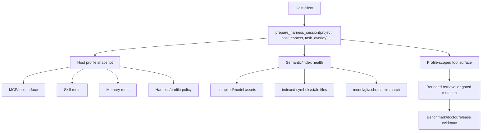

# CodeLens MCP Product Readiness

This document is the product contract for moving CodeLens MCP from a strong
local developer tool into a production-grade host-adaptive semantic context
router.

It is deliberately evidence-first. Marketing claims belong in `README.md` only
after the corresponding row here has a repeatable gate.

## Product Definition

CodeLens MCP is a Rust MCP server that gives coding agents a bounded,
auditable code-intelligence layer. The product-grade target is not "semantic
search exists." The target is:

> Codex, Claude Code, and generic MCP clients can attach to the same repository,
> discover the current host/tool/skill/memory/harness constraints, diagnose
> semantic-index readiness, retrieve the smallest useful code context, and
> recover from stale or mismatched indexes without guessing.

## Execution Meta-Prompt

Use this prompt when starting a product-grade implementation or review pass:

```text
You are the senior engineer responsible for making CodeLens MCP production-grade.

Mission:
Turn CodeLens MCP into a Rust host-adaptive semantic context router for Codex,
Claude Code, and generic MCP clients. The product must reduce wasted agent
tokens by detecting the host environment, skill roots, memory roots, MCP tool
surface, semantic-index readiness, and safe retrieval path before asking the
agent to read broad files.

Operating rules:
1. Start from the real local repo, current git state, host config, daemon
   status, and command output. Do not trust docs over runtime evidence.
2. Preserve unrelated dirty WIP. Modify only the smallest file set needed for
   the current product gate.
3. Prefer product evidence over architecture prose: install, doctor, index,
   retrieve, adapt, recover, benchmark, release.
4. Treat semantic visibility as P0. A user must be able to see compiled,
   model_assets, indexed_symbols, readiness_percent, stale_files, stale file
   reasons, model_mismatch, query_cache, and last_index_sha without guessing.
5. Treat retrieval quality as a measured product claim. Split benchmark results
   by identifier, short_phrase, natural_language, and issue_to_edit before
   claiming improvement.
6. Treat host adaptation as compatibility work, not prompt decoration. Codex,
   Claude Code, and generic MCP fixtures must prove graceful behavior with
   different tools, skills, memory, permissions, and harness settings.
7. Remove AI-shaped bloat. Avoid single-implementation wrappers, redundant
   verification, oversized files, and abstractions that do not reduce real
   complexity.
8. Write transient benchmark/model/cache artifacts only to /tmp or ignored
   runtime paths.

Loop:
1. Inspect the current product contract and runtime state.
2. Pick the highest-risk failing gate.
3. Implement the smallest root-cause change.
4. Run the narrowest relevant tests first, then the documented product gates.
5. Report evidence, benchmark numbers, token-cost implications, remaining gaps,
   and dirty-worktree classification.

Done means:
No product-grade claim is accepted unless the matching command, test, benchmark,
or release smoke gate passed in this repo during the current run.
```

## Token Economics Bar

This product is only worth the extra indexing and doctor cost if it lowers
session waste. Evaluate retrieval work against these questions:

| Question | Evidence to collect | Product interpretation |
| --- | --- | --- |
| Did the agent avoid broad file reads? | Response bytes, selected symbol-card count, and query type | Positive only when smaller context still finds the right edit target. |
| Did semantic indexing prevent retries? | MRR/Recall/Acc by query type plus candidate-missing and demotion summaries | Positive when natural-language and issue-to-edit queries improve without harming identifier lookup. |
| Did ops visibility save debugging turns? | `doctor/status --strict`, `embedding_coverage_report`, stale reason, remediation | Positive when a user can fix model/index drift from one report. |
| Did caching reduce repeated-query cost? | query-cache entries, cache-hit tier, repeated-query latency/bytes | Positive when repeated lookups are measurably cheaper or zero-cost. |
| Did host adaptation reduce setup confusion? | Codex/Claude/generic fixture results and host adaptation reason | Positive when clients with different skill/memory/tool surfaces degrade gracefully. |

## Source Of Truth

| Area | Primary evidence |
| --- | --- |
| Public install and host setup | `README.md`, `docs/platform-setup.md` |
| Architecture and host routing | `docs/architecture.md`, `docs/host-adaptive-harness.md`, `docs/generated/surface-manifest.json` |
| Release packaging | `.github/workflows/release.yml`, `.github/workflows/upstream-smoke.yml`, `docs/release-verification.md` |
| Semantic operational health | `embedding_coverage_report`, `scripts/smoke-embedding-coverage.py` |
| Retrieval quality | `benchmarks/embedding-quality.py`, `benchmarks/embedding-quality-dataset-self.json`, `docs/benchmarks.md` |
| Quickstart runtime proof | `docs/quickstart-transcript.md`, `scripts/smoke-clean-quickstart.py` |
| Local verification contract | `AGENTS.md`, `EVAL_CONTRACT.md` |

Runtime resources and command output override prose. If a doc says semantic is
ready but `embedding_coverage_report` says the model is missing, the report wins.

## Boundary Alignment

| Product boundary | Public promise today | Runtime-backed state | Phase 1 decision |
| --- | --- | --- | --- |
| Install | Multiple install channels are supported, but semantic behavior depends on feature flags and model sidecar availability. | README and release docs separate crates.io BM25/AST defaults from semantic/http release artifacts. | Keep the promise, but keep every channel-specific semantic claim tied to release or smoke evidence. |
| Doctor | One host-aware command should identify config, transport, binary, and semantic-index usability. | `doctor/status --strict` and `scripts/mcp-doctor.sh . --strict` probe attached HTTP daemon coverage and fail closed on unusable attached semantic state. | Treat doctor strict as the operator entrypoint for readiness, not a secondary debug script. |
| Index | Operators should see compiled/model/index/stale/cache/git freshness without reading implementation details. | `embedding_coverage_report` exposes compiled, model assets with `sha256`, indexed symbols, readiness percent, stale file reasons, freshness taxonomy, query cache, remediation, and last index SHA. | The schema is now part of the product contract; future changes require smoke-script and output-schema updates. |
| Retrieve | Agents should receive the smallest useful code context, with retrieval quality measured by query type. | Latest local gate passes on 112 rows with hybrid MRR@10 `0.758`, natural-language MRR `0.604`, issue-to-edit Recall@10 `0.909`, and p95 response tokens `16598`. | Keep the quality gate mandatory for ranker changes; next work is broader dataset expansion, external validation, and token reduction, not new claims. |
| Adapt | Codex, Claude Code, and generic MCP clients should get host-specific routing without hardcoding one harness. | Host adapter docs, manifest resources, `prepare_harness_session`, HTTP initialize snapshots, skill roots, and memory roots cover the first compatibility slice. | Keep adapter fixtures current as host config shapes change. |
| Recover | Missing, stale, or mismatched semantic state should produce one actionable remediation. | Coverage reports and doctor strict render `remediation.action`; `index_embeddings` refreshes the shared on-disk embedding index. | Recovery is usable for stale-index loops; missing-model, empty-index, and mismatched-model paths remain fixture-sensitive regression targets. |
| Benchmark | Retrieval and token claims should come from executable gates, not anecdotes. | `benchmarks/embedding-quality.py` records query-type gates, token fields, cache probes, and triage causes; upstream/release smoke workflows upload the self-retrieval quality and triage artifacts; `benchmarks/external-project-smoke.py` has a default fast fixture matrix that verifies `semantic_search(path_hint)` scoping and expected search hits. | Use the uploaded artifacts for release review, then expand the dataset before widening public claims. |
| Release | Tagged artifacts should include promised binaries, model assets, checksums, smoke results, and lifecycle evidence. | Release and upstream-smoke workflows run model verification, embedding coverage smoke, and index-lifecycle artifact upload. | Keep semantic release smoke fail-closed; collect cross-machine lifecycle thresholds before latency promises. |

## Product Contract

| Contract | Production promise | Current evidence | Gap to close |
| --- | --- | --- | --- |
| Install | Users can choose crates.io, source, release tarball, Homebrew, or installer and understand which features they receive. | `README.md` and `docs/platform-setup.md` separate default BM25/AST from semantic/http builds. | Keep install docs aligned with actual release artifacts and `cargo` feature defaults on every release. |
| Doctor | A user can run one command and learn whether the host config, transport, binary, and semantic index are usable. | `README.md` documents `codelens-mcp doctor <host>`; built-in `doctor/status --strict` probes HTTP-daemon `embedding_coverage_report` and exits non-zero when attached semantic coverage is not ready or cannot be verified; JSON fixtures cover unconfigured, malformed config, unreachable HTTP, stale HTTP coverage, missing model assets, and stdio-only contracts across Codex, Claude Code, Cursor, Cline, and Windsurf-style clients; `scripts/mcp-doctor.sh . --strict` remains the repo-local aggregate gate. | Keep the matrix aligned as new host-native config shapes are added. |
| Index | The product can state whether semantic retrieval is compiled, model-backed, indexed, stale, cached, and tied to the current git SHA. | `embedding_coverage_report`, output schemas, and `scripts/smoke-embedding-coverage.py` validate compiled/model asset sha/index/query-cache/git sha/freshness/remediation fields. | Keep daemon-facing remediation taxonomy stable as missing-index, stale-file, model-mismatch, and tool-schema-drift paths evolve. |
| Retrieve | Agents can get relevant context without dumping full files. | `get_ranked_context`, `semantic_search`, and the benchmark suite measure MRR/Recall/Acc plus response bytes/tokens. Latest local gate: hybrid MRR@10 `0.758`, Recall@10 `0.902`, Acc@1 `0.679`; natural-language MRR `0.604`; issue-to-edit Recall@10 `0.909`. | Keep the quality gate attached to every ranker change and reduce `get_ranked_context` token cost (`avg=8745`, `p95=16598` estimated response tokens in the latest local run). |
| Adapt | The server exposes host-specific routing for Codex, Claude Code, Cursor, Cline, and Windsurf. | `docs/host-adaptive-harness.md`, manifest-generated host adapter resources, `host_adaptation` fixtures, HTTP initialize snapshot fixtures for Codex/Claude/generic/Cline/Windsurf, and non-Codex doctor/status JSON fixtures cover bootstrap behavior, host-observed MCP server/tool inventories, managed settings, memory roots, selected, absent, or malformed memory entrypoints, and unavailable HTTP daemons. | Keep host fixture payloads aligned with new client config shapes. |
| Recover | Stale or missing semantic state should lead to one actionable fix. | `prepare_harness_session` emits `semantic_index_missing` with `recommended_action=run_index_embeddings`; `embedding_coverage_report` and doctor strict render `remediation.action`; `index_embeddings` refreshes the shared on-disk embedding index. | Keep missing-model, empty-index, stale-index, and mismatched-model recovery paths covered by fixtures and operator smoke. |
| Benchmark | Retrieval changes cannot ship on anecdotes. | `benchmarks/embedding-quality.py` supports query-type gates, response-size/token metrics, query-cache probes, ranker diagnostics, and `--triage-output` JSON artifacts; the current self dataset has 112 rows split across identifier, short_phrase, natural_language, and issue_to_edit; upstream and release smoke workflows now upload self-retrieval quality and triage artifacts; the default external-project smoke matrix checks Python/TypeScript/Rust fixtures with expected semantic hits. | Expand to 300-500 labeled queries and reduce p95 response tokens before widening public retrieval claims. |
| Productivity | Agent productivity claims must be backed by repeatable tool-call, follow-through, audit, and trend artifacts. | `scripts/run-productivity-proof-loop.sh` bundles local `tool_usage.jsonl` analysis, live daemon `eval_session_audit`, historical summary, and operator gate output into `.codelens/reports/productivity/`. Pass `--session-id` for each paired task so other agent sessions and retries do not contaminate a run. `status=verified` proves runtime rows carry a non-local HTTP session ID, Codex/Claude `client_name`, and no legacy rows; `evidence_status=task_observed` additionally requires a non-bootstrap task tool call. Attributed `tools/list` and `prepare_harness_session` traffic is `bootstrap_only`; generic hosts, probes, local audits, and older unattributed rows are `smoke_only`. Suggested-route outcomes distinguish direct follow-through, an alternative CodeLens route, no observed continuation, and an external fallback; only the last is a missed route. | Run the loop across enough paired real Codex/Claude sessions to compare tool calls per task, missed-route rate, rework frequency, token estimates, and audit pass rate against the previous baseline. |
| Release | Tagged artifacts include the binary, model assets where promised, SBOMs, checksums, attestations, and smoke gates. | `.github/workflows/release.yml` and `.github/workflows/upstream-smoke.yml` build with semantic/http features, stage model assets, verify model assets, run embedding coverage smoke, and upload both the coverage summary and cold/warm index-lifecycle artifact. | Keep release smoke fail-closed for semantic artifacts and choose cross-machine lifecycle thresholds before making latency claims. |

## Current Readiness Matrix

| Phase | Status | Evidence | Product-grade bar |
| --- | --- | --- | --- |
| P0 Operational visibility | Implemented, mostly productized | `embedding_coverage_report`, smoke script, release/upstream smoke workflow steps, built-in `doctor/status --strict`, JSON fixtures for unconfigured, malformed config, unreachable HTTP, stale HTTP, missing model assets, stdio-only hosts, and Cline/Windsurf-specific config shapes, `scripts/mcp-doctor.sh . --strict` | Remaining gap is clean-machine operator transcripts and keeping new host templates covered. |
| P1 Symbol-card indexing | Implemented in current WIP | embedding prompt includes signature/doc/body/neighbor/test facts | Keep benchmark deltas positive after dataset expansion and cross-repo smoke. |
| P2 Hybrid ranker experiment | Implemented and promoted to smoke evidence | `python3 benchmarks/embedding-quality.py ... --check --triage-output /tmp/codelens-embedding-quality-triage.json` passed on 112 rows: hybrid MRR@10 `0.758`, natural-language MRR `0.604`, issue-to-edit Recall@10 `0.909`, candidate-missing rate `3.6%`, cache-hit signal observed; triage artifact records 1 semantic-hit drop and 6 hybrid demotions; `scripts/test/test-embedding-quality-triage.py` pins `cause_candidates`, token-budget fields, and query-cache evidence; upstream and release smoke workflows upload `benchmarks/codelens-self-retrieval-*.{json,md}` artifacts | Expand labeled rows, reduce p95 response tokens, and keep external smoke separate from self-regression claims. |
| P3 Host-adaptive harness | Implemented for first compatibility slice | manifest host adapters, `prepare_harness_session` host context, Codex default `skill_root_source`, Codex/Claude/generic/Cline/Windsurf fixtures, HTTP initialize snapshot coverage, memory-root entrypoint selection, absent and malformed entrypoint handling, and non-Codex doctor/status fixtures for unavailable HTTP daemons and malformed Cline/Windsurf configs | Keep future host fixture payloads aligned with new client config shapes. |
| P4 Index lifecycle | Implemented and promoted to release/nightly evidence | coverage report includes model asset `sha256`, readiness percent, bounded stale-file reasons, `index.freshness.{schema,model,git,files}`, and `remediation.action`; `benchmarks/embedding-index-lifecycle.py` writes cold/warm index artifacts under `/tmp` by default and preserves model sha plus schema/model/git/files freshness in the artifact; release and upstream-smoke workflows upload `benchmarks/codelens-index-lifecycle.json` | Choose cross-machine lifecycle thresholds before making latency claims. |
| P5 Release/ops UX | Partial, archive/Homebrew layout replay and public-channel verifier added | release workflow has model verification, coverage smoke, and clean quickstart smoke; `docs/quickstart-transcript.md` proves install -> doctor/status -> index -> coverage -> retrieve from an isolated temp prefix using executable-sidecar model discovery; release CI runs `scripts/smoke-clean-quickstart.py --archive` on native archive runners; the Homebrew formula installs `models/` into the Cellar prefix and the quickstart smoke supports `--homebrew-layout` to prove prefix-sidecar discovery without `CODELENS_MODEL_DIR`; `scripts/public_release_channel_smoke.py` generates the post-tag public installer/Homebrew transcript plan and live metadata/installer checks | Run the verifier against a freshly published tag and attach the transcript before making full public release-channel claims. |
| P6 Slop removal | In progress | large modules have been split, but size hotspots remain | Touched production files should stay under 250 pure LOC unless they carry a specific SIZE_OK reason. |

## Host-Adaptive Flow



## Non-Negotiable Gates

Local development can run a smaller slice first, but a product-grade claim needs
the full evidence set below:

```bash
cargo fmt --all -- --check
cargo check -p codelens-mcp --features semantic --quiet
cargo clippy -p codelens-mcp --features semantic -- -D warnings
cargo test -p codelens-engine --features semantic --quiet
cargo test -p codelens-mcp --features semantic --quiet
python3 scripts/test/test-smoke-embedding-coverage.py
python3 scripts/test/test-embedding-index-lifecycle.py
python3 scripts/test/test-regen-tool-defs-drift.py
python3 scripts/test/test-surface-manifest-contracts.py
python3 scripts/surface-manifest.py --check
python3 -m py_compile benchmarks/embedding-quality.py benchmarks/external-project-smoke.py benchmarks/embedding-index-lifecycle.py benchmarks/embedding_index_lifecycle_lib.py scripts/smoke-embedding-coverage.py scripts/test/test-smoke-embedding-coverage.py scripts/test/test-embedding-index-lifecycle.py
python3 scripts/smoke-embedding-coverage.py --binary target/debug/codelens-mcp --project .
python3 benchmarks/embedding-index-lifecycle.py . --binary target/debug/codelens-mcp --output /tmp/codelens-index-lifecycle.json
python3 benchmarks/external-project-smoke.py --binary target/debug/codelens-mcp --matrix benchmarks/external-project-smoke-matrix.json --output /tmp/codelens-external-project-smoke.json --check
git diff --check
```

Retrieval/ranker promotion additionally requires:

Fast ranker iteration should first run the hybrid lane only. This keeps root
cause work observable without paying for every comparator subprocess on each
loop:

```bash
python3 benchmarks/embedding-quality.py . \
  --binary target/debug/codelens-mcp \
  --methods get_ranked_context \
  --workers 4 \
  --batch-size 16 \
  --query-cache-probe off \
  --output /tmp/codelens-embedding-quality-hybrid-only.json \
  --stdout summary \
  --markdown-output /tmp/codelens-embedding-quality-hybrid-only.md \
  --triage-output /tmp/codelens-embedding-quality-hybrid-only-triage.json \
  --check \
  --min-hybrid-mrr 0.70 \
  --max-hybrid-candidate-missing-rate 0.10 \
  --max-hybrid-p95-response-tokens 20000
```

Promotion still requires the full default method set with the cache probe
enabled so BM25/lexical, semantic, hybrid, and symbol-search comparators are
measured together. Keep batching enabled so the promotion gate measures ranker
quality without paying per-row process startup cost, and use method workers for
the independent comparator lanes while preserving deterministic output order.
Batch latency is reported separately as amortized batch latency; per-query
latency ceilings such as `--max-hybrid-avg-ms` must be run with
`--batch-size 1`:

```bash
python3 benchmarks/embedding-quality.py . \
  --binary target/debug/codelens-mcp \
  --method-workers 4 \
  --batch-size 16 \
  --query-cache-probe on \
  --output /tmp/codelens-embedding-quality-results.json \
  --stdout summary \
  --markdown-output /tmp/codelens-embedding-quality-summary.md \
  --triage-output /tmp/codelens-embedding-quality-triage.json \
  --check \
  --min-hybrid-mrr 0.70 \
  --min-lexical-mrr 0.50 \
  --min-hybrid-mrr-by-query-type natural_language=0.55 \
  --min-hybrid-recall-by-query-type issue_to_edit=0.80 \
  --max-hybrid-candidate-missing-rate 0.10 \
  --max-hybrid-p95-response-tokens 20000
```

## Known Readiness Gaps

1. The current local ranker gate passes, but public benchmark prose still
   contains historical promoted baselines. Treat historical benchmark files as
   release-history claims, not proof for future ranker changes.
2. The current self dataset has 112 rows. Any doc or release note that claims a
   live 96-row or 104-row self dataset must be updated or explicitly labeled as
   a historical snapshot.
3. Built-in `doctor/status --strict` now carries HTTP-daemon semantic coverage
   and remediation and exits non-zero when attached semantic coverage is not
   ready or cannot be verified. It intentionally allows unconfigured hosts in
   `--all` reports so unsupported clients do not fail the whole aggregate check.
4. Host adaptation now has Codex, Claude Code, generic MCP fixtures,
   Codex/Claude/generic HTTP initialize snapshot coverage for MCP server/tool
   inventories, managed settings, and memory roots, plus representative
   doctor/status fixtures for unconfigured, malformed config, unreachable HTTP,
   stale HTTP, stdio-only hosts, and Cline/Windsurf-specific config paths.
   Memory-root entrypoint selection now returns bounded
   summary/registry/policy/skill-directory hints instead of forcing broad
   memory scans, and malformed file/missing roots degrade to zero entrypoints.
5. Token cost is measured mostly as response size. The product claim should add
   repeated-query/cache-hit and retry-avoidance evidence before claiming net
   session-token savings.
6. Productivity evidence now has a repeatable local loop, but the current local
   sample size is still small. Treat early runs as instrumentation proof until
   multiple real task sessions accumulate.

## Overfitting Guardrails

The 112-row self dataset is a regression detector for this repository, not a
generalization proof. The latest expansion deliberately added host-adaptation,
coordination, report-job, and coverage/remediation queries that lowered hybrid
MRR from the prior 96-row run (`0.807`) to `0.758`; that drop is acceptable
because it makes the self gate harder instead of inflating the headline.

Use the self gate this way:

- Passing self retrieval proves that current CodeLens concepts remain
  findable in this repository.
- `candidate_missing`, `semantic_hit_dropped_by_hybrid`, and
  `hybrid_demoted_semantic_hit` rows are diagnostic backlog, not reasons to tune
  the ranker to this dataset alone.
- Public retrieval claims require external project smoke or release-quality
  matrix evidence in addition to the self gate.
- The fast external-project smoke must assert expected search hits, not only
  successful tool exit codes.
- External smoke labels must validate the semantic target for the query; they
  must not be blindly copied from the rename dry-run target when the two
  workflows are testing different behavior.
- Default-on ranker changes must not be justified by self MRR alone, especially
  when the added rows use repository-specific vocabulary such as host profiles,
  coordination claims, or CodeLens tool names.

Overfitting analysis for the current 112-row gate:

| Signal | Current evidence | Overfitting interpretation | Guardrail |
| --- | --- | --- | --- |
| Self score moved down after expansion | Hybrid MRR moved from `0.807` on 96 rows to `0.758` on 112 rows. | The expansion did not inflate the headline; it added harder in-repo retrieval cases. | Treat the lower score as the new stricter self-regression baseline. |
| Identifier rows remain easy | Identifier MRR is still `1.000`. | Aggregate MRR can hide weak natural-language behavior. | Track query-type metrics and do not use aggregate MRR alone. |
| Natural-language rows are still the hard tier | Natural-language MRR is `0.604`, above the `0.55` gate but materially below identifier lookup. | NL quality is the likely overfit surface if tuning uses CodeLens-specific terms. | Expand NL rows with non-CodeLens phrasing before public claims. |
| Issue-to-edit is no longer perfect | Issue-to-edit Recall@10 is `0.909` after adding coordination/profile edit intents. | The edit-intent slice is becoming less toy-like. | Keep adding issue-to-edit rows before changing ranker weights. |
| Candidate misses are visible | `candidate_missing_rate=3.6%` with 4 missing rows. | The triage artifact is catching blind spots instead of silently passing. | Fix or explain candidate-missing cases before using the self score as release evidence. |
| Hybrid demotions are visible | 1 semantic hit dropped by hybrid and 6 hybrid demotions. | Hybrid blending still has measurable failure modes. | Demotion rows are diagnostic backlog; do not tune only against these rows without external replay. |
| Fast fixture smoke asserts quality | Default `benchmarks/external-project-smoke-matrix.json` covers Python, TypeScript, and Rust fixtures, requires `semantic_search(path_hint)` to apply the configured scope, and requires the expected file/symbol within top 3. | This blocks a shallow pass where semantic search returns any successful payload while ignoring scope or missing the intended target. | Keep fixture queries small and non-CodeLens-specific; add languages only when the expected hit is meaningful. |
| Upstream smoke stays separate | Release/upstream smoke uses pinned Next.js tutorial, Flask, serde_json, and Spring Petclinic projects, and `--check` now requires an `expected_search` label for every project. | Upstream smoke prevents a self-only release story, but it is still scoped by `path_hint` and is not an MRR-equivalent quality matrix. | Release review must read self retrieval artifacts, fast fixture smoke, and upstream smoke artifacts together. |
| Search and mutation labels are separate | The upstream matrix uses semantic targets such as Next.js `LoginForm` and serde_json `serialize_bool` while retaining separate rename dry-run targets such as `Page` and `from_str`. | This prevents overfitting the smoke to whatever symbol was convenient for mutation testing. | Keep the search label aligned with the query intent, not with the dry-run edit target. |

## Latest Local Operator Evidence

On 2026-07-06, `python3 scripts/smoke-embedding-coverage.py --binary
target/debug/codelens-mcp --project .` passed with:

```text
historical clean-index snapshot:
status=ready, compiled=True, model_assets.available=True,
model_assets.sha256=ef1d1e9cfa72,
indexed_symbols=11630, readiness_percent=100%, stale_files=0,
model_mismatch=False, remediation.action=none, query_cache.entries=164,
last_index_sha=aa49a9f4c79a88aca18497c29dee4161caa59862
```

After the current WIP changed benchmark/retrieval files, the same smoke first
reported stale semantic coverage instead of pretending the old index was
current:

```text
status=stale, compiled=True, model_assets.available=True,
model_assets.sha256=ef1d1e9cfa72,
indexed_symbols=11672, readiness_percent=98%, stale_files=3,
stale_reason=benchmarks/external-project-smoke.py:embedding_keys_changed,
model_mismatch=False, remediation.action=refresh_embedding_index,
query_cache.entries=188,
last_index_sha=aa49a9f4c79a88aca18497c29dee4161caa59862
```

Running the documented recovery command refreshed the index for the current WIP:

```text
index_embeddings: indexed_symbols=11687, bridges_generated=783,
query_cache.entries=188, status=ok

embedding_coverage_report:
status=ready, compiled=True, model_assets.available=True,
model_assets.sha256=ef1d1e9cfa72,
indexed_symbols=11687, readiness_percent=100%, stale_files=0,
stale_reason=none, model_mismatch=False, remediation.action=none,
query_cache.entries=188,
last_index_sha=aa49a9f4c79a88aca18497c29dee4161caa59862
```

The same day, `bash scripts/mcp-doctor.sh . --strict` passed for attached
`claude-code`, `codex`, and `cursor` HTTP daemon configurations:

```text
Summary: attached=3, unconfigured=2, issues=0
Strict verdict: PASS
```

Current reports include `model_assets.sha256`, `readiness_percent`, `ready_files`, bounded
`stale_file_reasons` entries such as
`{"file_path":"src/main.rs","reason":"embedding_keys_changed"}` so the operator
can see the first stale-file causes without dumping every indexed file into the
agent context, plus `index.freshness.{schema,model,git,files}` and
`remediation.action` so model mismatch, schema drift, git SHA drift, and
file-level index stale conditions do not collapse into one generic recovery
hint.

When coverage is stale, the intended recovery command remains:

```bash
CODELENS_MODEL_DIR=crates/codelens-engine/models \
  /Users/bagjaeseog/.local/bin/codelens-mcp . --cmd index_embeddings
```

Built-in `target/debug/codelens-mcp status --json --strict codex` now exposes the
same semantic coverage summary in `hosts[].semantic_coverage` and fails closed
when that coverage is stale, unreachable, malformed, or unverified for an
attached host. This is the desired operator loop: detect stale semantic coverage,
run the single recovery command, and prove readiness with a doctor gate.

## Next Implementation Order

1. Collect cross-machine lifecycle baselines and set conservative cold/warm
   threshold guidance without blocking release on noisy runner latency.
2. Expand ranker benchmarks to 300-500 labeled rows and reduce p95 response
   tokens; the self-retrieval quality and triage artifacts are now attached to
   upstream/release smoke evidence.
3. Run `scripts/public_release_channel_smoke.py --version X.Y.Z --mode installer`
   and `--mode homebrew-info` against the next published tag, then attach the
   generated transcript to release evidence.
