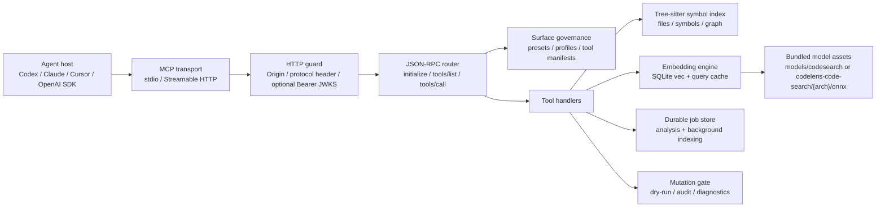
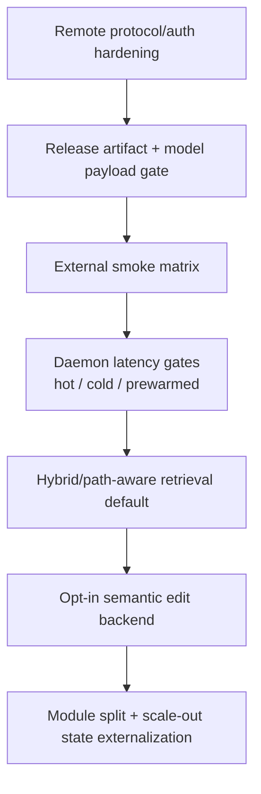

# CodeLens MCP Product Roadmap

Date: 2026-04-25

## Current Architecture

## Roadmap Status

| Priority | Item | Status | Product Meaning |
| --- | --- | --- | --- |
| P0 | MCP 2025-11-25 negotiation | Done | Latest, 2025-06-18, and 2025-03-26 are accepted from one constant source. |
| P0 | Anthropic remote tool-only shape | Done | `--compat anthropic-remote` advertises tools only and hides resources/prompts. |
| P0 | OpenAI/standard Streamable HTTP compatibility | Partial | Existing Streamable HTTP paths remain compatible; stateless 2026 roadmap work is still future. |
| P0 | HTTPS + JWKS auth | Done | `--transport https` requires PEM cert/key; non-loopback listen fails closed unless HTTPS + JWKS auth is configured. |
| P0 | Release model artifact guarantee | Done | Resolver accepts `models/codesearch` and release-style `models/codelens-code-search/{arch}/onnx`; release packaging now fails closed if model payload is absent. |
| P0 | External project smoke matrix | Done | CI runs Next.js, Flask, Rust, and Spring-style smoke projects through index, embedding, semantic search, and mutation dry-run. |
| P1 | Hybrid/path-aware semantic default | Done | `semantic_search` now reports `hybrid_path_aware` mode and can prefer a `path_hint`; pure semantic remains evidence, not the only ranking signal. |
| P1 | Query cache + prewarm | Done | Query embeddings persist in `.codelens/index/embeddings.db` and `index_embeddings(prewarm_queries)` reports cache stats. |
| P1 | Background `index_embeddings` | Done | `index_embeddings(background=true)` returns a durable job handle and updates progress through the existing job store. |
| P2 | Serena-grade edit backend | Roadmap | Keep as opt-in `semantic_edit_backend`; do not merge into retrieval core. |
| P2 | Large module split | Roadmap | Split `surface_manifest.rs`, `cli.rs`, `telemetry.rs`, and large integration tests after P0 remote auth lands. |

## Completion Shape

## Remaining Hard Gates

1. Add daemon latency gates for `hot_path`, `cold_distinct`, and `prewarmed_distinct` as separate release numbers.
2. Promote fixture smoke to real pinned upstream repositories for nightly/release CI, while keeping fixture smoke as the fast PR gate.
3. Keep edit-backend precision work behind an explicit capability; retrieval, ranking, and mutation safety must stay independently testable.
4. Externalize session/job/index state before positioning CodeLens as a remote multi-instance service.
