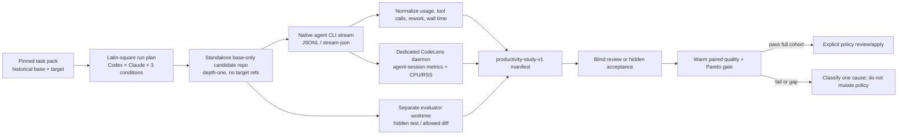

# Controlled Agent Productivity Study

`productivity-study-v1` is the only path that can change CodeLens routing
policy from measured agent productivity. It supersedes neither retrieval
benchmarks nor the runtime health proof loop: those remain diagnostic evidence.

## Current Evidence State

The pilot task pack and runner exist, but no completed pilot cohort is stored in
this repository yet. Historical `real-session` entries and synthetic token
benchmarks are not evidence for a policy promotion because they lack the
required paired task outcome, agent usage, hidden acceptance, and rework data.

Until the full cohort passes, keep CodeLens opt-in for complex work and retain
native tools as the default for simple local lookup.

## Study Contract

- Conditions: `baseline`, `naive-on`, and `routed-on`.
- Claude isolation: every condition uses `--strict-mcp-config`; only treatment
  conditions add the explicit CodeLens MCP config, while permission mode still
  follows each task's read-only contract.
- Agents: Codex and Claude with model and CLI version written per run.
- Isolation: every candidate begins in a standalone depth-one Git repository
  fetched at the exact historical base SHA. It has no source remote, refs, or
  access to the hidden target commit; current source WIP and production data
  are excluded. Only the evaluator uses a target-aware detached worktree.
- Pilot: 8 tasks (4 task kinds × CodeLens and SignatureStudio) × 3 conditions
  × 2 agents = 48 runs. The full study expands only after the pilot gate.
- Primary comparison: warm-index paired runs. Cold start is an overhead lane,
  not pooled into the primary productivity median.
- Quality: repair/refactor tasks require allowed-diff plus hidden targeted
  verification. Read/review tasks require two independent blind rubric
  decisions; disagreement is `withheld`.
- Gate: complex-task quality may not regress. Median total agent tokens **or**
  wall time must improve by at least 20%, while every protected cost/resource
  metric may not regress by more than 10%. Missing metrics create a coverage
  gap, never a zero value.
- Telemetry: the isolated daemon writes a temporary session-scoped JSONL only
  for the run. The collector excludes its control session, derives the
  agent-session context tokens and p50/p95 tool latency, then deletes that
  JSONL after retaining its SHA-256 and a redacted failure excerpt.
- Retention: raw agent streams, telemetry JSONL, blind-review packets, and
  candidate diffs are deleted after scoring; only manifests, version/commit
  hashes, aggregate metrics, redacted failure evidence, and raw SHA-256 remain.
- Policy: the policy SHA is captured before a run and checked after it. No
  refresh/apply operation is available in the study runner. The CLI defaults
  to the versioned study policy beside the task pack, never a shared home policy.
- Binary provenance: before creating a run artifact directory, the runner
  captures the requested executable into a private content-addressed snapshot
  under the artifact root and inspects and executes only that snapshot. Its
  embedded Git SHA must match the clean CodeLens repository HEAD. Requested
  path, executed snapshot path, version, build timestamp, dirty flag, and
  content SHA-256 are retained in `codelens_binary_provenance`; malformed,
  mutated, stale, dirty, symlinked, or colliding binaries fail closed. Runs
  with identical binary content reuse the same read-only snapshot path. Each
  daemon launch then binds that verified content to a private ephemeral
  hardlink, checks its inode and hash before and after execution, and removes it.
- Process isolation: every candidate, evaluator, agent, daemon, grader, and
  provenance Git subprocess removes ambient `GIT_*` state. The runner keeps
  `HOME`, `PATH`, and non-Git authentication state, disables system/global Git
  config and prompts, forces `core.hooksPath=/dev/null`, and points zsh/bash/sh
  startup-file variables at an inert target. Grading uses `zsh -f -c`.



## Components

| Responsibility | Implementation |
| --- | --- |
| Immutable manifest and minimal evidence retention | `benchmarks/harness/productivity_study_contract.py` |
| Codex/Claude usage and rework normalization | `benchmarks/harness/productivity_study_events.py` |
| Task-pack validation, Latin ordering, evaluator worktrees, hidden grading | `benchmarks/harness/productivity_study_runner.py` |
| Base-only candidate checkout and Git environment isolation | `benchmarks/harness/productivity_study_candidate.py` |
| Reusable private content-addressed binary snapshots | `benchmarks/harness/productivity_study_binary_snapshot.py` |
| Fail-closed CodeLens binary provenance | `benchmarks/harness/productivity_study_provenance.py` |
| Quality, blind-review, warm-only and Pareto gates | `benchmarks/harness/productivity_study_report.py` |
| Thin agent CLI invocations | `benchmarks/harness/productivity_study_agents.py` |
| Dedicated daemon, structured telemetry, CPU/RSS sampling | `benchmarks/harness/productivity_study_runtime.py` |
| Agent-session telemetry aggregation without raw retention | `benchmarks/harness/productivity_study_mcp_metrics.py` |
| Run orchestration and manifest writing | `benchmarks/harness/productivity_study_execution.py` |
| Independent blind scoring and packet deletion | `benchmarks/harness/productivity_study_review.py` |
| Manifest-only condition, coverage, and per-agent gate report | `benchmarks/harness/productivity_study_report_runner.py` |

The legacy `harness_runner_common.py` is intentionally not extended for this
study. Its compatibility wrappers remain available to existing operators.

## Operations

Inspect the deterministic pilot only (no model call, no policy mutation):

```bash
python3 benchmarks/harness/productivity_study_cli.py
```

For one real run, pin both models and use an HTTP-capable binary. Results are
written outside the repository by default.

```bash
cargo build --release -p codelens-mcp --features http

python3 benchmarks/harness/productivity_study_cli.py \
  --execute-sequence 0 \
  --codex-model <pinned-codex-model> \
  --claude-model <pinned-claude-model>
```

The runner is deliberately single-sequence. Execute the planned Latin order;
do not parallelize runs against a shared daemon or auto-refresh routing policy
between them.

`--index-mode warm` and `--index-mode cold` produce distinct run IDs. Plan and
execute with the same explicit mode; cold runs remain a separate overhead lane
and cannot overwrite or be pooled with warm primary runs.

After a read/review run, complete both blinded evaluations with the same pinned
models. This command deletes the packet and evaluator raw streams after it
records only the two decisions and their hashes in the manifest.

```bash
python3 benchmarks/harness/productivity_study_review.py \
  ~/.codex/productivity-studies/productivity-study-v1-pilot/<run>/run-manifest.json \
  --codex-model <pinned-codex-model> \
  --claude-model <pinned-claude-model>
```

Generate a manifest-only report after the pilot. The pair thresholds are per
agent: six complex pairs and two simple routed lookups in the two-repository
pilot; the full three-repository study raises those to 27 and three.

```bash
python3 benchmarks/harness/productivity_study_report_runner.py \
  ~/.codex/productivity-studies/productivity-study-v1-pilot \
  --minimum-complex-pairs 6 \
  --minimum-simple-runs 2
```

## Known Gaps Before Policy Promotion

- The pilot needs all 48 real runs, blind reviews for read/review tasks, and
  complete metric coverage before any pilot conclusion.
- The full 180-run study is still required before changing the shipped routing
  default.
- A zero-baseline server metric makes the stated strict Pareto ratio fail on
  any positive treatment cost. Keep that outcome explicit; do not silently
  substitute a synthetic baseline or remove the metric.
- The report keeps gates per agent. A strong aggregate median cannot mask a
  weak Codex or Claude cohort.
